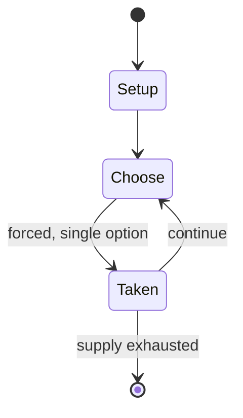

# Nerdle

*2022 video game*

`nerdle` &nbsp; state: **DEEPENED** &nbsp; method: **heuristic**

## Found layer (recorded, not trusted)

| field | value |
| --- | --- |
| wikidata | Q123459268 |
| wikipedia | Nerdle |
| genres (source) | puzzle video game |
| instance of (source) | video game |
| country of origin | -- |

## Declared layer (orders bench work)

| field | value |
| --- | --- |
| year created | 2022 |
| epoch | CONTEMPORARY |
| region | -- |
| media | TILE, VIDEO |
| players | -- |
| age band | -- |
| exogenous process | -- |
| loss shape | -- |
| live axes | - |
| horizon | -- |
| scoring shape | -- |
| information | -- |
| interaction | -- |
| turn structure | -- |
| tractability | SAMPLING_ONLY |
| randomness | -- |
| luck factor | 0.35 |
| rules complexity | 1.67 |
| strategic depth | 2.0 |
| novelty | 0.0876 |
| solved status | -- |
| strategies | -- |
| algorithms | -- |

## Object model

```
Episode
  players      : ?
  turn_structure: ?
  horizon       : ?
  scoring       : ?

TileBag        -- unordered draw source
Layout         -- placed tiles and their adjacencies
WorldState     -- simulation state advanced by the engine
Avatar         -- player-controlled agent
Clock          -- frame or tick counter
```

## State transition diagram



## Research item -- turn trace

```
# Nerdle -- simulated turn events
# generated from the DECLARED vector, not from a rulebook.
# structure: exo=None loss=None horizon=None scoring=None axes=-

t=0    SETUP        players=2  pot=0  capacity=7
t=1    FORCED       p1 single legal option taken (pot_gain=+1.2)
t=2    ENDTURN      turn passes to p2
t=3    FORCED       p2 single legal option taken (pot_gain=+1.0)
t=4    FORCED       p2 single legal option taken (pot_gain=+0.8)
t=5    FORCED       p2 single legal option taken (pot_gain=+1.3)
t=6    ENDTURN      turn passes to p1
t=7    FORCED       p1 single legal option taken (pot_gain=+1.6)
t=8    FORCED       p1 single legal option taken (pot_gain=+1.4)
t=9    FORCED       p1 single legal option taken (pot_gain=+0.5)
t=10   ENDTURN      turn passes to p2
t=11   FORCED       p2 single legal option taken (pot_gain=+1.8)
t=12   ENDTURN      turn passes to p1
t=13   FORCED       p1 single legal option taken (pot_gain=+0.7)
t=14   ENDTURN      turn passes to p2
t=15   FORCED       p2 single legal option taken (pot_gain=+0.8)
t=16   FORCED       p2 single legal option taken (pot_gain=+0.5)
t=17   FORCED       p2 single legal option taken (pot_gain=+1.4)
t=18   FORCED       p2 single legal option taken (pot_gain=+1.4)
t=19   ENDTURN      turn passes to p1
t=20   FORCED       p1 single legal option taken (pot_gain=+1.0)
t=21   FORCED       p1 single legal option taken (pot_gain=+1.5)
t=22   ENDTURN      turn passes to p2
t=23   FORCED       p2 single legal option taken (pot_gain=+1.1)
t=24   FORCED       p2 single legal option taken (pot_gain=+1.1)
t=25   FORCED       p2 single legal option taken (pot_gain=+1.7)
t=26   FORCED       p2 single legal option taken (pot_gain=+1.1)
t=27   ENDTURN      turn passes to p1

terminal: VARIABLE
```

## Source extract

Nerdle is a web-based number game created and developed by London-based data scientist Richard
Mann together with his children and software developer Marcus Tettmar. Players have six attempts
to guess an eight-digit/symbol calculation, with feedback given for each guess in the form of
colored tiles indicating when the chosen numbers or math symbols match or occupy the correct
position.  The game was inspired by the popular web-based Wordle and the founders' love of math.
Nerdle has a single daily solution, with all players attempting to guess the same calculation.
== Gameplay == Players have to guess an equation. Green tiles are correct, purple tiles are in
the equation but in the wrong spot. Gray tiles are not in the equation. Players have six tries
to guess. The equation is new everyday.   == References ==   == External links == Official
website

<sub>Wikipedia, CC BY-SA. Retained as evidence for the structural
classification above. Every rule inferred from it is HYPOTHESIZED
until audited against a rulebook.</sub>
