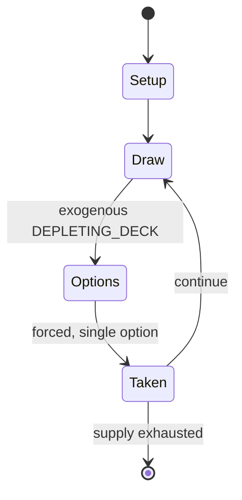

# Newmarket

*gambling card game*

`newmarket` &nbsp; state: **DEEPENED** &nbsp; method: **heuristic**

## Found layer (recorded, not trusted)

| field | value |
| --- | --- |
| wikidata | Q104842854 |
| wikipedia | Newmarket (card game) |
| genres (source) | -- |
| instance of (source) | card game |
| country of origin | -- |

## Declared layer (orders bench work)

| field | value |
| --- | --- |
| year created | -- |
| epoch | -- |
| region | -- |
| media | CARD, GAMBLING |
| players | 3-8 |
| age band | -- |
| exogenous process | DEPLETING_DECK |
| loss shape | -- |
| live axes | ORDER |
| horizon | -- |
| scoring shape | -- |
| information | -- |
| interaction | -- |
| turn structure | -- |
| tractability | EXACT_WITH_CUT |
| randomness | DECK_SHUFFLE |
| luck factor | 0.48 |
| rules complexity | 2.18 |
| strategic depth | 2.25 |
| novelty | 0.7404 |
| solved status | -- |
| strategies | spatial_packing |
| algorithms | -- |

## Object model

```
Episode
  players      : 3-8
  turn_structure: ?
  horizon       : ?
  scoring       : ?

Deck           -- ordered multiset, drawn without replacement
Hand           -- private multiset held by one player
DiscardPile    -- public accumulation of spent cards
Sequence       -- the permutation under the player's control
```

## State transition diagram



## Research item -- turn trace

```
# Newmarket -- simulated turn events
# generated from the DECLARED vector, not from a rulebook.
# structure: exo=DEPLETING_DECK loss=None horizon=None scoring=None axes=ORDER

t=0    SETUP        players=3  pot=0  capacity=3
t=1    DRAW         p1 draw from deck -> outcome #3  (p=0.247)
t=2    FORCED       p1 single legal option taken (pot_gain=+1.9)
t=3    ENDTURN      turn passes to p2
t=4    DRAW         p2 draw from deck -> outcome #4  (p=0.151)
t=5    FORCED       p2 single legal option taken (pot_gain=+2.0)
t=6    DRAW         p2 draw from deck -> outcome #2  (p=0.212)
t=7    FORCED       p2 single legal option taken (pot_gain=+0.7)
t=8    ENDTURN      turn passes to p3
t=9    DRAW         p3 draw from deck -> outcome #6  (p=0.226)
t=10   FORCED       p3 single legal option taken (pot_gain=+0.5)
t=11   ENDTURN      turn passes to p1
t=12   DRAW         p1 draw from deck -> outcome #3  (p=0.152)
t=13   FORCED       p1 single legal option taken (pot_gain=+1.2)
t=14   DRAW         p1 draw from deck -> outcome #3  (p=0.078)
t=15   FORCED       p1 single legal option taken (pot_gain=+1.1)
t=16   ENDTURN      turn passes to p2
t=17   DRAW         p2 draw from deck -> outcome #3  (p=0.297)
t=18   FORCED       p2 single legal option taken (pot_gain=+1.7)
t=19   ENDTURN      turn passes to p3
t=20   DRAW         p3 draw from deck -> outcome #6  (p=0.044)
t=21   FORCED       p3 single legal option taken (pot_gain=+1.8)
t=22   ENDTURN      turn passes to p1
t=23   DRAW         p1 draw from deck -> outcome #6  (p=0.048)
t=24   FORCED       p1 single legal option taken (pot_gain=+1.4)
t=25   ENDTURN      turn passes to p2
t=26   DRAW         p2 draw from deck -> outcome #3  (p=0.119)
t=27   FORCED       p2 single legal option taken (pot_gain=+1.1)

terminal: VARIABLE
```

## Source extract

Newmarket is an English card game of the matching type for any number of players. It is a
domestic gambling game, involving more chance than skill, and emerged in the 1880s as an
improvement of the older game of Pope Joan. It became known in America as Stops or Boodle before
developing into Michigan. In 1981, Newmarket was still the sixth most popular card game in
Britain.   == History == Newmarket's predecessor was an English gambling game called Pope Joan
that had an elaborate staking board in the shape of a rotating multi-compartment dish. Pope
Joan's popularity waned in favour of Newmarket in the second half of the 19th century, but the
latter was mentioned as early as 1820 in an account of a duke "losing considerably at
Newmarket". Its earliest rules were published in the 1850s and another early description appears
in The Bazaar, Exchange and Mart in 1875; it differs from later rules in that no spare hand is
dealt to increase the number of stop cards. In America, the game was also known as Newmarket to
begin with, but later became known as Stops or Boodle before being superseded there by Michigan
in the 1920s. Newmarket continues to be played in the UK, although, like Michigan

<sub>Wikipedia, CC BY-SA. Retained as evidence for the structural
classification above. Every rule inferred from it is HYPOTHESIZED
until audited against a rulebook.</sub>
