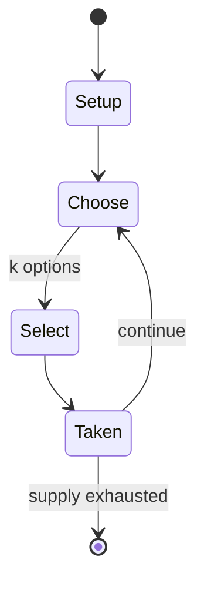

# Nim

`nim` &nbsp; state: **DEEPENED** &nbsp; method: **heuristic**

## Found layer (recorded, not trusted)

| field | value |
| --- | --- |
| wikidata | Q724409 |
| wikipedia | Nim |
| genres (source) | -- |
| instance of (source) | -- |
| country of origin | -- |

## Declared layer (orders bench work)

| field | value |
| --- | --- |
| year created | -- |
| epoch | -- |
| region | -- |
| media | - |
| players | -- |
| age band | -- |
| exogenous process | NONE |
| loss shape | OPPORTUNITY_ONLY |
| live axes | ORDER, SELECT, SPATIAL |
| horizon | -- |
| scoring shape | NEGATIVE_AVOIDANCE |
| information | PERFECT |
| interaction | COMPETITIVE |
| turn structure | STRICT_TURN |
| tractability | EXACT_WITH_CUT |
| randomness | NONE |
| luck factor | 0.02 |
| rules complexity | 2.14 |
| strategic depth | 2.4 |
| novelty | 0.7751 |
| solved status | -- |
| strategies | signalling |
| algorithms | -- |

## Object model

```
Episode
  players      : ?
  turn_structure: STRICT_TURN
  horizon       : ?
  scoring       : NEGATIVE_AVOIDANCE

Sequence       -- the permutation under the player's control
OptionSet      -- the choices available after an exogenous draw
Placement      -- position subject to geometric legality
```

## State transition diagram



## Research item -- turn trace

```
# Nim -- simulated turn events
# generated from the DECLARED vector, not from a rulebook.
# structure: exo=NONE loss=OPPORTUNITY_ONLY horizon=None scoring=NEGATIVE_AVOIDANCE axes=ORDER,SELECT,SPATIAL

t=0    SETUP        players=2  pot=0  capacity=4
t=1    SELECT       p1 2 options; take #1  (pot_gain=+2.4, capacity=-1)
t=2    SPATIAL      p1 places at (6,0); adjacency legal
t=3    SELECT       p1 3 options; take #1  (pot_gain=+1.0, capacity=-2)
t=4    SPATIAL      p1 places at (0,7); adjacency legal
t=5    SELECT       p1 4 options; take #2  (pot_gain=+2.9, capacity=-2)
t=6    SELECT       p1 4 options; take #2  (pot_gain=+2.5, capacity=-2)
t=7    SELECT       p1 3 options; take #1  (pot_gain=+2.5, capacity=-1)
t=8    SPATIAL      p1 places at (2,1); adjacency legal
t=9    SELECT       p1 2 options; take #2  (pot_gain=+3.4, capacity=-1)
t=10   SPATIAL      p1 places at (0,4); adjacency legal
t=11   SELECT       p1 4 options; take #2  (pot_gain=+0.5, capacity=-0)
t=12   SELECT       p1 1 options; take #1  (pot_gain=+2.4, capacity=-2)
t=13   SELECT       p1 3 options; take #3  (pot_gain=+1.9, capacity=-1)
t=14   ENDTURN      turn passes to p2
t=15   SELECT       p2 2 options; take #2  (pot_gain=+0.8, capacity=-1)
t=16   SELECT       p2 1 options; take #1  (pot_gain=+1.9, capacity=-2)
t=17   ENDTURN      turn passes to p1
t=18   SELECT       p1 2 options; take #1  (pot_gain=+0.6, capacity=-2)
t=19   SPATIAL      p1 places at (3,3); adjacency legal
t=20   SELECT       p1 1 options; take #1  (pot_gain=+3.4, capacity=-2)
t=21   ENDTURN      turn passes to p2
t=22   SELECT       p2 3 options; take #3  (pot_gain=+3.5, capacity=-1)
t=23   SPATIAL      p2 places at (4,3); adjacency legal
t=24   SELECT       p2 2 options; take #1  (pot_gain=+1.1, capacity=-0)
t=25   ENDTURN      turn passes to p1
t=26   SELECT       p1 3 options; take #3  (pot_gain=+3.2, capacity=-2)
t=27   SPATIAL      p1 places at (1,6); adjacency legal
t=28   ENDTURN      turn passes to p2

terminal: VARIABLE
```

## Conditions

| kind | threshold | effect | trigger |
| --- | --- | --- | --- |
| TERMINATE | -- | -- | If this removes either all or all but one objects from the heap that has two or more, then no heaps will have more than one object, so the players are forced to alternate removing exactly one object until the game ends. |
| TERMINATE | -- | -- | At that point, the next player removes either all objects (or all but one) from the heap that has two or more, so no heaps will have more than one object (in other words, so all remaining heaps have exactly one object ea |
| BOUNDARY | -- | -- | On each turn, a player must remove at least one object, and may remove any number of objects provided they all come from the same heap or pile. |
| BOUNDARY | -- | -- | In either normal play or a misère game, when there is exactly one heap with at least two objects, the player who takes next can easily win. |
| BOUNDARY | -- | -- | These strategies for normal play and a misère game are the same until the number of heaps with at least two objects is exactly equal to one. |
| BOUNDARY | -- | -- | Then letting yk = s ⊕ xk, we claim that yk < xk: all bits to the left of d are the same in xk and yk, bit d decreases from 1 to 0 (decreasing the value by 2d), and any change in the remaining bits will amount to at most  |
| BOUNDARY | -- | -- | The first player says "1" and each player in turn increases the number by 1, 2, or 3, but may not exceed 21; the player forced to say "21" loses. |
| BOUNDARY | -- | -- | The 21 game can also be played with different numbers, e.g., "Add at most 5; lose on 34". |
| BOUNDARY | -- | -- | In index-k nim, instead of removing objects from only one heap, players can remove objects from at least one but up to k different heaps. |
| BOUNDARY | -- | -- | The number of elements that may be removed from each heap may be either arbitrary or limited to at most r elements, like in the "subtraction game" above. |
| BOUNDARY | -- | -- | Indeed, the value thus computed is zero for the final position, and given a configuration of heaps for which this value is zero, any change of at most k heaps will make the value non-zero. |
| BOUNDARY | -- | -- | Conversely, given a configuration with non-zero value, one can always take from at most k heaps, carefully chosen, so that the value will become zero. |
| BOUNDARY | -- | -- | Candy nim is a version of normal-play nim in which players try to achieve two goals at the same time: taking the last object (in this case, candy) and taking the maximum number of candies by the end of the game. |

## Source extract

Nim is a mathematical combinatorial game in which two players take turns removing (or "nimming")
objects from distinct heaps or piles. On each turn, a player must remove at least one object,
and may remove any number of objects provided they all come from the same heap or pile.
Depending on the version being played, the goal of the game is either to avoid taking the last
object or to take the last object. Nim is fundamental to the Sprague–Grundy theorem, which
essentially says that every impartial game is equivalent (when regarded as a subgame of a larger
impartial game) to a nim game with a single pile.   == History == Variants of nim have been
played since ancient times. The game is said to have originated in China—it closely resembles
the Chinese game of jiǎn-shízǐ (捡石子), or "picking stones"—but the origin is uncertain; the
earliest European references to nim are from the beginning of the 16th century. Its current name
was coined by Charles L. Bouton of Harvard University, who also developed the complete theory of
the game in 1901, but the origins of the name were never fully explained. The Oxford English
Dictionary derives the name from the German verb nimm, meaning "take". At

<sub>Wikipedia, CC BY-SA. Retained as evidence for the structural
classification above. Every rule inferred from it is HYPOTHESIZED
until audited against a rulebook.</sub>
