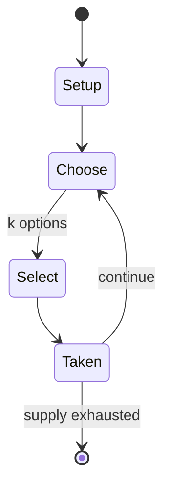

# Nine men's morris

`nine_men_s_morris` &nbsp; state: **DEEPENED** &nbsp; method: **heuristic**

## Found layer (recorded, not trusted)

| field | value |
| --- | --- |
| wikidata | Q209669 |
| wikipedia | Nine men's morris |
| genres (source) | -- |
| instance of (source) | -- |
| country of origin | -- |

## Declared layer (orders bench work)

| field | value |
| --- | --- |
| year created | -1400 |
| epoch | DEEP_ANTIQUITY |
| region | -- |
| media | BOARD |
| players | 2 |
| age band | -- |
| exogenous process | -- |
| loss shape | -- |
| live axes | ORDER, SELECT, SPATIAL |
| horizon | -- |
| scoring shape | -- |
| information | -- |
| interaction | COMPETITIVE |
| turn structure | PHASE_STRUCTURED |
| tractability | EXACT |
| randomness | -- |
| luck factor | 0.05 |
| rules complexity | 3.44 |
| strategic depth | 1.9 |
| novelty | 0.8252 |
| solved status | SOLVED_STRONG |
| strategies | blocking, zugzwang |
| algorithms | -- |

## Object model

```
Episode
  players      : 2
  turn_structure: PHASE_STRUCTURED
  horizon       : ?
  scoring       : ?

Board          -- spatial substrate; cells carry position and occupancy
Piece          -- movable token owned by a player
Sequence       -- the permutation under the player's control
OptionSet      -- the choices available after an exogenous draw
Placement      -- position subject to geometric legality
```

## State transition diagram



## Research item -- turn trace

```
# Nine men's morris -- simulated turn events
# generated from the DECLARED vector, not from a rulebook.
# structure: exo=None loss=None horizon=None scoring=None axes=ORDER,SELECT,SPATIAL

t=0    SETUP        players=2  pot=0  capacity=5
t=1    SELECT       p1 2 options; take #1  (pot_gain=+2.1, capacity=-2)
t=2    SELECT       p1 3 options; take #3  (pot_gain=+2.9, capacity=-0)
t=3    SPATIAL      p1 places at (1,5); adjacency legal
t=4    SELECT       p1 3 options; take #1  (pot_gain=+2.9, capacity=-2)
t=5    SELECT       p1 1 options; take #1  (pot_gain=+2.9, capacity=-2)
t=6    SPATIAL      p1 places at (0,2); adjacency legal
t=7    ENDTURN      turn passes to p2
t=8    SELECT       p2 3 options; take #3  (pot_gain=+0.6, capacity=-0)
t=9    SPATIAL      p2 places at (1,2); adjacency legal
t=10   SELECT       p2 3 options; take #2  (pot_gain=+2.7, capacity=-1)
t=11   ENDTURN      turn passes to p1
t=12   SELECT       p1 4 options; take #4  (pot_gain=+1.0, capacity=-1)
t=13   ENDTURN      turn passes to p2
t=14   SELECT       p2 4 options; take #2  (pot_gain=+0.8, capacity=-0)
t=15   SPATIAL      p2 places at (2,3); adjacency legal
t=16   SELECT       p2 2 options; take #2  (pot_gain=+2.0, capacity=-1)
t=17   SELECT       p2 4 options; take #1  (pot_gain=+3.0, capacity=-1)
t=18   SELECT       p2 2 options; take #1  (pot_gain=+2.7, capacity=-0)
t=19   ENDTURN      turn passes to p1
t=20   SELECT       p1 4 options; take #4  (pot_gain=+1.8, capacity=-2)
t=21   SELECT       p1 3 options; take #3  (pot_gain=+2.1, capacity=-0)
t=22   ENDTURN      turn passes to p2
t=23   SELECT       p2 2 options; take #1  (pot_gain=+2.0, capacity=-2)
t=24   SELECT       p2 1 options; take #1  (pot_gain=+3.3, capacity=-1)
t=25   SELECT       p2 3 options; take #3  (pot_gain=+1.5, capacity=-2)
t=26   SELECT       p2 2 options; take #2  (pot_gain=+1.4, capacity=-1)
t=27   ENDTURN      turn passes to p1

terminal: VARIABLE
```

## Conditions

| kind | threshold | effect | trigger |
| --- | --- | --- | --- |
| WIN | -- | -- | These boards used holes, not lines, to represent the nine spaces on the board—hence the name "nine holes"—and forming a diagonal row did not win the game. |
| BOUNDARY | -- | -- | It is an ancient game, dating back to at least the Roman Empire. |

## Source extract

Nine men's morris is a strategy board game for two players. It is an ancient game, dating back
to at least the Roman Empire. The game is also known as nine-man morris, mill, mills, the mill
game, merels, merrills, merelles, marelles, morelles, and ninepenny marl in English. In North
America, the game has also been called cowboy checkers, and its board is sometimes printed on
the back of checkerboards. Nine men's morris is a solved game, that is, a game whose optimal
strategy has already been calculated. It has been shown that with perfect play from both
players, the game results in a draw. The classical Latin term mareculus is a diminutive of
'man'; the Ecclesiastical Latin word merellus means 'gamepiece', which may have been corrupted
in English to 'morris', whilst miles is Latin for soldier. Three main alternative variations of
the game are three, six, and twelve men's morris.   == Rules == The board consists of a grid
with twenty-four intersections, or points. Each player has nine pieces, or men, usually coloured
black and white. Players try to form 'mills'—three of their own men lined horizontally or
vertically—allowing a player to remove an opponent's man from the game. A play

<sub>Wikipedia, CC BY-SA. Retained as evidence for the structural
classification above. Every rule inferred from it is HYPOTHESIZED
until audited against a rulebook.</sub>
