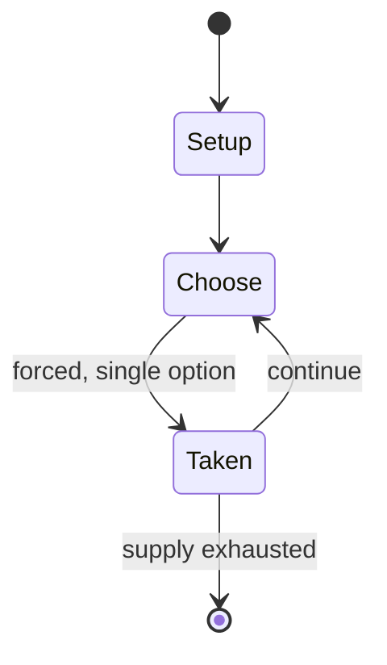

# no-castling chess

*chess variation*

`no_castling_chess` &nbsp; state: **DEEPENED** &nbsp; method: **heuristic**

## Found layer (recorded, not trusted)

| field | value |
| --- | --- |
| wikidata | Q120824212 |
| wikipedia | No Castling Chess |
| genres (source) | -- |
| instance of (source) | chess variant |
| country of origin | -- |

## Declared layer (orders bench work)

| field | value |
| --- | --- |
| year created | -- |
| epoch | -- |
| region | -- |
| media | - |
| players | -- |
| age band | -- |
| exogenous process | -- |
| loss shape | -- |
| live axes | - |
| horizon | -- |
| scoring shape | -- |
| information | -- |
| interaction | -- |
| turn structure | -- |
| tractability | SAMPLING_ONLY |
| randomness | -- |
| luck factor | 0.35 |
| rules complexity | 1.71 |
| strategic depth | 2.3 |
| novelty | 0.0866 |
| solved status | -- |
| strategies | -- |
| algorithms | alpha_zero_self_play |

## Object model

```
Episode
  players      : ?
  turn_structure: ?
  horizon       : ?
  scoring       : ?

State          -- opaque; no medium or axis evidence was found
Player         -- an agent that selects among legal successors
```

## State transition diagram



## Research item -- turn trace

```
# no-castling chess -- simulated turn events
# generated from the DECLARED vector, not from a rulebook.
# structure: exo=None loss=None horizon=None scoring=None axes=-

t=0    SETUP        players=2  pot=0  capacity=3
t=1    FORCED       p1 single legal option taken (pot_gain=+1.3)
t=2    FORCED       p1 single legal option taken (pot_gain=+0.7)
t=3    FORCED       p1 single legal option taken (pot_gain=+0.8)
t=4    FORCED       p1 single legal option taken (pot_gain=+1.8)
t=5    ENDTURN      turn passes to p2
t=6    FORCED       p2 single legal option taken (pot_gain=+0.7)
t=7    ENDTURN      turn passes to p1
t=8    FORCED       p1 single legal option taken (pot_gain=+1.9)
t=9    FORCED       p1 single legal option taken (pot_gain=+1.9)
t=10   FORCED       p1 single legal option taken (pot_gain=+1.9)
t=11   FORCED       p1 single legal option taken (pot_gain=+1.8)
t=12   FORCED       p1 single legal option taken (pot_gain=+1.1)
t=13   FORCED       p1 single legal option taken (pot_gain=+1.2)
t=14   FORCED       p1 single legal option taken (pot_gain=+1.2)
t=15   ENDTURN      turn passes to p2
t=16   FORCED       p2 single legal option taken (pot_gain=+1.6)
t=17   FORCED       p2 single legal option taken (pot_gain=+1.7)
t=18   FORCED       p2 single legal option taken (pot_gain=+1.6)
t=19   FORCED       p2 single legal option taken (pot_gain=+1.3)
t=20   ENDTURN      turn passes to p1
t=21   FORCED       p1 single legal option taken (pot_gain=+0.8)
t=22   FORCED       p1 single legal option taken (pot_gain=+1.8)
t=23   ENDTURN      turn passes to p2
t=24   FORCED       p2 single legal option taken (pot_gain=+1.4)
t=25   FORCED       p2 single legal option taken (pot_gain=+0.6)
t=26   ENDTURN      turn passes to p1

terminal: VARIABLE
```

## Source extract

No Castling Chess is a variation of the game of chess invented by the former world chess
champion Vladimir Kramnik and thoroughly explored by DeepMind, the team behind AlphaZero. In
this variant, every rule is the same as chess, except that castling is not allowed. This variant
reduces king safety, theoretically leading to more dynamic games, as it would be considerably
harder to force a draw and the pieces would be forced to engage in a mêlée. According to
Kramnik, who assisted DeepMind, in exploring this variant, this game helps to sidestep opening
preparation. He added: "This would inevitably lead to a considerably higher amount of decisive
games in chess tournaments until the new theory develops, and more creativity would be required
in order to win."   == Matches == 2021: Former world champion Viswanathan Anand defeated Kramnik
2½–1½ in a No Castling Chess match under classical time controls as part of the annual chess
festival in Dortmund. 2022: The tournament was expanded to a double round-robin with four
players. Kramnik was due to play but had to withdraw after testing positive for COVID-19.
Dmitrij Kollars, who replaced Kramnik, was the surprise winner of the tournament,

<sub>Wikipedia, CC BY-SA. Retained as evidence for the structural
classification above. Every rule inferred from it is HYPOTHESIZED
until audited against a rulebook.</sub>
