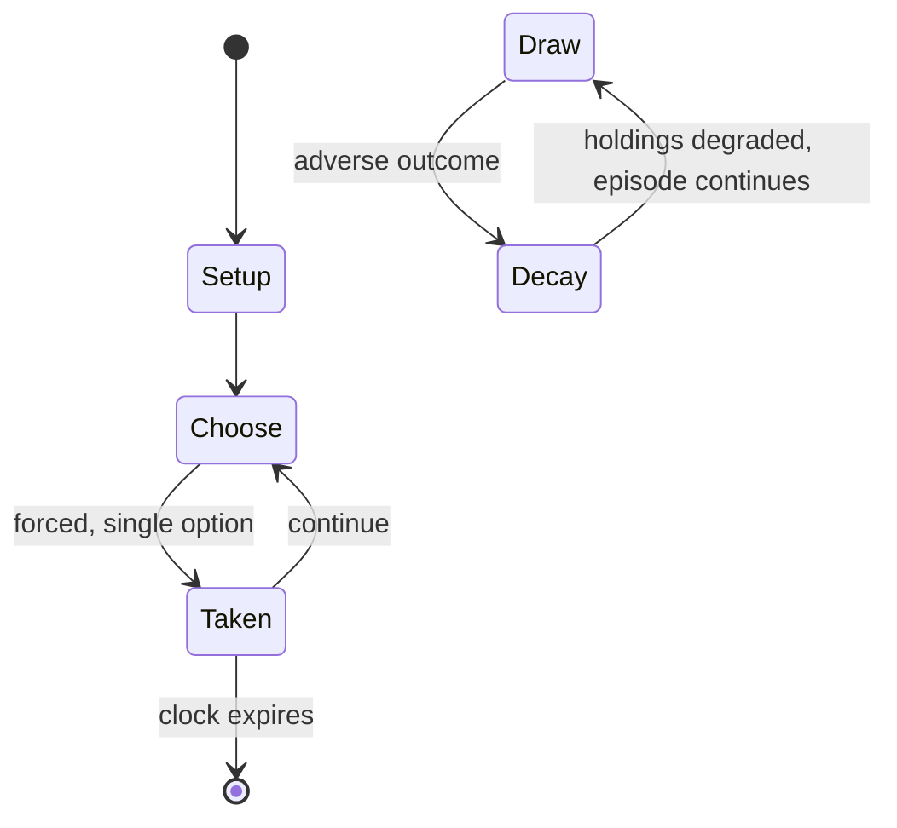

# Nonogram

`nonogram` &nbsp; state: **DEEPENED** &nbsp; method: **heuristic**

## Found layer (recorded, not trusted)

| field | value |
| --- | --- |
| wikidata | Q835894 |
| wikipedia | Nonogram |
| genres (source) | -- |
| instance of (source) | -- |
| country of origin | -- |

## Declared layer (orders bench work)

| field | value |
| --- | --- |
| year created | 1995 |
| epoch | DIGITAL |
| region | -- |
| media | GAMBLING, PUZZLE, VIDEO |
| players | -- |
| age band | -- |
| exogenous process | -- |
| loss shape | PARTIAL_DECAY |
| live axes | SPATIAL |
| horizon | CLOCK_LIMITED |
| scoring shape | SET_COLLECTION_CONVEX |
| information | -- |
| interaction | NEGOTIATION |
| turn structure | -- |
| tractability | SAMPLING_ONLY |
| randomness | HIDDEN_INFO |
| luck factor | 0.35 |
| rules complexity | 2.7 |
| strategic depth | 2.5 |
| novelty | 0.5401 |
| solved status | -- |
| strategies | opponent_modelling, set_collection |
| algorithms | -- |

## Object model

```
Episode
  players      : ?
  turn_structure: ?
  horizon       : CLOCK_LIMITED
  scoring       : SET_COLLECTION_CONVEX

Configuration  -- the arrangement to be resolved
Constraint     -- predicate a legal configuration must satisfy
WorldState     -- simulation state advanced by the engine
Avatar         -- player-controlled agent
Clock          -- frame or tick counter
Placement      -- position subject to geometric legality
```

## State transition diagram



## Research item -- turn trace

```
# Nonogram -- simulated turn events
# generated from the DECLARED vector, not from a rulebook.
# structure: exo=None loss=PARTIAL_DECAY horizon=CLOCK_LIMITED scoring=SET_COLLECTION_CONVEX axes=SPATIAL

t=0    SETUP        players=2  pot=0  capacity=4
t=1    FORCED       p1 single legal option taken (pot_gain=+0.9)
t=2    FORCED       p1 single legal option taken (pot_gain=+1.9)
t=3    SPATIAL      p1 places at (0,3); adjacency legal
t=4    ENDTURN      turn passes to p2
t=5    FORCED       p2 single legal option taken (pot_gain=+1.5)
t=6    FORCED       p2 single legal option taken (pot_gain=+0.6)
t=7    FORCED       p2 single legal option taken (pot_gain=+1.8)
t=8    ENDTURN      turn passes to p1
t=9    FORCED       p1 single legal option taken (pot_gain=+1.2)
t=10   FORCED       p1 single legal option taken (pot_gain=+0.9)
t=11   SPATIAL      p1 places at (2,6); adjacency legal
t=12   FORCED       p1 single legal option taken (pot_gain=+1.5)
t=13   ENDTURN      turn passes to p2
t=14   FORCED       p2 single legal option taken (pot_gain=+0.8)
t=15   ENDTURN      turn passes to p1
t=16   FORCED       p1 single legal option taken (pot_gain=+1.8)
t=17   ENDTURN      turn passes to p2
t=18   FORCED       p2 single legal option taken (pot_gain=+1.0)
t=19   FORCED       p2 single legal option taken (pot_gain=+1.6)
t=20   SPATIAL      p2 places at (5,4); adjacency legal
t=21   FORCED       p2 single legal option taken (pot_gain=+0.6)
t=22   FORCED       p2 single legal option taken (pot_gain=+0.7)
t=23   FORCED       p2 single legal option taken (pot_gain=+1.5)
t=24   SPATIAL      p2 places at (6,3); adjacency legal
t=25   ENDTURN      turn passes to p1
t=26   FORCED       p1 single legal option taken (pot_gain=+1.9)
t=27   SPATIAL      p1 places at (7,6); adjacency legal

terminal: CLOCK_LIMITED
```

## Conditions

| kind | threshold | effect | trigger |
| --- | --- | --- | --- |
| ELIMINATE | -- | -- | The hidden picture may help locate and eliminate an error, but otherwise it plays little part in the solving process, as it may mislead. |
| BOUNDARY | -- | -- | For example, a clue of "4 8 3" would mean there are sets of four, eight, and three filled squares, in that order, with at least one blank square between successive sets. |
| BOUNDARY | -- | -- | A nonogram solver written in C++ and published in the journal Pattern Recognition solves lines in quadratic time at most. |
| PENALTY | -- | -- | Hints (line clears) may be requested at a time penalty, and mistakes made earn time penalties as well (the amount increasing for each mistake). |
| PENALTY | -- | -- | Normal mode tells players if they made an error (with a time penalty) and free mode does not. |

## Source extract

Nonograms, also known as Hanjie, Paint by Numbers, Griddlers, Pic-a-Pix, and Picross, are
picture logic puzzles in which cells in a grid must be colored or left blank according to
numbers at the edges of the grid to reveal a hidden picture. In this puzzle, the numbers are a
form of discrete tomography that measures how many unbroken lines of filled-in squares there are
in any given row or column. For example, a clue of "4 8 3" would mean there are sets of four,
eight, and three filled squares, in that order, with at least one blank square between
successive sets.  These puzzles are often black and white — describing a binary image — but they
can also be colored. If colored, the number clues are also colored to indicate the color of the
squares. Two differently colored numbers may or may not have a space in between them. For
example, a black four followed by a red two could mean four black boxes, some empty spaces, and
two red boxes, or it could simply mean four black boxes followed immediately by two red ones.
Nonograms have no theoretical limits on size, and are not restricted to square layouts.
Nonograms were named after Non Ishida, one of the two inventors of the puzzle.   == Hi

<sub>Wikipedia, CC BY-SA. Retained as evidence for the structural
classification above. Every rule inferred from it is HYPOTHESIZED
until audited against a rulebook.</sub>
