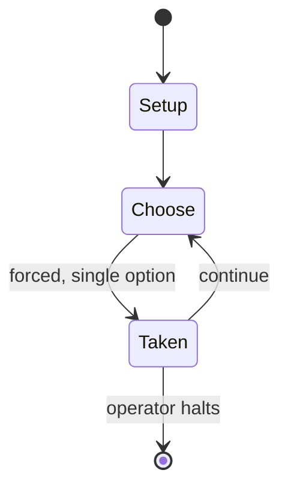

# Oceans

*2020 card game*

`oceans` &nbsp; state: **DEEPENED** &nbsp; method: **heuristic**

## Found layer (recorded, not trusted)

| field | value |
| --- | --- |
| wikidata | Q109827350 |
| wikipedia | Oceans (board game) |
| genres (source) | card game |
| instance of (source) | board game |
| country of origin | United States |

## Declared layer (orders bench work)

| field | value |
| --- | --- |
| year created | 2020 |
| epoch | CONTEMPORARY |
| region | NORTH_AMERICA |
| media | BOARD, CARD |
| players | 2-4 |
| age band | -- |
| exogenous process | -- |
| loss shape | -- |
| live axes | - |
| horizon | OPEN_ENDED |
| scoring shape | -- |
| information | -- |
| interaction | -- |
| turn structure | PHASE_STRUCTURED |
| tractability | SAMPLING_ONLY |
| randomness | -- |
| luck factor | -- |
| rules complexity | 2.5 |
| strategic depth | 2.0 |
| novelty | 0.6247 |
| solved status | -- |
| strategies | -- |
| algorithms | -- |

## Object model

```
Episode
  players      : 2-4
  turn_structure: PHASE_STRUCTURED
  horizon       : OPEN_ENDED
  scoring       : ?

Board          -- spatial substrate; cells carry position and occupancy
Piece          -- movable token owned by a player
Deck           -- ordered multiset, drawn without replacement
Hand           -- private multiset held by one player
DiscardPile    -- public accumulation of spent cards
```

## State transition diagram



## Research item -- turn trace

```
# Oceans -- simulated turn events
# generated from the DECLARED vector, not from a rulebook.
# structure: exo=None loss=None horizon=OPEN_ENDED scoring=None axes=-

t=0    SETUP        players=2  pot=0  capacity=7
t=1    FORCED       p1 single legal option taken (pot_gain=+1.3)
t=2    FORCED       p1 single legal option taken (pot_gain=+0.8)
t=3    FORCED       p1 single legal option taken (pot_gain=+1.6)
t=4    FORCED       p1 single legal option taken (pot_gain=+1.2)
t=5    FORCED       p1 single legal option taken (pot_gain=+0.5)
t=6    FORCED       p1 single legal option taken (pot_gain=+1.4)
t=7    ENDTURN      turn passes to p2
t=8    FORCED       p2 single legal option taken (pot_gain=+0.6)
t=9    FORCED       p2 single legal option taken (pot_gain=+0.7)
t=10   FORCED       p2 single legal option taken (pot_gain=+1.6)
t=11   FORCED       p2 single legal option taken (pot_gain=+1.4)
t=12   FORCED       p2 single legal option taken (pot_gain=+1.1)
t=13   FORCED       p2 single legal option taken (pot_gain=+1.5)
t=14   ENDTURN      turn passes to p1
t=15   FORCED       p1 single legal option taken (pot_gain=+1.3)
t=16   FORCED       p1 single legal option taken (pot_gain=+1.3)
t=17   FORCED       p1 single legal option taken (pot_gain=+0.5)
t=18   ENDTURN      turn passes to p2
t=19   FORCED       p2 single legal option taken (pot_gain=+0.8)
t=20   FORCED       p2 single legal option taken (pot_gain=+0.5)
t=21   FORCED       p2 single legal option taken (pot_gain=+2.0)
t=22   ENDTURN      turn passes to p1
t=23   FORCED       p1 single legal option taken (pot_gain=+1.2)
t=24   ENDTURN      turn passes to p2
t=25   FORCED       p2 single legal option taken (pot_gain=+1.7)
t=26   FORCED       p2 single legal option taken (pot_gain=+1.8)
t=27   ENDTURN      turn passes to p1

terminal: OPEN_ENDED
```

## Conditions

| kind | threshold | effect | trigger |
| --- | --- | --- | --- |
| WIN | -- | -- | The player with the most collective fish tokens in their score pile and on their species boards wins the game. |

## Source extract

Oceans is a nature-themed strategy board game published in 2020 by North Star Games. It is a
game in the Evolution series. The game's development was funded via a crowdfunding campaign on
Kickstarter.   == Gameplay == Unlike its predecessor Evolution, in which players execute their
turns in shared phases, in Oceans players take individual turns to create species by assembling
trait cards. These creatures are released into an aquatic ecosystem where they must obtain food
and avoid becoming prey to other creatures. These are represented by boards that can hold nine
fish (each fish is a "population token"). During the game, the creature may evolve defenses
against predators, and predators may evolve tactics to circumvent those defenses. Up to three
trait cards can be used to evolve a species. The ecosystems are represented by one reef board
and an ocean board with three zones filled with fish tokens. Each turn, the player uses one card
to either evolve an extant species, to create a new one, or to migrate fish from one ocean box
to another. They then feed one of their species, either by "grazing from the reef" ("foraging"),
preying on another species ("attacking") or passively from th

<sub>Wikipedia, CC BY-SA. Retained as evidence for the structural
classification above. Every rule inferred from it is HYPOTHESIZED
until audited against a rulebook.</sub>
