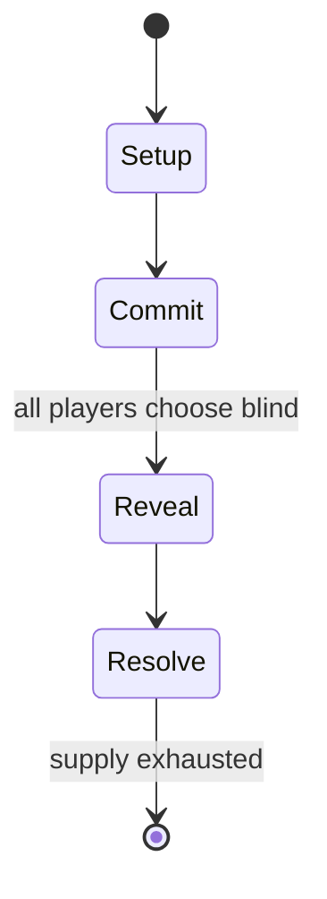

# Odds and evens (hand game)

`odds_and_evens_hand_game` &nbsp; state: **DEEPENED** &nbsp; method: **heuristic**

## Found layer (recorded, not trusted)

| field | value |
| --- | --- |
| wikidata | Q1456815 |
| wikipedia | Odds and evens (hand game) |
| genres (source) | -- |
| instance of (source) | -- |
| country of origin | -- |

## Declared layer (orders bench work)

| field | value |
| --- | --- |
| year created | -- |
| epoch | -- |
| region | -- |
| media | - |
| players | -- |
| age band | -- |
| exogenous process | -- |
| loss shape | -- |
| live axes | COMMIT_BLIND |
| horizon | -- |
| scoring shape | -- |
| information | SIMULTANEOUS |
| interaction | -- |
| turn structure | SIMULTANEOUS |
| tractability | SAMPLING_ONLY |
| randomness | SIMULTANEOUS_CHOICE |
| luck factor | 0.3 |
| rules complexity | 2.05 |
| strategic depth | 2.25 |
| novelty | 0.6299 |
| solved status | -- |
| strategies | probability_estimation |
| algorithms | -- |

## Object model

```
Episode
  players      : ?
  turn_structure: SIMULTANEOUS
  horizon       : ?
  scoring       : ?

SealedChoice   -- irrevocable choice made without observation
```

## State transition diagram



## Research item -- turn trace

```
# Odds and evens (hand game) -- simulated turn events
# generated from the DECLARED vector, not from a rulebook.
# structure: exo=None loss=None horizon=None scoring=None axes=COMMIT_BLIND

t=0    SETUP        players=2  pot=0  capacity=7
t=1    FORCED       p1 single legal option taken (pot_gain=+0.8)
t=2    FORCED       p1 single legal option taken (pot_gain=+0.6)
t=3    ENDTURN      turn passes to p2
t=4    FORCED       p2 single legal option taken (pot_gain=+1.0)
t=5    FORCED       p2 single legal option taken (pot_gain=+1.8)
t=6    FORCED       p2 single legal option taken (pot_gain=+1.1)
t=7    ENDTURN      turn passes to p1
t=8    FORCED       p1 single legal option taken (pot_gain=+1.9)
t=9    FORCED       p1 single legal option taken (pot_gain=+1.1)
t=10   FORCED       p1 single legal option taken (pot_gain=+0.9)
t=11   FORCED       p1 single legal option taken (pot_gain=+0.7)
t=12   FORCED       p1 single legal option taken (pot_gain=+1.2)
t=13   FORCED       p1 single legal option taken (pot_gain=+1.5)
t=14   ENDTURN      turn passes to p2
t=15   FORCED       p2 single legal option taken (pot_gain=+1.6)
t=16   FORCED       p2 single legal option taken (pot_gain=+0.9)
t=17   FORCED       p2 single legal option taken (pot_gain=+1.6)
t=18   FORCED       p2 single legal option taken (pot_gain=+0.6)
t=19   ENDTURN      turn passes to p1
t=20   FORCED       p1 single legal option taken (pot_gain=+1.3)
t=21   ENDTURN      turn passes to p2
t=22   FORCED       p2 single legal option taken (pot_gain=+0.9)
t=23   ENDTURN      turn passes to p1
t=24   FORCED       p1 single legal option taken (pot_gain=+2.0)
t=25   FORCED       p1 single legal option taken (pot_gain=+1.4)
t=26   ENDTURN      turn passes to p2

terminal: VARIABLE
```

## Source extract

Odds and evens is a simple game of chance and hand game, involving two people simultaneously
revealing a number of fingers and winning or losing depending on whether they are odd or even,
or alternatively involving one person picking up coins or other small objects and hiding them in
their closed hand, while another player guesses whether they have an odd or even number. The
game may be used to make a decision or played for fun. The finger game is also known as swords,
choosies, pick, odds-on poke, or bucking up. This zero-sum game, a variation of the ancient
morra and par-impar, is played in Europe, the US, and in Brazil, especially among children.   ==
History ==  This game was known by the Greeks (as artiazein) and Romans (as ludere par impar).
In the 1858 Krünitzlexikon it says: "The game Odds and Evens was very common amongst the Romans
and was played either with tali, tesseris, or money and known as "Alea maior", or with nuts,
beans and almonds and known as "Alea minor"."  A medieval reference is found in the Renner by
Hugo von Trimberg (verse 2695). Odds and Evens (Gerade und Ungerade) is included in the list of
games prohibited in Austria-Hungary in 1904 by the Ministry of

<sub>Wikipedia, CC BY-SA. Retained as evidence for the structural
classification above. Every rule inferred from it is HYPOTHESIZED
until audited against a rulebook.</sub>
