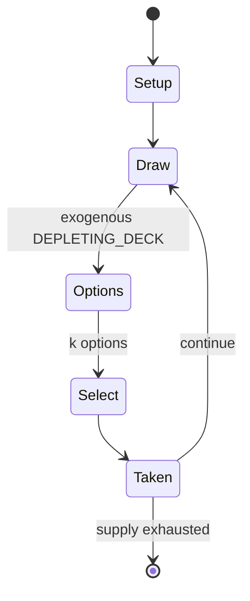

# Oicho-Kabu

*Japanese card game*

`oicho_kabu` &nbsp; state: **DEEPENED** &nbsp; method: **heuristic**

## Found layer (recorded, not trusted)

| field | value |
| --- | --- |
| wikidata | Q3100473 |
| wikipedia | Oicho-Kabu |
| genres (source) | -- |
| instance of (source) | card game |
| country of origin | Japan |

## Declared layer (orders bench work)

| field | value |
| --- | --- |
| year created | -- |
| epoch | -- |
| region | EAST_ASIA |
| media | CARD |
| players | -- |
| age band | -- |
| exogenous process | DEPLETING_DECK |
| loss shape | -- |
| live axes | SELECT |
| horizon | -- |
| scoring shape | -- |
| information | -- |
| interaction | -- |
| turn structure | -- |
| tractability | EXACT_WITH_CUT |
| randomness | DECK_SHUFFLE, HIDDEN_INFO |
| luck factor | 0.53 |
| rules complexity | 2.25 |
| strategic depth | 2.2 |
| novelty | 0.68 |
| solved status | -- |
| strategies | tableau_building |
| algorithms | -- |

## Object model

```
Episode
  players      : ?
  turn_structure: ?
  horizon       : ?
  scoring       : ?

Deck           -- ordered multiset, drawn without replacement
Hand           -- private multiset held by one player
DiscardPile    -- public accumulation of spent cards
OptionSet      -- the choices available after an exogenous draw
```

## State transition diagram



## Research item -- turn trace

```
# Oicho-Kabu -- simulated turn events
# generated from the DECLARED vector, not from a rulebook.
# structure: exo=DEPLETING_DECK loss=None horizon=None scoring=None axes=SELECT

t=0    SETUP        players=2  pot=0  capacity=4
t=1    DRAW         p1 draw from deck -> outcome #1  (p=0.266)
t=2    SELECT       p1 3 options; take #2  (pot_gain=+1.3, capacity=-0)
t=3    ENDTURN      turn passes to p2
t=4    DRAW         p2 draw from deck -> outcome #3  (p=0.011)
t=5    SELECT       p2 3 options; take #1  (pot_gain=+2.4, capacity=-2)
t=6    ENDTURN      turn passes to p1
t=7    DRAW         p1 draw from deck -> outcome #1  (p=0.142)
t=8    SELECT       p1 4 options; take #4  (pot_gain=+1.3, capacity=-0)
t=9    DRAW         p1 draw from deck -> outcome #1  (p=0.118)
t=10   SELECT       p1 2 options; take #2  (pot_gain=+2.9, capacity=-2)
t=11   DRAW         p1 draw from deck -> outcome #2  (p=0.257)
t=12   SELECT       p1 2 options; take #2  (pot_gain=+1.1, capacity=-1)
t=13   DRAW         p1 draw from deck -> outcome #1  (p=0.238)
t=14   SELECT       p1 3 options; take #1  (pot_gain=+3.3, capacity=-2)
t=15   DRAW         p1 draw from deck -> outcome #6  (p=0.065)
t=16   SELECT       p1 3 options; take #2  (pot_gain=+1.7, capacity=-0)
t=17   ENDTURN      turn passes to p2
t=18   DRAW         p2 draw from deck -> outcome #2  (p=0.288)
t=19   SELECT       p2 2 options; take #1  (pot_gain=+1.9, capacity=-1)
t=20   DRAW         p2 draw from deck -> outcome #5  (p=0.176)
t=21   SELECT       p2 4 options; take #2  (pot_gain=+2.7, capacity=-2)
t=22   DRAW         p2 draw from deck -> outcome #5  (p=0.281)
t=23   SELECT       p2 3 options; take #3  (pot_gain=+2.3, capacity=-1)
t=24   DRAW         p2 draw from deck -> outcome #6  (p=0.278)
t=25   SELECT       p2 4 options; take #2  (pot_gain=+0.9, capacity=-2)
t=26   DRAW         p2 draw from deck -> outcome #1  (p=0.088)
t=27   SELECT       p2 4 options; take #2  (pot_gain=+1.3, capacity=-0)

terminal: VARIABLE
```

## Conditions

| kind | threshold | effect | trigger |
| --- | --- | --- | --- |
| BOUNDARY | -- | -- | Before the game starts, the players decide on the domae (胴前), which is the maximum number of points they can bet on. |
| BOUNDARY | -- | -- | This is the maximum limit for the total bets of all the players. |

## Source extract

Oicho-Kabu (おいちょかぶ) is a traditional Japanese card game that is similar to baccarat. It is
typically played with special kabufuda cards.  A hanafuda deck can also be used, if the last two
months are discarded, and Western playing cards can be used if the face cards are removed from
the deck and aces are counted as one. "Oicho-Kabu" derived from Portuguese "Oito-Cabo" which in
English means "Eight-End". As in baccarat, this game also has a dealer, whom the players try to
beat. The goal of the game is to reach 9. As in baccarat, the last digit of any total over 10 is
the hand's score: a 15 counts as 5, a 12 as 2, and a 20 as 0. The worst hands in oicho-kabu have
a value of 0. One of these worst hands is an eight, a nine and a three, phonetically expressed
as "ya-kyu-san". This is the origin of the Japanese word for "gangster", yakuza.   == Gameplay
== Before the game starts, the players decide on the domae (胴前), which is the maximum number of
points they can bet on. This is the maximum limit for the total bets of all the players. For
example, if the domae is 50 points, player A bets 25 points, player B bets 15 points, and player
C bets 10 points, then player D is not allowed to bet s

<sub>Wikipedia, CC BY-SA. Retained as evidence for the structural
classification above. Every rule inferred from it is HYPOTHESIZED
until audited against a rulebook.</sub>
