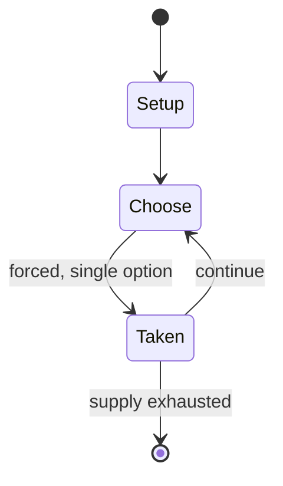

# Okey

*board game*

`okey` &nbsp; state: **DEEPENED** &nbsp; method: **heuristic**

## Found layer (recorded, not trusted)

| field | value |
| --- | --- |
| wikidata | Q903415 |
| wikipedia | Okey |
| genres (source) | -- |
| instance of (source) | board game, tile-based game |
| country of origin | Turkey |

## Declared layer (orders bench work)

| field | value |
| --- | --- |
| year created | -- |
| epoch | -- |
| region | WEST_ASIA |
| media | BOARD, TILE |
| players | -- |
| age band | -- |
| exogenous process | NONE |
| loss shape | OPPORTUNITY_ONLY |
| live axes | DISCARD |
| horizon | -- |
| scoring shape | -- |
| information | PERFECT |
| interaction | -- |
| turn structure | STRICT_TURN |
| tractability | EXACT_WITH_CUT |
| randomness | NONE |
| luck factor | 0.02 |
| rules complexity | 2.26 |
| strategic depth | 2.4 |
| novelty | 0.783 |
| solved status | -- |
| strategies | -- |
| algorithms | -- |

## Object model

```
Episode
  players      : ?
  turn_structure: STRICT_TURN
  horizon       : ?
  scoring       : ?

Board          -- spatial substrate; cells carry position and occupancy
Piece          -- movable token owned by a player
TileBag        -- unordered draw source
Layout         -- placed tiles and their adjacencies
DiscardChoice  -- what is given up to satisfy a limit
```

## State transition diagram



## Research item -- turn trace

```
# Okey -- simulated turn events
# generated from the DECLARED vector, not from a rulebook.
# structure: exo=NONE loss=OPPORTUNITY_ONLY horizon=None scoring=None axes=DISCARD

t=0    SETUP        players=2  pot=0  capacity=4
t=1    FORCED       p1 single legal option taken (pot_gain=+1.0)
t=2    ENDTURN      turn passes to p2
t=3    FORCED       p2 single legal option taken (pot_gain=+1.2)
t=4    FORCED       p2 single legal option taken (pot_gain=+1.7)
t=5    FORCED       p2 single legal option taken (pot_gain=+1.3)
t=6    DISCARD      p2 discards to hand limit
t=7    FORCED       p2 single legal option taken (pot_gain=+0.6)
t=8    DISCARD      p2 discards to hand limit
t=9    FORCED       p2 single legal option taken (pot_gain=+1.2)
t=10   FORCED       p2 single legal option taken (pot_gain=+1.3)
t=11   FORCED       p2 single legal option taken (pot_gain=+1.5)
t=12   FORCED       p2 single legal option taken (pot_gain=+1.9)
t=13   FORCED       p2 single legal option taken (pot_gain=+1.9)
t=14   DISCARD      p2 discards to hand limit
t=15   FORCED       p2 single legal option taken (pot_gain=+1.7)
t=16   DISCARD      p2 discards to hand limit
t=17   FORCED       p2 single legal option taken (pot_gain=+0.8)
t=18   DISCARD      p2 discards to hand limit
t=19   FORCED       p2 single legal option taken (pot_gain=+1.5)
t=20   FORCED       p2 single legal option taken (pot_gain=+1.4)
t=21   ENDTURN      turn passes to p1
t=22   FORCED       p1 single legal option taken (pot_gain=+1.7)
t=23   FORCED       p1 single legal option taken (pot_gain=+1.4)
t=24   FORCED       p1 single legal option taken (pot_gain=+2.0)
t=25   DISCARD      p1 discards to hand limit
t=26   FORCED       p1 single legal option taken (pot_gain=+1.4)

terminal: VARIABLE
```

## Conditions

| kind | threshold | effect | trigger |
| --- | --- | --- | --- |
| PENALTY | 202 penalty | -- | If they have not opened yet they automatically receive 202 penalty points instead. |
| PENALTY | 404 penalty | -- | The player the finished receives 202 minus points and players that have not opened receive 404 penalty points. |
| PENALTY | 808 penalty | -- | In this case, the player that finished receives 404 minus points and all other players receive 808 penalty points. |
| PENALTY | 101 penalty | -- | If a player has a joker left in their hand when another player finishes the round or the round had ended they receive a 101 penalty. |
| PENALTY | 101 penalty | -- | If a player discards the joker they receive a 101 penalty. |
| PENALTY | 101 points | -- | If a player tries to open, but does not have the required 101 points and they have to take back their tiles, they receive a 101 penalty. |
| PENALTY | 101 penalty | -- | If a player throws away a tile that can be added to a set that is already on the table they receive a 101 penalty. |
| PENALTY | 101 penalty | -- | If a player adds multiple tiles on the table and takes them back they receive a 101 penalty. |
| ELIMINATE | -- | -- | Some play that any player whose score reaches zero or less leaves the game, but the other players continue to play. |
| WIN | -- | -- | When all of the rounds have finished, all penalty and minus points of all of the rounds are added together and the player with the fewest points is the winner. |
| TERMINATE | -- | -- | When there are no tiles left in the centre except the single exposed tile, if the next player to play does not want to take the previous player's discard, the play ends because there are no cards left to draw. |
| TERMINATE | -- | -- | If the game ends without any player exposing a winning hand (because there are no tiles left to draw, and the player whose turn it is cannot win by taking the previous discard), then there is no score. |
| BOUNDARY | -- | -- | It is convenient to have at least six in front of the dealer, but this makes no real difference to the game. |
| BOUNDARY | -- | -- | Another type of winning hand consists of having at least seven pairs. |
| BOUNDARY | -- | -- | If the player has a winning hand of groups and runs using at least one joker, they do not have to expose it immediately. |
| PENALTY | -- | -- | A player is allowed to take the discarded tile and then return it and still take from the bank without receiving a penalty. |
| PENALTY | -- | -- | No players receive any penalties. |
| PENALTY | -- | -- | The other players receive penalty points. |
| PENALTY | -- | -- | The other players receive penalty points according to the total value of all of the tiles left in their hand. |
| PENALTY | -- | -- | If he finishes his hand other players receive double penalty points. |
| PENALTY | -- | -- | If another player finishes the round, the player that opened with doubles receive double the value of their remaining tiles in penalty points. |
| PENALTY | -- | -- | Players receive an additional penalty of 101 for the following actions. |
| PENALTY | -- | -- | These penalties are added to the total points for that round. |
| PENALTY | -- | -- | When they have not opened yet they receive the standard total penalty of 202. |

## Source extract

Okey (Turkish pronunciation: [ˈocej]) is a tile-based game, popular in Turkey, of the rummy
family. The aim of the game is to score points against the opposing players by collecting
certain groups of tiles. It is usually played with four players, but can also be played with
only two or three players.   == Setting up the game ==  The 106 tiles are placed face down on
the table and thoroughly mixed. Next, the players stack the tiles face down in groups of 5,
creating a total of 21 stacks. There is no specific rule about how many stacks should be in
front of each player. It is convenient to have at least six in front of the dealer, but this
makes no real difference to the game. One tile remains unstacked and is kept by the dealer
briefly. The dealer is randomly chosen at the start and passes to the right after every round.
The dealer then throws a die to determine on which stack the one remaining tile will be placed
upon. For example if a 6 is thrown, the tile is placed on the sixth stack in front of the dealer
(counting from left). If the number thrown is greater than the number of stacks in front of the
dealer, then the count will continue using the stacks in front of the player to

<sub>Wikipedia, CC BY-SA. Retained as evidence for the structural
classification above. Every rule inferred from it is HYPOTHESIZED
until audited against a rulebook.</sub>
