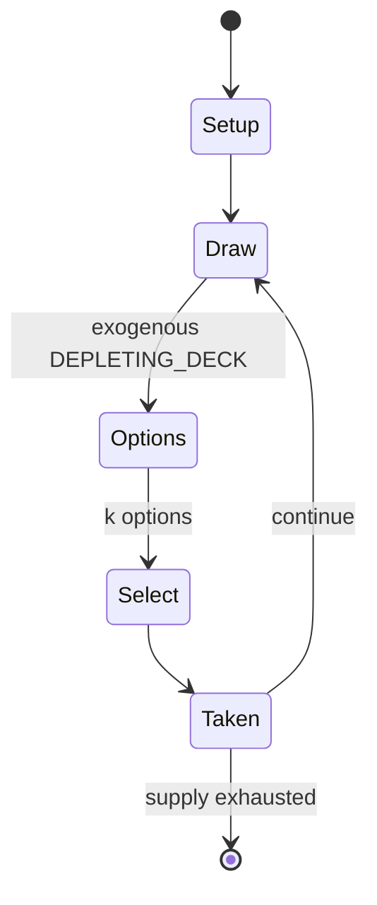

# Old maid (card game)

`old_maid_card_game` &nbsp; state: **DEEPENED** &nbsp; method: **heuristic**

## Found layer (recorded, not trusted)

| field | value |
| --- | --- |
| wikidata | Q476996 |
| wikipedia | Old maid (card game) |
| genres (source) | -- |
| instance of (source) | -- |
| country of origin | -- |

## Declared layer (orders bench work)

| field | value |
| --- | --- |
| year created | -- |
| epoch | -- |
| region | -- |
| media | CARD |
| players | -- |
| age band | -- |
| exogenous process | DEPLETING_DECK |
| loss shape | -- |
| live axes | DISCARD, SELECT |
| horizon | -- |
| scoring shape | -- |
| information | -- |
| interaction | -- |
| turn structure | -- |
| tractability | EXACT_WITH_CUT |
| randomness | DECK_SHUFFLE, HIDDEN_INFO |
| luck factor | 0.53 |
| rules complexity | 2.82 |
| strategic depth | 2.2 |
| novelty | 0.6978 |
| solved status | -- |
| strategies | spatial_packing |
| algorithms | -- |

## Object model

```
Episode
  players      : ?
  turn_structure: ?
  horizon       : ?
  scoring       : ?

Deck           -- ordered multiset, drawn without replacement
Hand           -- private multiset held by one player
DiscardPile    -- public accumulation of spent cards
DiscardChoice  -- what is given up to satisfy a limit
OptionSet      -- the choices available after an exogenous draw
```

## State transition diagram



## Research item -- turn trace

```
# Old maid (card game) -- simulated turn events
# generated from the DECLARED vector, not from a rulebook.
# structure: exo=DEPLETING_DECK loss=None horizon=None scoring=None axes=DISCARD,SELECT

t=0    SETUP        players=2  pot=0  capacity=3
t=1    DRAW         p1 draw from deck -> outcome #2  (p=0.293)
t=2    SELECT       p1 4 options; take #2  (pot_gain=+2.4, capacity=-0)
t=3    DISCARD      p1 discards to hand limit
t=4    DRAW         p1 draw from deck -> outcome #4  (p=0.070)
t=5    SELECT       p1 1 options; take #1  (pot_gain=+1.9, capacity=-1)
t=6    ENDTURN      turn passes to p2
t=7    DRAW         p2 draw from deck -> outcome #2  (p=0.251)
t=8    SELECT       p2 2 options; take #1  (pot_gain=+1.2, capacity=-2)
t=9    DISCARD      p2 discards to hand limit
t=10   ENDTURN      turn passes to p1
t=11   DRAW         p1 draw from deck -> outcome #1  (p=0.120)
t=12   SELECT       p1 4 options; take #3  (pot_gain=+3.2, capacity=-0)
t=13   DISCARD      p1 discards to hand limit
t=14   DRAW         p1 draw from deck -> outcome #4  (p=0.063)
t=15   SELECT       p1 1 options; take #1  (pot_gain=+2.6, capacity=-0)
t=16   DISCARD      p1 discards to hand limit
t=17   ENDTURN      turn passes to p2
t=18   DRAW         p2 draw from deck -> outcome #1  (p=0.156)
t=19   SELECT       p2 4 options; take #4  (pot_gain=+2.1, capacity=-2)
t=20   DRAW         p2 draw from deck -> outcome #1  (p=0.269)
t=21   SELECT       p2 2 options; take #1  (pot_gain=+0.6, capacity=-0)
t=22   ENDTURN      turn passes to p1
t=23   DRAW         p1 draw from deck -> outcome #1  (p=0.265)
t=24   SELECT       p1 1 options; take #1  (pot_gain=+2.3, capacity=-0)
t=25   DRAW         p1 draw from deck -> outcome #3  (p=0.208)
t=26   SELECT       p1 3 options; take #1  (pot_gain=+3.5, capacity=-0)

terminal: VARIABLE
```

## Conditions

| kind | threshold | effect | trigger |
| --- | --- | --- | --- |
| WIN | -- | -- | The first player to shed all her cards wins the game. |
| PENALTY | -- | -- | The aims were threefold: to wed as many couples as possible, to make a match between Father Christmas and Mrs Bond, and to avoid being left with Mistress Mary, the penalty for which was to give every other player 2 count |
| PENALTY | -- | -- | If the loser draws a red card, they receive soft raps; if a black card, hard raps. |

## Source extract

Old Maid is a 19th-century American card game for two or more players, presumed to have derived
from an ancient European gambling game in which the loser pays for the drinks.   == History ==
The rules of the game are first recorded in a book for girls by Eliza Leslie, who published them
in America in 1831 and England in 1835 under the names Old Maid (when played by girls) or Old
Bachelor (when played by boys). However, it may well be older and derived from the German game
of Black Peter, whose rules are recorded as early as 1821. Meanwhile the rules of the French
game, Vieux Garçon, first appear in 1853. All these games are probably ancient and derived from
simple gambling games in which the aim was to determine a loser who had to pay for the next
round of drinks (cf. drinking game).  These games originally employed a pack of 32 or 52 French
cards, the queen of diamonds or jack of spades typically being the odd card and the player who
is last in and left holding a single queen or jack becoming the "old maid", "vieux garçon", or
"Black Peter" depending on the game.  The term "old maid" predates the game and referred to a
childless or unmarried woman. In its day it was seen as the eq

<sub>Wikipedia, CC BY-SA. Retained as evidence for the structural
classification above. Every rule inferred from it is HYPOTHESIZED
until audited against a rulebook.</sub>
