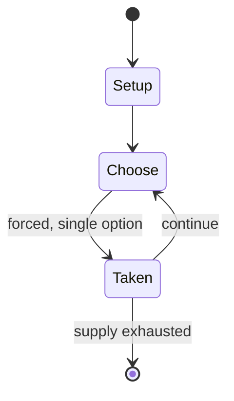

# Ollo in the Sunny Valley Fair

`ollo_in_the_sunny_valley_fair` &nbsp; state: **DEEPENED** &nbsp; method: **heuristic**

## Found layer (recorded, not trusted)

| field | value |
| --- | --- |
| wikidata | Q23305905 |
| wikipedia | Ollo in the Sunny Valley Fair |
| genres (source) | -- |
| instance of (source) | -- |
| country of origin | -- |

## Declared layer (orders bench work)

| field | value |
| --- | --- |
| year created | -- |
| epoch | -- |
| region | -- |
| media | PUZZLE |
| players | -- |
| age band | -- |
| exogenous process | -- |
| loss shape | -- |
| live axes | TRADE |
| horizon | -- |
| scoring shape | -- |
| information | -- |
| interaction | NEGOTIATION |
| turn structure | -- |
| tractability | INTRACTABLE |
| randomness | -- |
| luck factor | 0.35 |
| rules complexity | 2.47 |
| strategic depth | 2.0 |
| novelty | 0.9473 |
| solved status | -- |
| strategies | -- |
| algorithms | -- |

## Object model

```
Episode
  players      : ?
  turn_structure: ?
  horizon       : ?
  scoring       : ?

Configuration  -- the arrangement to be resolved
Constraint     -- predicate a legal configuration must satisfy
Offer          -- proposed exchange between two agents
```

## State transition diagram



## Research item -- turn trace

```
# Ollo in the Sunny Valley Fair -- simulated turn events
# generated from the DECLARED vector, not from a rulebook.
# structure: exo=None loss=None horizon=None scoring=None axes=TRADE

t=0    SETUP        players=2  pot=0  capacity=3
t=1    FORCED       p1 single legal option taken (pot_gain=+0.8)
t=2    TRADE        p1 offers 2:1 exchange to p2
t=3    FORCED       p1 single legal option taken (pot_gain=+0.9)
t=4    TRADE        p1 offers 2:1 exchange to p2
t=5    FORCED       p1 single legal option taken (pot_gain=+1.6)
t=6    TRADE        p1 offers 2:1 exchange to p2
t=7    ENDTURN      turn passes to p2
t=8    FORCED       p2 single legal option taken (pot_gain=+0.7)
t=9    TRADE        p2 offers 2:1 exchange to p1
t=10   ENDTURN      turn passes to p1
t=11   FORCED       p1 single legal option taken (pot_gain=+1.5)
t=12   FORCED       p1 single legal option taken (pot_gain=+1.8)
t=13   ENDTURN      turn passes to p2
t=14   FORCED       p2 single legal option taken (pot_gain=+0.9)
t=15   TRADE        p2 offers 2:1 exchange to p1
t=16   FORCED       p2 single legal option taken (pot_gain=+1.6)
t=17   FORCED       p2 single legal option taken (pot_gain=+1.1)
t=18   TRADE        p2 offers 2:1 exchange to p1
t=19   FORCED       p2 single legal option taken (pot_gain=+1.7)
t=20   FORCED       p2 single legal option taken (pot_gain=+1.9)
t=21   TRADE        p2 offers 2:1 exchange to p1
t=22   FORCED       p2 single legal option taken (pot_gain=+0.5)
t=23   FORCED       p2 single legal option taken (pot_gain=+1.8)
t=24   TRADE        p2 offers 2:1 exchange to p1
t=25   FORCED       p2 single legal option taken (pot_gain=+1.8)
t=26   TRADE        p2 offers 2:1 exchange to p1
t=27   ENDTURN      turn passes to p1

terminal: VARIABLE
```

## Source extract

Ollo in the Sunny Valley Fair is a 2002 point-and-click adventure game produced by Hulabee
Entertainment and published by Plaid Banana Entertainment.   == Plot == Ollo is helping Rose, a
friend of his, grow a tomato for the annual fair. The tomato becomes gigantic and belts down to
the Valley destroying everything in its path. Ollo has to help everyone put everything back
together and capture the tomato.   == Gameplay == The game allows the player to pick up items,
go to different locations, listen to characters, and find trivial click points. Clicking on an
item allows the player to drag it over the screen. Clicking on a certain place while holding an
object allows Ollo to use it. Most puzzles require the player to make exchanges with characters
and trade items.   == Development == Ollo in the Sunny Valley Fair was the second game published
by Plaid Banana Entertainment and the third game developed by Hulabee Entertainment. It was
written by Dave Grossman. Ben Hochberg was the music composer. Ollo in the Sunny Valley Fair was
designed by Mike Paganini, who was also the art lead, and Shannon Romano, who was also the
program lead. Aimee Paganini was the producer. Ron Gilbert was the

<sub>Wikipedia, CC BY-SA. Retained as evidence for the structural
classification above. Every rule inferred from it is HYPOTHESIZED
until audited against a rulebook.</sub>
