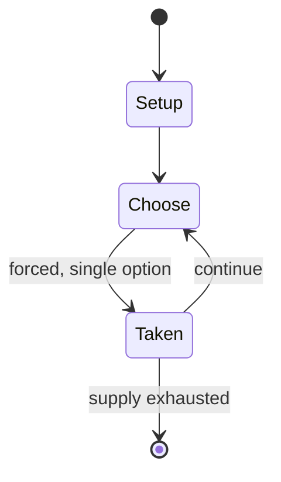

# Olympiade Mathématique Belge

*mathematical competition*

`olympiade_math_matique_belge` &nbsp; state: **DEEPENED** &nbsp; method: **heuristic**

## Found layer (recorded, not trusted)

| field | value |
| --- | --- |
| wikidata | Q1018394 |
| wikipedia | Olympiade Mathématique Belge |
| genres (source) | -- |
| instance of (source) | mathematics competition |
| country of origin | -- |

## Declared layer (orders bench work)

| field | value |
| --- | --- |
| year created | 1976 |
| epoch | DIGITAL |
| region | -- |
| media | - |
| players | -- |
| age band | -- |
| exogenous process | -- |
| loss shape | -- |
| live axes | - |
| horizon | -- |
| scoring shape | -- |
| information | -- |
| interaction | COMPETITIVE |
| turn structure | -- |
| tractability | SAMPLING_ONLY |
| randomness | -- |
| luck factor | 0.35 |
| rules complexity | 1.72 |
| strategic depth | 2.0 |
| novelty | 0.3117 |
| solved status | -- |
| strategies | -- |
| algorithms | -- |

## Object model

```
Episode
  players      : ?
  turn_structure: ?
  horizon       : ?
  scoring       : ?

State          -- opaque; no medium or axis evidence was found
Player         -- an agent that selects among legal successors
```

## State transition diagram



## Research item -- turn trace

```
# Olympiade Mathématique Belge -- simulated turn events
# generated from the DECLARED vector, not from a rulebook.
# structure: exo=None loss=None horizon=None scoring=None axes=-

t=0    SETUP        players=2  pot=0  capacity=4
t=1    FORCED       p1 single legal option taken (pot_gain=+1.7)
t=2    FORCED       p1 single legal option taken (pot_gain=+1.7)
t=3    FORCED       p1 single legal option taken (pot_gain=+0.7)
t=4    FORCED       p1 single legal option taken (pot_gain=+1.7)
t=5    FORCED       p1 single legal option taken (pot_gain=+1.4)
t=6    FORCED       p1 single legal option taken (pot_gain=+1.7)
t=7    FORCED       p1 single legal option taken (pot_gain=+1.2)
t=8    FORCED       p1 single legal option taken (pot_gain=+0.9)
t=9    FORCED       p1 single legal option taken (pot_gain=+1.7)
t=10   FORCED       p1 single legal option taken (pot_gain=+0.8)
t=11   FORCED       p1 single legal option taken (pot_gain=+0.9)
t=12   FORCED       p1 single legal option taken (pot_gain=+0.8)
t=13   FORCED       p1 single legal option taken (pot_gain=+1.8)
t=14   FORCED       p1 single legal option taken (pot_gain=+1.8)
t=15   ENDTURN      turn passes to p2
t=16   FORCED       p2 single legal option taken (pot_gain=+1.4)
t=17   ENDTURN      turn passes to p1
t=18   FORCED       p1 single legal option taken (pot_gain=+0.7)
t=19   FORCED       p1 single legal option taken (pot_gain=+1.3)
t=20   ENDTURN      turn passes to p2
t=21   FORCED       p2 single legal option taken (pot_gain=+1.6)
t=22   FORCED       p2 single legal option taken (pot_gain=+0.8)
t=23   FORCED       p2 single legal option taken (pot_gain=+0.6)
t=24   ENDTURN      turn passes to p1
t=25   FORCED       p1 single legal option taken (pot_gain=+0.5)
t=26   ENDTURN      turn passes to p2

terminal: VARIABLE
```

## Source extract

The Olympiade Mathématique Belge (English: Belgian Mathematical Olympiad; OMB) is a mathematical
competition for students in grades 7 to 12, organised each year since 1976. Only students from
the French community participate, Dutch-speaking students can compete in the Vlaamse Wiskunde
Olympiade. The competition is split up into three age categories:  Mini-Olympiade for grades 7
and 8 Midi-Olympiade for grades 9 and 10 Maxi-Olympiade for grades 11 and 12 Among the
participants, three are selected to represent Belgium in the International Mathematical
Olympiad, together with three students selected through the Vlaamse Wiskunde Olympiade. These
three participants were chosen through a series of contests. The first round is the «
éliminatoire » in which anyone who is eligible to participate in their own category can. Out of
these students, about 10% of the highest-scoring ones are selected to participate in the «
demi-finale ». In this round, a similar multiple-choice test (almost identical in layout to the
first round) is given to the contestants. Out of the top scorers from this round, participants
are invited to take part in the « finale ». In this final test, 4 or 5 questions are

<sub>Wikipedia, CC BY-SA. Retained as evidence for the structural
classification above. Every rule inferred from it is HYPOTHESIZED
until audited against a rulebook.</sub>
