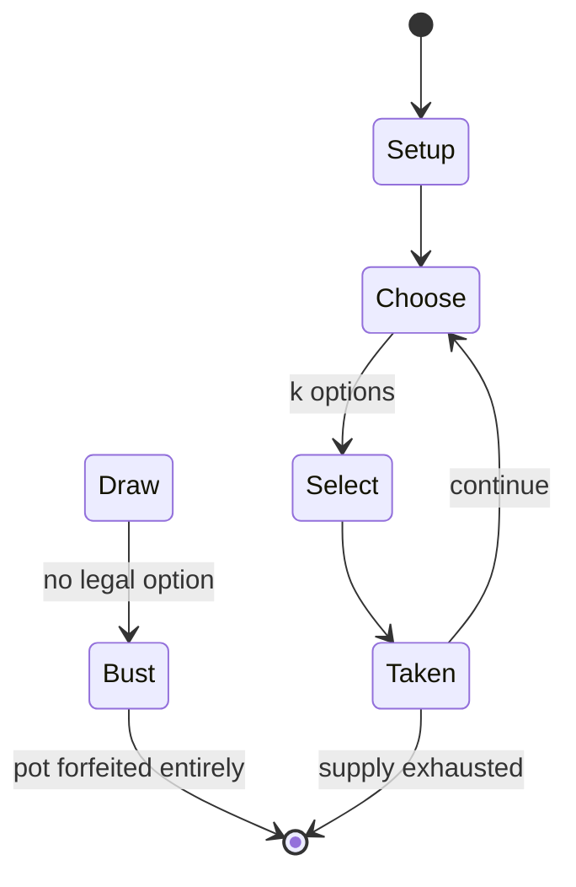

# Omerta

*2003 video game*

`omerta` &nbsp; state: **DEEPENED** &nbsp; method: **heuristic**

## Found layer (recorded, not trusted)

| field | value |
| --- | --- |
| wikidata | Q2099056 |
| wikipedia | Omerta (video game) |
| genres (source) | action game |
| instance of (source) | video game |
| country of origin | Netherlands |

## Declared layer (orders bench work)

| field | value |
| --- | --- |
| year created | 2003 |
| epoch | CONTEMPORARY |
| region | EUROPE_WEST |
| media | GAMBLING, VIDEO |
| players | -- |
| age band | -- |
| exogenous process | -- |
| loss shape | TOTAL_RUIN |
| live axes | SELECT |
| horizon | -- |
| scoring shape | -- |
| information | -- |
| interaction | TRAITOR |
| turn structure | -- |
| tractability | SAMPLING_ONLY |
| randomness | -- |
| luck factor | 0.35 |
| rules complexity | 2.64 |
| strategic depth | 2.25 |
| novelty | 0.6739 |
| solved status | -- |
| strategies | coalition_forming |
| algorithms | -- |

## Object model

```
Episode
  players      : ?
  turn_structure: ?
  horizon       : ?
  scoring       : ?

WorldState     -- simulation state advanced by the engine
Avatar         -- player-controlled agent
Clock          -- frame or tick counter
OptionSet      -- the choices available after an exogenous draw
```

## State transition diagram



## Research item -- turn trace

```
# Omerta -- simulated turn events
# generated from the DECLARED vector, not from a rulebook.
# structure: exo=None loss=TOTAL_RUIN horizon=None scoring=None axes=SELECT

t=0    SETUP        players=2  pot=0  capacity=5
t=1    SELECT       p1 4 options; take #4  (pot_gain=+3.1, capacity=-2)
t=2    SELECT       p1 2 options; take #2  (pot_gain=+1.2, capacity=-1)
t=3    ENDTURN      turn passes to p2
t=4    SELECT       p2 1 options; take #1  (pot_gain=+3.1, capacity=-1)
t=5    DEATH        p2 no legal option -- BUST. pot 7.4 -> 0.0
t=6    NOTE         loss_shape=TOTAL_RUIN: entire pot forfeited

terminal: VARIABLE
```

## Conditions

| kind | threshold | effect | trigger |
| --- | --- | --- | --- |
| BOUNDARY | -- | -- | Players would request a maximum of eleven webpages per minute, or purchase an unlock-code which raised the click-limit to 40 webpages per minute. |

## Source extract

Omerta is a browser-based text MMORPG that launched in 2003. The player takes control of an
American gangster in the 1930s, who must work their way up the ranks of organized crime by
stealing cars, committing crimes, breaking people out of prison, and dealing alcohol and
narcotics.   == Development == Omerta was launched publicly on 26 September 2003 with the first
version, now known as Omerta 1.0. This version was written by Moritz Daan in Groningen. During
the 16-year run of Omerta, there have been about 38 million player registrations. In January
2008, Omerta moved to a new service provider with 20 servers running the FreeBSD operating
system. In July 2009 version 3.0 of Omerta was released. In the first month after the release
more than 100,000 players registered. Following several intermediate versions, in February 2013
version 4.0 was released with enhanced game-play and a modern graphical style replaced the
original frame-based standard web layout. Version 5.0 has been the current build since 2015.
== Gameplay == Omerta is a strategic massively multiplayer online role playing game where
players undertake criminal activities to earn money and experience. Each player establi

<sub>Wikipedia, CC BY-SA. Retained as evidence for the structural
classification above. Every rule inferred from it is HYPOTHESIZED
until audited against a rulebook.</sub>
