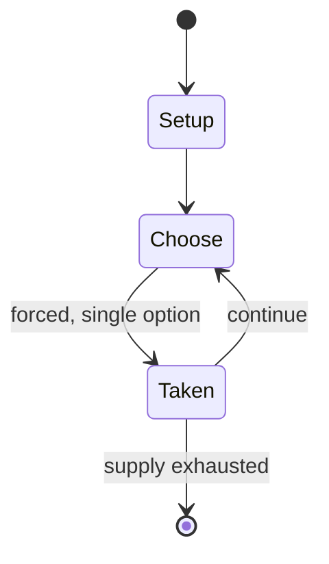

# Omweso

`omweso` &nbsp; state: **DEEPENED** &nbsp; method: **heuristic**

## Found layer (recorded, not trusted)

| field | value |
| --- | --- |
| wikidata | Q3656653 |
| wikipedia | Omweso |
| genres (source) | -- |
| instance of (source) | -- |
| country of origin | -- |

## Declared layer (orders bench work)

| field | value |
| --- | --- |
| year created | -- |
| epoch | -- |
| region | -- |
| media | MANCALA |
| players | -- |
| age band | -- |
| exogenous process | -- |
| loss shape | -- |
| live axes | - |
| horizon | -- |
| scoring shape | -- |
| information | -- |
| interaction | COMPETITIVE |
| turn structure | -- |
| tractability | SAMPLING_ONLY |
| randomness | -- |
| luck factor | 0.35 |
| rules complexity | 1.84 |
| strategic depth | 2.0 |
| novelty | 0.3553 |
| solved status | -- |
| strategies | -- |
| algorithms | -- |

## Object model

```
Episode
  players      : ?
  turn_structure: ?
  horizon       : ?
  scoring       : ?

Pits           -- cyclic array of counts
Store          -- player's banked seeds
```

## State transition diagram



## Research item -- turn trace

```
# Omweso -- simulated turn events
# generated from the DECLARED vector, not from a rulebook.
# structure: exo=None loss=None horizon=None scoring=None axes=-

t=0    SETUP        players=2  pot=0  capacity=4
t=1    FORCED       p1 single legal option taken (pot_gain=+0.6)
t=2    FORCED       p1 single legal option taken (pot_gain=+1.0)
t=3    ENDTURN      turn passes to p2
t=4    FORCED       p2 single legal option taken (pot_gain=+0.9)
t=5    FORCED       p2 single legal option taken (pot_gain=+0.9)
t=6    FORCED       p2 single legal option taken (pot_gain=+1.0)
t=7    FORCED       p2 single legal option taken (pot_gain=+1.9)
t=8    FORCED       p2 single legal option taken (pot_gain=+2.0)
t=9    FORCED       p2 single legal option taken (pot_gain=+0.8)
t=10   FORCED       p2 single legal option taken (pot_gain=+1.0)
t=11   FORCED       p2 single legal option taken (pot_gain=+0.8)
t=12   FORCED       p2 single legal option taken (pot_gain=+1.5)
t=13   ENDTURN      turn passes to p1
t=14   FORCED       p1 single legal option taken (pot_gain=+2.0)
t=15   ENDTURN      turn passes to p2
t=16   FORCED       p2 single legal option taken (pot_gain=+1.4)
t=17   ENDTURN      turn passes to p1
t=18   FORCED       p1 single legal option taken (pot_gain=+0.8)
t=19   FORCED       p1 single legal option taken (pot_gain=+1.2)
t=20   ENDTURN      turn passes to p2
t=21   FORCED       p2 single legal option taken (pot_gain=+1.8)
t=22   ENDTURN      turn passes to p1
t=23   FORCED       p1 single legal option taken (pot_gain=+1.8)
t=24   FORCED       p1 single legal option taken (pot_gain=+0.6)
t=25   ENDTURN      turn passes to p2
t=26   FORCED       p2 single legal option taken (pot_gain=+1.7)
t=27   ENDTURN      turn passes to p1

terminal: VARIABLE
```

## Conditions

| kind | threshold | effect | trigger |
| --- | --- | --- | --- |
| WIN | -- | -- | The normal way to win the game is to be the last player to be able to make a legal move, possible by capturing all an opponent's stones or reducing the opponent to no more than one seed in each pit. |
| WIN | -- | -- | The normal way to win the game is to be the last player left with a legal move. |
| BOUNDARY | -- | -- | A player moves by selecting a pit with at least two seeds, and sowing them one by one around their side of the board in a counter-clockwise direction from the starting pit. |

## Source extract

Omweso (sometimes shortened to Mweso) is the traditional mancala game of the Ugandan people. The
game was supposedly introduced by the Bachwezi people of the ancient Bunyoro-kitara empire of
Uganda. Nowadays the game is played and enjoyed by people from various parts of Uganda. The
equipment needed for the game is essentially the same as that of the Bao game (found in Tanzania
and neighbouring countries). Omweso is strictly related to a wide family of mancalas found in
eastern and southern Africa; these include Coro in the Lango region of Uganda, Aweet in Sudan,
ǁHus in Namibia, Kombe in Lamu (Kenya), Mongale in Mombasa (Kenya), Mongola in Congo, Igisoro in
Rwanda, and Kiela in Angola. The name "Omweso" is derived from Swahili word michezo, which means
"game". Omweso, as the Baganda call it is also known as vulumula in Busoga, ascoro/soro to the
Luo, amwesor to the Itesots, coro to the Lango and ekibuguzo to the Rwandese. It is the same
game almost similar rules but with different names.   == Rules ==   === Equipment ===  Omweso
requires a board of 32 pits, arranged with eight pits lengthwise towards the players, and four
pits deep.  Each player's territory is the 16 pits on their

<sub>Wikipedia, CC BY-SA. Retained as evidence for the structural
classification above. Every rule inferred from it is HYPOTHESIZED
until audited against a rulebook.</sub>
