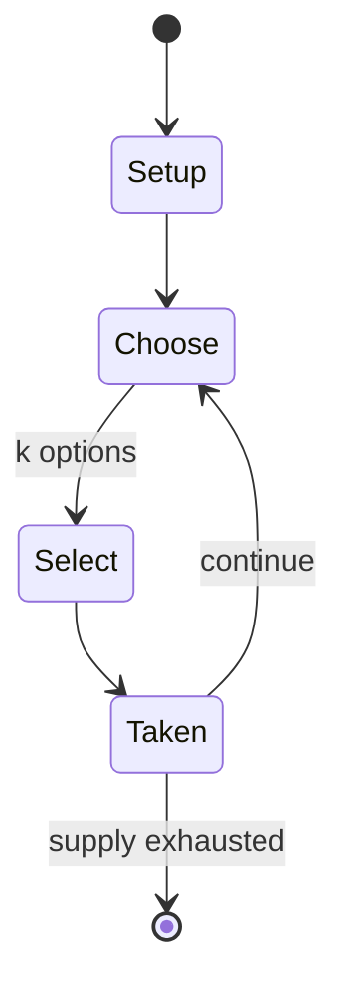

# One Piece Card Game

*collectible card game*

`one_piece_card_game` &nbsp; state: **DEEPENED** &nbsp; method: **heuristic**

## Found layer (recorded, not trusted)

| field | value |
| --- | --- |
| wikidata | Q135267848 |
| wikipedia | One Piece Card Game |
| genres (source) | -- |
| instance of (source) | collectible card game |
| country of origin | -- |

## Declared layer (orders bench work)

| field | value |
| --- | --- |
| year created | -- |
| epoch | -- |
| region | -- |
| media | CARD, COLLECTIBLE |
| players | -- |
| age band | -- |
| exogenous process | -- |
| loss shape | -- |
| live axes | SELECT, TRADE |
| horizon | -- |
| scoring shape | -- |
| information | -- |
| interaction | COMPETITIVE |
| turn structure | -- |
| tractability | SAMPLING_ONLY |
| randomness | -- |
| luck factor | 0.35 |
| rules complexity | 2.33 |
| strategic depth | 2.0 |
| novelty | 0.3499 |
| solved status | -- |
| strategies | -- |
| algorithms | -- |

## Object model

```
Episode
  players      : ?
  turn_structure: ?
  horizon       : ?
  scoring       : ?

Deck           -- ordered multiset, drawn without replacement
Hand           -- private multiset held by one player
DiscardPile    -- public accumulation of spent cards
OptionSet      -- the choices available after an exogenous draw
Offer          -- proposed exchange between two agents
```

## State transition diagram



## Research item -- turn trace

```
# One Piece Card Game -- simulated turn events
# generated from the DECLARED vector, not from a rulebook.
# structure: exo=None loss=None horizon=None scoring=None axes=SELECT,TRADE

t=0    SETUP        players=2  pot=0  capacity=5
t=1    SELECT       p1 3 options; take #2  (pot_gain=+2.8, capacity=-0)
t=2    ENDTURN      turn passes to p2
t=3    SELECT       p2 2 options; take #1  (pot_gain=+3.1, capacity=-1)
t=4    SELECT       p2 4 options; take #4  (pot_gain=+0.8, capacity=-2)
t=5    ENDTURN      turn passes to p1
t=6    SELECT       p1 2 options; take #1  (pot_gain=+3.3, capacity=-1)
t=7    ENDTURN      turn passes to p2
t=8    SELECT       p2 1 options; take #1  (pot_gain=+1.3, capacity=-2)
t=9    SELECT       p2 3 options; take #2  (pot_gain=+2.0, capacity=-2)
t=10   SELECT       p2 4 options; take #3  (pot_gain=+2.9, capacity=-0)
t=11   TRADE        p2 offers 2:1 exchange to p1
t=12   SELECT       p2 3 options; take #3  (pot_gain=+3.1, capacity=-1)
t=13   TRADE        p2 offers 2:1 exchange to p1
t=14   SELECT       p2 3 options; take #1  (pot_gain=+1.0, capacity=-0)
t=15   TRADE        p2 offers 2:1 exchange to p1
t=16   ENDTURN      turn passes to p1
t=17   SELECT       p1 1 options; take #1  (pot_gain=+0.8, capacity=-2)
t=18   SELECT       p1 4 options; take #4  (pot_gain=+2.2, capacity=-1)
t=19   SELECT       p1 1 options; take #1  (pot_gain=+2.8, capacity=-0)
t=20   SELECT       p1 2 options; take #1  (pot_gain=+3.2, capacity=-1)
t=21   TRADE        p1 offers 2:1 exchange to p2
t=22   SELECT       p1 1 options; take #1  (pot_gain=+1.9, capacity=-1)
t=23   SELECT       p1 2 options; take #2  (pot_gain=+1.3, capacity=-2)
t=24   ENDTURN      turn passes to p2
t=25   SELECT       p2 4 options; take #2  (pot_gain=+1.9, capacity=-1)
t=26   SELECT       p2 3 options; take #2  (pot_gain=+1.4, capacity=-0)
t=27   ENDTURN      turn passes to p1

terminal: VARIABLE
```

## Source extract

One Piece Card Game is a collectible card game based on the manga One Piece. The One Piece Card
Game most resembles the Dragon Ball Super Card Game and Hearthstone. Bandai has created an
official free tutorial app that teaches the basics of gameplay.   == Development and publication
== The One Piece Card Game is a new and separate card game to the previously released One Piece
card game, which was also produced by Bandai. The new card game was released by Bandai in Japan
on July 8, 2022, and globally on December 2, 2022. The launch included four themed-starter decks
based on different groups from the series: the Straw Hat Crew, the Worst Generation, the Seven
Warlords of the Sea, and the Animal Kingdom Pirates. Manga creator Eiichiro Oda confirms the use
of manga art in the card game. Moreover, a unique set of cards based on characters featured in
Netflix's live-action adaptation of the anime. An important part of the development of the One
Piece Card Game has been its organized competitive scene, operated through official tournaments
held by Bandai. Since the game's release, regional and international championships have been
organized, featuring competitive events where players ca

<sub>Wikipedia, CC BY-SA. Retained as evidence for the structural
classification above. Every rule inferred from it is HYPOTHESIZED
until audited against a rulebook.</sub>
