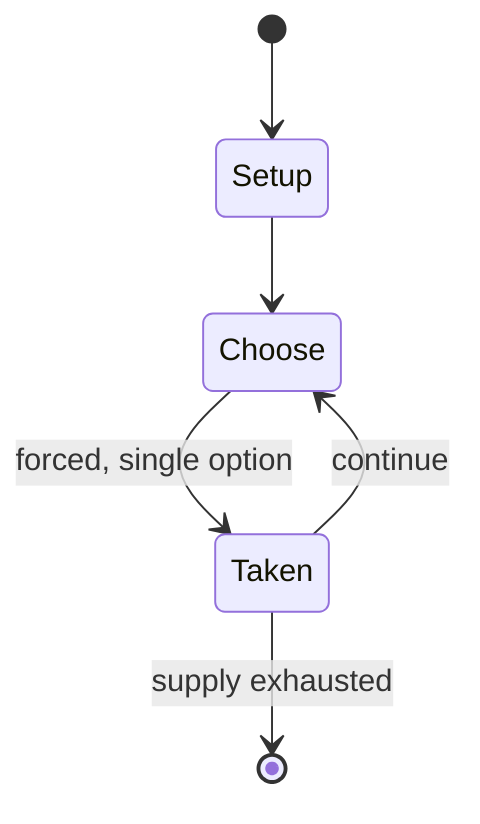

# One potato, two potato

*children's counting-out rhyme*

`one_potato_two_potato` &nbsp; state: **DEEPENED** &nbsp; method: **heuristic**

## Found layer (recorded, not trusted)

| field | value |
| --- | --- |
| wikidata | Q108392498 |
| wikipedia | One potato, two potato |
| genres (source) | traditional folk song |
| instance of (source) | counting-out game |
| country of origin | -- |

## Declared layer (orders bench work)

| field | value |
| --- | --- |
| year created | -- |
| epoch | -- |
| region | -- |
| media | - |
| players | -- |
| age band | -- |
| exogenous process | -- |
| loss shape | -- |
| live axes | - |
| horizon | -- |
| scoring shape | -- |
| information | -- |
| interaction | -- |
| turn structure | STRICT_TURN |
| tractability | SAMPLING_ONLY |
| randomness | -- |
| luck factor | 0.35 |
| rules complexity | 1.71 |
| strategic depth | 2.0 |
| novelty | 0.4408 |
| solved status | -- |
| strategies | -- |
| algorithms | -- |

## Object model

```
Episode
  players      : ?
  turn_structure: STRICT_TURN
  horizon       : ?
  scoring       : ?

State          -- opaque; no medium or axis evidence was found
Player         -- an agent that selects among legal successors
```

## State transition diagram



## Research item -- turn trace

```
# One potato, two potato -- simulated turn events
# generated from the DECLARED vector, not from a rulebook.
# structure: exo=None loss=None horizon=None scoring=None axes=-

t=0    SETUP        players=2  pot=0  capacity=4
t=1    FORCED       p1 single legal option taken (pot_gain=+1.4)
t=2    ENDTURN      turn passes to p2
t=3    FORCED       p2 single legal option taken (pot_gain=+0.9)
t=4    ENDTURN      turn passes to p1
t=5    FORCED       p1 single legal option taken (pot_gain=+1.4)
t=6    ENDTURN      turn passes to p2
t=7    FORCED       p2 single legal option taken (pot_gain=+1.6)
t=8    ENDTURN      turn passes to p1
t=9    FORCED       p1 single legal option taken (pot_gain=+0.9)
t=10   FORCED       p1 single legal option taken (pot_gain=+1.3)
t=11   ENDTURN      turn passes to p2
t=12   FORCED       p2 single legal option taken (pot_gain=+1.4)
t=13   FORCED       p2 single legal option taken (pot_gain=+0.8)
t=14   ENDTURN      turn passes to p1
t=15   FORCED       p1 single legal option taken (pot_gain=+1.0)
t=16   FORCED       p1 single legal option taken (pot_gain=+0.8)
t=17   FORCED       p1 single legal option taken (pot_gain=+2.0)
t=18   FORCED       p1 single legal option taken (pot_gain=+1.5)
t=19   FORCED       p1 single legal option taken (pot_gain=+1.7)
t=20   FORCED       p1 single legal option taken (pot_gain=+1.5)
t=21   FORCED       p1 single legal option taken (pot_gain=+1.6)
t=22   FORCED       p1 single legal option taken (pot_gain=+0.7)
t=23   ENDTURN      turn passes to p2
t=24   FORCED       p2 single legal option taken (pot_gain=+1.2)
t=25   FORCED       p2 single legal option taken (pot_gain=+2.0)
t=26   FORCED       p2 single legal option taken (pot_gain=+1.0)

terminal: VARIABLE
```

## Source extract

"One potato, two potato" (sometimes "One potato, two potatoes") is a traditional children's
counting-out rhyme with accompanying hand actions. It has a Roud number of 19230.   == Text ==
The rhyme has been recorded in a large number of variants, but often consists of or starts with
these lines:  The Dictionary of English Folklore (2000) lists the rhyme as "common all over
Britain, USA, Canada and Australia". Its origins are unknown, but there seems to be no record
earlier than 1885, when it was noted in Nova Scotia, Canada.   == Variants == There are many
recorded variants of the rhyme, some of which prefer the plural "One potato, two potatoes", and
others which substitute "spud", "tate" or "apple" for "potato". One collected variant ends
"[...] seven potato, raw". Multiple continuations also exist, including "[...] Eight potato,
nine potato, ten potato all / One, two, three, four, five, six, seven, eight, nine, ten" and
"One bad spud!" (collected by Steve Roud).   == Actions == In one version, on the command "spuds
up!" the children to be counted out extend clenched fists. One child recites the rhyme while
using their own fist to tap each of the others in turn. The child whose fi

<sub>Wikipedia, CC BY-SA. Retained as evidence for the structural
classification above. Every rule inferred from it is HYPOTHESIZED
until audited against a rulebook.</sub>
