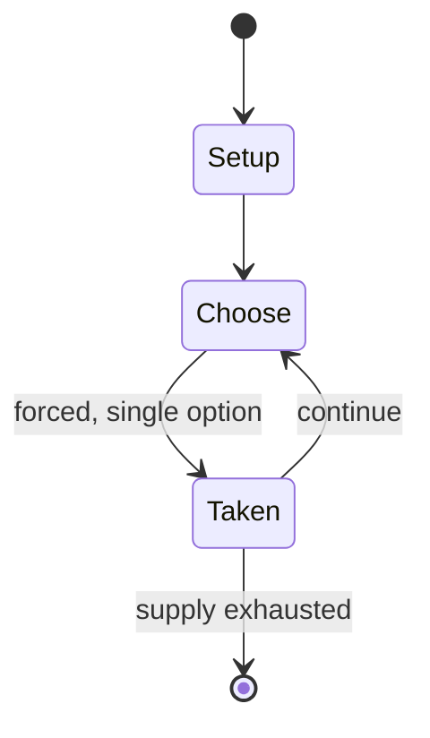

# Onitama

`onitama` &nbsp; state: **DEEPENED** &nbsp; method: **heuristic**

## Found layer (recorded, not trusted)

| field | value |
| --- | --- |
| wikidata | Q56457416 |
| wikipedia | Onitama |
| genres (source) | -- |
| instance of (source) | -- |
| country of origin | -- |

## Declared layer (orders bench work)

| field | value |
| --- | --- |
| year created | 2014 |
| epoch | CONTEMPORARY |
| region | -- |
| media | BOARD |
| players | 2 |
| age band | -- |
| exogenous process | -- |
| loss shape | -- |
| live axes | - |
| horizon | -- |
| scoring shape | SET_COLLECTION_CONVEX |
| information | -- |
| interaction | COMPETITIVE |
| turn structure | -- |
| tractability | SAMPLING_ONLY |
| randomness | -- |
| luck factor | 0.35 |
| rules complexity | 1.77 |
| strategic depth | 2.0 |
| novelty | 0.3553 |
| solved status | -- |
| strategies | set_collection, spatial_packing |
| algorithms | -- |

## Object model

```
Episode
  players      : 2
  turn_structure: ?
  horizon       : ?
  scoring       : SET_COLLECTION_CONVEX

Board          -- spatial substrate; cells carry position and occupancy
Piece          -- movable token owned by a player
```

## State transition diagram



## Research item -- turn trace

```
# Onitama -- simulated turn events
# generated from the DECLARED vector, not from a rulebook.
# structure: exo=None loss=None horizon=None scoring=SET_COLLECTION_CONVEX axes=-

t=0    SETUP        players=2  pot=0  capacity=5
t=1    FORCED       p1 single legal option taken (pot_gain=+0.6)
t=2    FORCED       p1 single legal option taken (pot_gain=+0.9)
t=3    FORCED       p1 single legal option taken (pot_gain=+1.3)
t=4    FORCED       p1 single legal option taken (pot_gain=+1.1)
t=5    FORCED       p1 single legal option taken (pot_gain=+0.6)
t=6    FORCED       p1 single legal option taken (pot_gain=+1.2)
t=7    ENDTURN      turn passes to p2
t=8    FORCED       p2 single legal option taken (pot_gain=+0.7)
t=9    FORCED       p2 single legal option taken (pot_gain=+1.3)
t=10   FORCED       p2 single legal option taken (pot_gain=+2.0)
t=11   FORCED       p2 single legal option taken (pot_gain=+1.9)
t=12   FORCED       p2 single legal option taken (pot_gain=+1.1)
t=13   FORCED       p2 single legal option taken (pot_gain=+1.6)
t=14   FORCED       p2 single legal option taken (pot_gain=+0.6)
t=15   FORCED       p2 single legal option taken (pot_gain=+1.3)
t=16   ENDTURN      turn passes to p1
t=17   FORCED       p1 single legal option taken (pot_gain=+1.0)
t=18   ENDTURN      turn passes to p2
t=19   FORCED       p2 single legal option taken (pot_gain=+0.7)
t=20   FORCED       p2 single legal option taken (pot_gain=+2.0)
t=21   ENDTURN      turn passes to p1
t=22   FORCED       p1 single legal option taken (pot_gain=+1.0)
t=23   FORCED       p1 single legal option taken (pot_gain=+0.6)
t=24   FORCED       p1 single legal option taken (pot_gain=+1.3)
t=25   FORCED       p1 single legal option taken (pot_gain=+1.1)
t=26   FORCED       p1 single legal option taken (pot_gain=+0.9)
t=27   ENDTURN      turn passes to p2

terminal: VARIABLE
```

## Source extract

Onitama is a strategy board game for two players created in 2014 by Japanese game designer
Shimpei Sato and launched by Arcane Wonders. In Germany, the game was launched by Pegasus Games
in 2017. It is thematically based on the different fighting styles of Japanese martial arts. The
game had a digital release in 2018.   == Equipment == The game is played on a 5x5 board. Each
player receives five pieces: one master piece placed in the middle square of the back row, known
as the Temple Arch, and four student pieces flanking the master. Five random movement cards
(from the 16 available) are utilized per game and dictate how the pieces may move during the
game.   == Gameplay == There are two methods to win a game: the first method, known as the Way
of the Stone, requires the player to capture the opponent’s master piece; the second method,
known as the Way of the Stream, requires the player to move their master piece on to the
opponent's Temple Arch.  Each player begins with two movement cards face-up, and the fifth card
is placed to the right of the starting player (as indicated on this card). A player’s turn
consists of choosing one of their two movement cards and moving one of their

<sub>Wikipedia, CC BY-SA. Retained as evidence for the structural
classification above. Every rule inferred from it is HYPOTHESIZED
until audited against a rulebook.</sub>
