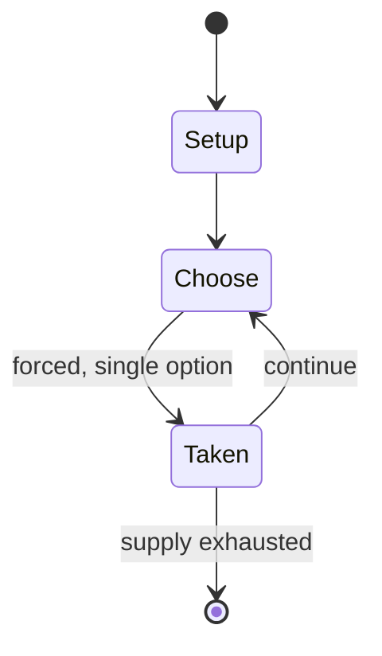

# Oonch Neech

`oonch_neech` &nbsp; state: **DEEPENED** &nbsp; method: **heuristic**

## Found layer (recorded, not trusted)

| field | value |
| --- | --- |
| wikidata | Q13001396 |
| wikipedia | Oonch Neech |
| genres (source) | -- |
| instance of (source) | -- |
| country of origin | -- |

## Declared layer (orders bench work)

| field | value |
| --- | --- |
| year created | -- |
| epoch | -- |
| region | -- |
| media | - |
| players | -- |
| age band | CHILD |
| exogenous process | -- |
| loss shape | -- |
| live axes | - |
| horizon | -- |
| scoring shape | -- |
| information | -- |
| interaction | -- |
| turn structure | -- |
| tractability | SAMPLING_ONLY |
| randomness | -- |
| luck factor | 0.35 |
| rules complexity | 1.75 |
| strategic depth | 2.0 |
| novelty | 0.0914 |
| solved status | -- |
| strategies | -- |
| algorithms | -- |

## Object model

```
Episode
  players      : ?
  turn_structure: ?
  horizon       : ?
  scoring       : ?

State          -- opaque; no medium or axis evidence was found
Player         -- an agent that selects among legal successors
```

## State transition diagram



## Research item -- turn trace

```
# Oonch Neech -- simulated turn events
# generated from the DECLARED vector, not from a rulebook.
# structure: exo=None loss=None horizon=None scoring=None axes=-

t=0    SETUP        players=2  pot=0  capacity=6
t=1    FORCED       p1 single legal option taken (pot_gain=+1.5)
t=2    ENDTURN      turn passes to p2
t=3    FORCED       p2 single legal option taken (pot_gain=+0.9)
t=4    ENDTURN      turn passes to p1
t=5    FORCED       p1 single legal option taken (pot_gain=+1.2)
t=6    FORCED       p1 single legal option taken (pot_gain=+1.5)
t=7    FORCED       p1 single legal option taken (pot_gain=+0.8)
t=8    ENDTURN      turn passes to p2
t=9    FORCED       p2 single legal option taken (pot_gain=+0.9)
t=10   FORCED       p2 single legal option taken (pot_gain=+2.0)
t=11   FORCED       p2 single legal option taken (pot_gain=+1.6)
t=12   FORCED       p2 single legal option taken (pot_gain=+2.0)
t=13   FORCED       p2 single legal option taken (pot_gain=+1.1)
t=14   FORCED       p2 single legal option taken (pot_gain=+0.5)
t=15   ENDTURN      turn passes to p1
t=16   FORCED       p1 single legal option taken (pot_gain=+1.5)
t=17   ENDTURN      turn passes to p2
t=18   FORCED       p2 single legal option taken (pot_gain=+0.9)
t=19   ENDTURN      turn passes to p1
t=20   FORCED       p1 single legal option taken (pot_gain=+1.7)
t=21   ENDTURN      turn passes to p2
t=22   FORCED       p2 single legal option taken (pot_gain=+1.9)
t=23   FORCED       p2 single legal option taken (pot_gain=+0.5)
t=24   FORCED       p2 single legal option taken (pot_gain=+1.2)
t=25   FORCED       p2 single legal option taken (pot_gain=+1.9)
t=26   FORCED       p2 single legal option taken (pot_gain=+1.4)

terminal: VARIABLE
```

## Conditions

| kind | threshold | effect | trigger |
| --- | --- | --- | --- |
| BOUNDARY | -- | -- | This game needs at least 4 or more players. |

## Source extract

Oonch Neech (or Oonch Neech ka Papada) is a rural and urban street children's game and variation
of tag played in North India and Pakistan. Oonch Neech (Hindi) translates to Up and Down in
English. In Andhra Pradesh, the game is called Nela Banda, (Telugu: నేల-బండ) which is now
extinct owing to urbanization and western influence. This game needs at least 4 or more players.
In Maharashtra, it is known as Dagad ka Maati (Marathi: दगड़ का माती) literally meaning "Stone
or Sand" In Oonch Neech if the denner (tagger) says neech (down), all players have to go to an
elevated area. If he says oonch (up) then all players have to stay down. Whatever the denner
picks, he has to stay on that platform.   == Terms == Oonch means an area higher than ground
level or simply Upper Level. Neech means the ground area or the lower surface area or simply
Lower Level. The denner is the person who catches the other players.   == Gameplay == To start
one person, say A, is chosen as denner. The players ask the denner : 'Oonch neech ka
papada—Oonch mangi ki  neech?' meaning "do you want the upper level or the lower level?" The
catcher chooses either Oonch (any height) or Neech (ground). Usually he chooses N

<sub>Wikipedia, CC BY-SA. Retained as evidence for the structural
classification above. Every rule inferred from it is HYPOTHESIZED
until audited against a rulebook.</sub>
