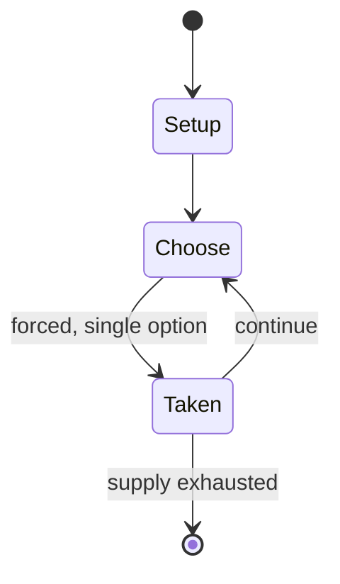

# Order and Chaos

*variant of tic-tac-toe on a 6×6 board, invented by S. Sniderman in 1981, in which the player Order tries to create a 5-in-a-row (either X or O); the opponent Chaos tries to stop this*

`order_and_chaos` &nbsp; state: **DEEPENED** &nbsp; method: **heuristic**

## Found layer (recorded, not trusted)

| field | value |
| --- | --- |
| wikidata | Q10885944 |
| wikipedia | Order and Chaos |
| genres (source) | -- |
| instance of (source) | abstract strategy game, solved game |
| country of origin | -- |

## Declared layer (orders bench work)

| field | value |
| --- | --- |
| year created | 1981 |
| epoch | DIGITAL |
| region | -- |
| media | BOARD |
| players | -- |
| age band | -- |
| exogenous process | -- |
| loss shape | -- |
| live axes | - |
| horizon | -- |
| scoring shape | SET_COLLECTION_CONVEX |
| information | -- |
| interaction | COMPETITIVE |
| turn structure | -- |
| tractability | EXACT |
| randomness | -- |
| luck factor | 0.35 |
| rules complexity | 1.73 |
| strategic depth | 1.65 |
| novelty | 0.7741 |
| solved status | SOLVED_WEAK |
| strategies | set_collection |
| algorithms | -- |

## Object model

```
Episode
  players      : ?
  turn_structure: ?
  horizon       : ?
  scoring       : SET_COLLECTION_CONVEX

Board          -- spatial substrate; cells carry position and occupancy
Piece          -- movable token owned by a player
```

## State transition diagram



## Research item -- turn trace

```
# Order and Chaos -- simulated turn events
# generated from the DECLARED vector, not from a rulebook.
# structure: exo=None loss=None horizon=None scoring=SET_COLLECTION_CONVEX axes=-

t=0    SETUP        players=2  pot=0  capacity=7
t=1    FORCED       p1 single legal option taken (pot_gain=+1.4)
t=2    FORCED       p1 single legal option taken (pot_gain=+2.0)
t=3    FORCED       p1 single legal option taken (pot_gain=+0.8)
t=4    FORCED       p1 single legal option taken (pot_gain=+0.8)
t=5    FORCED       p1 single legal option taken (pot_gain=+0.7)
t=6    ENDTURN      turn passes to p2
t=7    FORCED       p2 single legal option taken (pot_gain=+1.9)
t=8    FORCED       p2 single legal option taken (pot_gain=+0.6)
t=9    FORCED       p2 single legal option taken (pot_gain=+1.2)
t=10   FORCED       p2 single legal option taken (pot_gain=+1.7)
t=11   FORCED       p2 single legal option taken (pot_gain=+2.0)
t=12   FORCED       p2 single legal option taken (pot_gain=+1.6)
t=13   FORCED       p2 single legal option taken (pot_gain=+0.8)
t=14   FORCED       p2 single legal option taken (pot_gain=+1.4)
t=15   FORCED       p2 single legal option taken (pot_gain=+1.8)
t=16   FORCED       p2 single legal option taken (pot_gain=+1.2)
t=17   FORCED       p2 single legal option taken (pot_gain=+2.0)
t=18   FORCED       p2 single legal option taken (pot_gain=+1.7)
t=19   FORCED       p2 single legal option taken (pot_gain=+1.7)
t=20   ENDTURN      turn passes to p1
t=21   FORCED       p1 single legal option taken (pot_gain=+1.8)
t=22   FORCED       p1 single legal option taken (pot_gain=+0.9)
t=23   FORCED       p1 single legal option taken (pot_gain=+1.0)
t=24   FORCED       p1 single legal option taken (pot_gain=+1.3)
t=25   ENDTURN      turn passes to p2
t=26   FORCED       p2 single legal option taken (pot_gain=+0.5)

terminal: VARIABLE
```

## Source extract

Order and Chaos is a variant of the game tic-tac-toe on a 6×6 gameboard. It was invented by
Stephen Sniderman and introduced by him in Games magazine in 1981. The player Order strives to
create a five-in-a-row of either Xs or Os. The opponent Chaos endeavors to prevent this.   ==
Game rules == Unlike typical board games, both players control both sets of pieces (Xs and Os).
The game starts with the board empty. Order plays first, then turns alternate. On each turn, a
player places either an X or an O on any open square. Once played, pieces cannot be moved, thus
Order and Chaos can be played using pencil and paper. Order aims to get five like pieces in a
row either vertically, horizontally, or diagonally. Chaos aims to fill the board without
completion of a line of five like pieces.    === Rules addition === The original rules in Games
magazine implied that six-in-a-row also wins. That version of the game was claimed weakly solved
as a forced win for Order. The inventor has subsequently suggested a new rule to better balance
winning chances for both sides: Six-in-a-row does not qualify as a win. The new rule offers
Chaos new defensive tactics against Order's previously "unstoppable"

<sub>Wikipedia, CC BY-SA. Retained as evidence for the structural
classification above. Every rule inferred from it is HYPOTHESIZED
until audited against a rulebook.</sub>
