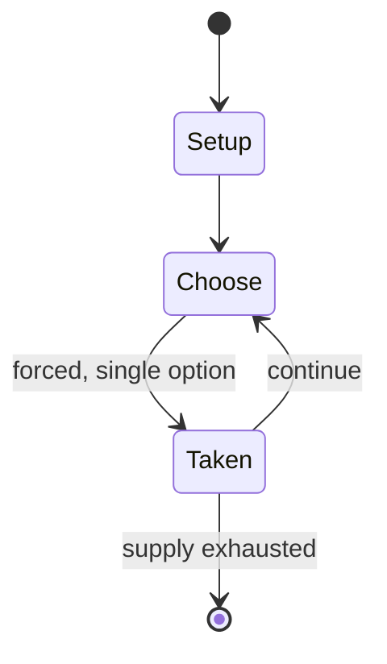

# Otedama

*traditional Japanese children's game*

`otedama` &nbsp; state: **DEEPENED** &nbsp; method: **heuristic**

## Found layer (recorded, not trusted)

| field | value |
| --- | --- |
| wikidata | Q7108496 |
| wikipedia | Otedama |
| genres (source) | -- |
| instance of (source) | traditional game |
| country of origin | Japan |

## Declared layer (orders bench work)

| field | value |
| --- | --- |
| year created | -- |
| epoch | -- |
| region | EAST_ASIA |
| media | - |
| players | -- |
| age band | CHILD |
| exogenous process | -- |
| loss shape | -- |
| live axes | - |
| horizon | -- |
| scoring shape | -- |
| information | -- |
| interaction | SOLITAIRE |
| turn structure | STRICT_TURN |
| tractability | SAMPLING_ONLY |
| randomness | -- |
| luck factor | 0.35 |
| rules complexity | 1.68 |
| strategic depth | 2.0 |
| novelty | 0.528 |
| solved status | -- |
| strategies | -- |
| algorithms | -- |

## Object model

```
Episode
  players      : ?
  turn_structure: STRICT_TURN
  horizon       : ?
  scoring       : ?

State          -- opaque; no medium or axis evidence was found
Player         -- an agent that selects among legal successors
```

## State transition diagram



## Research item -- turn trace

```
# Otedama -- simulated turn events
# generated from the DECLARED vector, not from a rulebook.
# structure: exo=None loss=None horizon=None scoring=None axes=-

t=0    SETUP        players=2  pot=0  capacity=5
t=1    FORCED       p1 single legal option taken (pot_gain=+1.8)
t=2    FORCED       p1 single legal option taken (pot_gain=+1.6)
t=3    ENDTURN      turn passes to p2
t=4    FORCED       p2 single legal option taken (pot_gain=+0.7)
t=5    FORCED       p2 single legal option taken (pot_gain=+1.6)
t=6    ENDTURN      turn passes to p1
t=7    FORCED       p1 single legal option taken (pot_gain=+0.9)
t=8    ENDTURN      turn passes to p2
t=9    FORCED       p2 single legal option taken (pot_gain=+1.0)
t=10   FORCED       p2 single legal option taken (pot_gain=+1.3)
t=11   FORCED       p2 single legal option taken (pot_gain=+1.4)
t=12   FORCED       p2 single legal option taken (pot_gain=+0.5)
t=13   ENDTURN      turn passes to p1
t=14   FORCED       p1 single legal option taken (pot_gain=+1.9)
t=15   FORCED       p1 single legal option taken (pot_gain=+1.8)
t=16   ENDTURN      turn passes to p2
t=17   FORCED       p2 single legal option taken (pot_gain=+2.0)
t=18   ENDTURN      turn passes to p1
t=19   FORCED       p1 single legal option taken (pot_gain=+1.6)
t=20   FORCED       p1 single legal option taken (pot_gain=+1.1)
t=21   FORCED       p1 single legal option taken (pot_gain=+1.6)
t=22   FORCED       p1 single legal option taken (pot_gain=+1.3)
t=23   FORCED       p1 single legal option taken (pot_gain=+2.0)
t=24   ENDTURN      turn passes to p2
t=25   FORCED       p2 single legal option taken (pot_gain=+1.2)
t=26   ENDTURN      turn passes to p1

terminal: VARIABLE
```

## Source extract

Otedama (お手玉) is a traditional Japanese children's game. Small bean bags are tossed and juggled
in a game similar to jacks. Although it is generally a social game, Otedama can also be played
alone. It is rarely competitive and often accompanied by singing. Otedama play is thought to be
in decline.   == History == Otedama was transmitted to Japan from China in the Nara Period. It
reached its peak of popularity in post-World War II Japan when other toys were unavailable. The
bean bags, called ojami, were sewn together from strips of silk cloth and contained azuki beans.
During war times, the beans were removed from the bags to feed children; as a result, there were
almost no bean bags left in Japan. Otedama almost completely vanished from Japan because of
this.  In the early 1990s, a small group of people in Niihama created a club and annual
convention to help restore otedama throughout Japan.   == Gameplay == Otedama was a very popular
among girls and knowledge of the game was passed down from grandmother to granddaughter.
Specific game play varies widely from region to region. Most play with five bean bags although
some variations have been seen. Players take turns throwing and cat

<sub>Wikipedia, CC BY-SA. Retained as evidence for the structural
classification above. Every rule inferred from it is HYPOTHESIZED
until audited against a rulebook.</sub>
