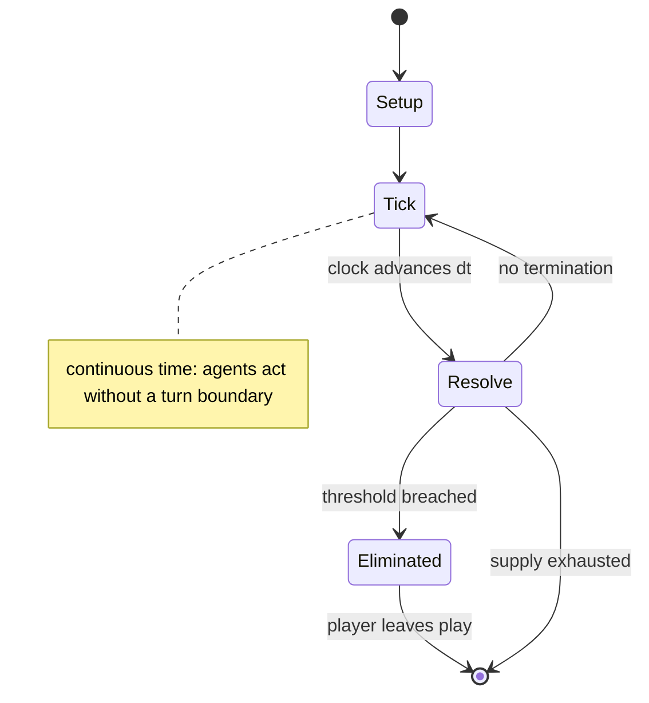

# Oware

*abstract strategy game*

`oware` &nbsp; state: **DEEPENED** &nbsp; method: **heuristic**

## Found layer (recorded, not trusted)

| field | value |
| --- | --- |
| wikidata | Q575620 |
| wikipedia | Oware |
| genres (source) | -- |
| instance of (source) | board game, mancala, solved game |
| country of origin | -- |

## Declared layer (orders bench work)

| field | value |
| --- | --- |
| year created | -- |
| epoch | -- |
| region | -- |
| media | ABSTRACT, BOARD, MANCALA |
| players | -- |
| age band | -- |
| exogenous process | NONE |
| loss shape | ELIMINATION |
| live axes | SELECT |
| horizon | VARIABLE |
| scoring shape | -- |
| information | PERFECT |
| interaction | SOLITAIRE |
| turn structure | REAL_TIME |
| tractability | EXACT |
| randomness | NONE |
| luck factor | 0.02 |
| rules complexity | 2.19 |
| strategic depth | 1.8 |
| novelty | 0.8333 |
| solved status | SOLVED_STRONG |
| strategies | -- |
| algorithms | -- |

## Object model

```
Episode
  players      : ?
  turn_structure: REAL_TIME
  horizon       : VARIABLE
  scoring       : ?

Board          -- spatial substrate; cells carry position and occupancy
Piece          -- movable token owned by a player
Pits           -- cyclic array of counts
Store          -- player's banked seeds
OptionSet      -- the choices available after an exogenous draw
```

## State transition diagram



## Research item -- clock trace

```
# Oware -- simulated clock trace (no turn boundary)
# generated from the DECLARED vector, not from a rulebook.
# structure: exo=NONE loss=ELIMINATION horizon=VARIABLE scoring=None axes=SELECT

clk=0.000s  START        agents=4  clock=free running
clk=2.493s  ACTION       a1 acts continuously; no turn boundary crossed
clk=4.519s  CONTEST      a4 and a1 contend for the same resource
clk=7.495s  ACTION       a1 acts continuously; no turn boundary crossed
clk=10.036s  CONTEST      a1 and a2 contend for the same resource
clk=12.511s  ACTION       a3 acts continuously; no turn boundary crossed
clk=15.177s  STOPPAGE     clock halts; state frozen
clk=15.709s  ACTION       a3 acts continuously; no turn boundary crossed
clk=15.941s  ACTION       a3 acts continuously; no turn boundary crossed
clk=16.222s  ACTION       a3 acts continuously; no turn boundary crossed
clk=17.882s  SCORE        a3 scores (+1)
clk=20.116s  INFRACTION   a1 commits infraction (count=1)
clk=21.052s  ACTION       a4 acts continuously; no turn boundary crossed
clk=21.969s  ACTION       a1 acts continuously; no turn boundary crossed
clk=23.992s  CONTEST      a3 and a4 contend for the same resource
clk=25.659s  SCORE        a3 scores (+3)
clk=28.318s  SCORE        a1 scores (+1)
clk=29.735s  CONTEST      a3 and a4 contend for the same resource
clk=31.087s  ACTION       a4 acts continuously; no turn boundary crossed
clk=32.756s  SCORE        a1 scores (+1)
clk=33.928s  ACTION       a4 acts continuously; no turn boundary crossed
clk=34.567s  INFRACTION   a3 commits infraction (count=1)
clk=34.948s  ACTION       a1 acts continuously; no turn boundary crossed
clk=36.450s  CONTEST      a2 and a3 contend for the same resource
clk=38.611s  ACTION       a2 acts continuously; no turn boundary crossed
clk=40.244s  CONTEST      a2 and a3 contend for the same resource
clk=43.068s  ACTION       a2 acts continuously; no turn boundary crossed

note: elapsed time, not move count, is the episode's ordering variable.
```

## Conditions

| kind | threshold | effect | trigger |
| --- | --- | --- | --- |
| TERMINATE | 1 player | -- | The game is over when one player has captured 25 or more seeds, or each player has taken 24 seeds (draw). |
| WIN | -- | -- | Since the game has only 48 seeds, capturing 25 is sufficient to win the game. |
| TERMINATE | -- | -- | If both players agree that the game has been reduced to an endless cycle, the game ends when each player has seeds in their holes and then each player captures the seeds on their side of the board. |
| PENALTY | -- | -- | However, if a move would capture all of an opponent's seeds, the capture is forfeited since this would prevent the opponent from continuing the game, and the seeds are instead left on the board. |

## Source extract

Oware is an abstract strategy game among the mancala family of board games (pit and pebble
games) played worldwide with slight variations as to the layout of the game, number of players
and strategy of play. Its origin is uncertain, but it is widely believed to be of Ashanti
origin. Played in the Bono Region, Bono East Region, Ahafo Region, Central Region, Western
Region, Eastern Region, and Ashanti Region of Ghana as well as throughout the Caribbean, oware
and its variants have many names - ayò, ayoayo (Yoruba), awalé (Ivory Coast, Benin), wari
(Mali), ouri, ouril or uril (Cape Verde), warri (Caribbean), wali (Dagbani), adji (Ewe),
nchọ/ókwè (Igbo), ise (Edo), awale (Ga) (meaning "spoons" in English). A common name in English
is awari but one of the earliest Western scholars to study the game, Robert Sutherland Rattray,
used the name wari.   == Rules == The following are the rules for the abapa variation,
considered to be the most appropriate for serious, adult play.   === Equipment === The game
requires an oware board and 48 seeds. A typical oware board has two straight rows of six pits,
called "houses", and optionally one large "score" house at each end. Each player controls the

<sub>Wikipedia, CC BY-SA. Retained as evidence for the structural
classification above. Every rule inferred from it is HYPOTHESIZED
until audited against a rulebook.</sub>
