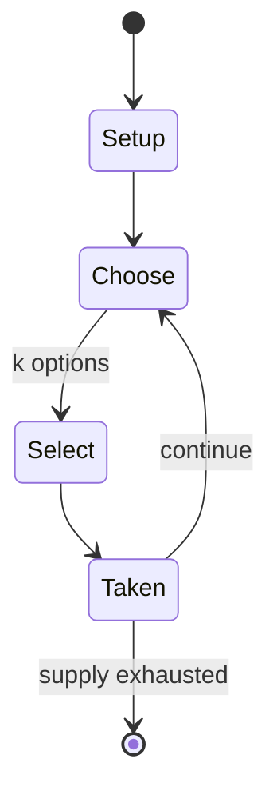

# Owela

*mancala*

`owela` &nbsp; state: **DEEPENED** &nbsp; method: **heuristic**

## Found layer (recorded, not trusted)

| field | value |
| --- | --- |
| wikidata | Q4545492 |
| wikipedia | Owela |
| genres (source) | -- |
| instance of (source) | board game, mancala |
| country of origin | -- |

## Declared layer (orders bench work)

| field | value |
| --- | --- |
| year created | -- |
| epoch | -- |
| region | -- |
| media | BOARD, MANCALA |
| players | -- |
| age band | -- |
| exogenous process | -- |
| loss shape | -- |
| live axes | ORDER, SELECT |
| horizon | -- |
| scoring shape | -- |
| information | -- |
| interaction | COMPETITIVE |
| turn structure | -- |
| tractability | SAMPLING_ONLY |
| randomness | -- |
| luck factor | 0.35 |
| rules complexity | 2.38 |
| strategic depth | 2.0 |
| novelty | 0.3553 |
| solved status | -- |
| strategies | -- |
| algorithms | -- |

## Object model

```
Episode
  players      : ?
  turn_structure: ?
  horizon       : ?
  scoring       : ?

Board          -- spatial substrate; cells carry position and occupancy
Piece          -- movable token owned by a player
Pits           -- cyclic array of counts
Store          -- player's banked seeds
Sequence       -- the permutation under the player's control
OptionSet      -- the choices available after an exogenous draw
```

## State transition diagram



## Research item -- turn trace

```
# Owela -- simulated turn events
# generated from the DECLARED vector, not from a rulebook.
# structure: exo=None loss=None horizon=None scoring=None axes=ORDER,SELECT

t=0    SETUP        players=2  pot=0  capacity=4
t=1    SELECT       p1 1 options; take #1  (pot_gain=+3.2, capacity=-0)
t=2    SELECT       p1 1 options; take #1  (pot_gain=+1.1, capacity=-1)
t=3    SELECT       p1 1 options; take #1  (pot_gain=+1.2, capacity=-0)
t=4    SELECT       p1 3 options; take #2  (pot_gain=+0.8, capacity=-1)
t=5    SELECT       p1 4 options; take #1  (pot_gain=+2.5, capacity=-2)
t=6    SELECT       p1 2 options; take #2  (pot_gain=+3.0, capacity=-0)
t=7    SELECT       p1 4 options; take #4  (pot_gain=+1.4, capacity=-0)
t=8    SELECT       p1 4 options; take #4  (pot_gain=+2.1, capacity=-2)
t=9    SELECT       p1 4 options; take #4  (pot_gain=+0.6, capacity=-2)
t=10   SELECT       p1 3 options; take #2  (pot_gain=+2.0, capacity=-0)
t=11   SELECT       p1 4 options; take #4  (pot_gain=+3.0, capacity=-0)
t=12   SELECT       p1 3 options; take #2  (pot_gain=+1.1, capacity=-1)
t=13   SELECT       p1 4 options; take #1  (pot_gain=+3.0, capacity=-2)
t=14   SELECT       p1 3 options; take #2  (pot_gain=+1.8, capacity=-1)
t=15   SELECT       p1 2 options; take #2  (pot_gain=+2.1, capacity=-1)
t=16   SELECT       p1 1 options; take #1  (pot_gain=+2.9, capacity=-2)
t=17   SELECT       p1 2 options; take #1  (pot_gain=+3.3, capacity=-0)
t=18   SELECT       p1 2 options; take #1  (pot_gain=+2.3, capacity=-1)
t=19   ENDTURN      turn passes to p2
t=20   SELECT       p2 3 options; take #3  (pot_gain=+1.6, capacity=-0)
t=21   SELECT       p2 3 options; take #1  (pot_gain=+2.1, capacity=-2)
t=22   SELECT       p2 3 options; take #3  (pot_gain=+3.1, capacity=-1)
t=23   SELECT       p2 4 options; take #1  (pot_gain=+1.7, capacity=-2)
t=24   SELECT       p2 1 options; take #1  (pot_gain=+1.2, capacity=-0)
t=25   SELECT       p2 1 options; take #1  (pot_gain=+0.7, capacity=-1)
t=26   ENDTURN      turn passes to p1

terminal: VARIABLE
```

## Conditions

| kind | threshold | effect | trigger |
| --- | --- | --- | --- |
| BOUNDARY | -- | -- | The winner is the last player to be able to make a legal move, possible by capturing all an opponent's stones or reducing the opponent to no more than one seed in each pit. |
| BOUNDARY | -- | -- | A player moves by selecting a pit with at least two seeds, and sowing them one by one around their side of the board in a counter-clockwise direction from the starting pit. |

## Source extract

Owela, also referred to by the Khoekhoe language loanword ǁHus, is the Oshiwambo name of a
traditional mancala board game played by the Nama people, Herero people, Rukwangali speakers,
and other ethnic groups from Namibia (and its Southern African neighbours). It is related to the
Omweso family of mancala games played in Eastern and Southern Africa. Although this is an
abstract strategy game, the consequences of individual moves are so hard to predict that it can
be considered, to some extent, a game of chance.   == Gameplay ==   === Equipment === Owela is
typically played on a board with 4 rows of 6 to 24 pits. In addition, a number of
undifferentiated seeds are needed depending on the size of the board. Owela can also be played
without a board by digging rows of pits in sand.   === Objective === The winner is the last
player to be able to make a legal move, possible by capturing all an opponent's stones or
reducing the opponent to no more than one seed in each pit.   === Setup === Two seeds are placed
in each of the outer pits.  Two seeds are also placed in each of the four rightmost inner pits
for each player.   === Sowing === A player moves by selecting a pit with at least two

<sub>Wikipedia, CC BY-SA. Retained as evidence for the structural
classification above. Every rule inferred from it is HYPOTHESIZED
until audited against a rulebook.</sub>
