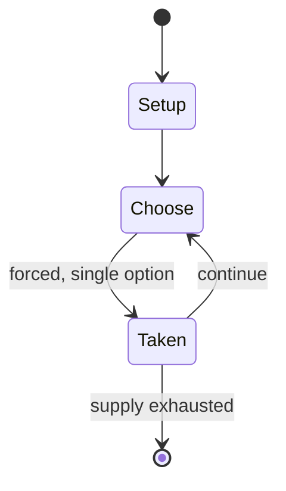

# Pachisi

`pachisi` &nbsp; state: **DEEPENED** &nbsp; method: **heuristic**

## Found layer (recorded, not trusted)

| field | value |
| --- | --- |
| wikidata | Q796171 |
| wikipedia | Pachisi |
| genres (source) | -- |
| instance of (source) | -- |
| country of origin | -- |

## Declared layer (orders bench work)

| field | value |
| --- | --- |
| year created | -- |
| epoch | -- |
| region | -- |
| media | BOARD |
| players | -- |
| age band | -- |
| exogenous process | NONE |
| loss shape | OPPORTUNITY_ONLY |
| live axes | - |
| horizon | -- |
| scoring shape | RACE_POSITION |
| information | PERFECT |
| interaction | COMPETITIVE |
| turn structure | -- |
| tractability | EXACT_WITH_CUT |
| randomness | NONE |
| luck factor | 0.02 |
| rules complexity | 2.34 |
| strategic depth | 2.4 |
| novelty | 0.784 |
| solved status | -- |
| strategies | -- |
| algorithms | -- |

## Object model

```
Episode
  players      : ?
  turn_structure: ?
  horizon       : ?
  scoring       : RACE_POSITION

Board          -- spatial substrate; cells carry position and occupancy
Piece          -- movable token owned by a player
```

## State transition diagram



## Research item -- turn trace

```
# Pachisi -- simulated turn events
# generated from the DECLARED vector, not from a rulebook.
# structure: exo=NONE loss=OPPORTUNITY_ONLY horizon=None scoring=RACE_POSITION axes=-

t=0    SETUP        players=2  pot=0  capacity=3
t=1    FORCED       p1 single legal option taken (pot_gain=+1.4)
t=2    FORCED       p1 single legal option taken (pot_gain=+1.3)
t=3    ENDTURN      turn passes to p2
t=4    FORCED       p2 single legal option taken (pot_gain=+1.6)
t=5    ENDTURN      turn passes to p1
t=6    FORCED       p1 single legal option taken (pot_gain=+0.5)
t=7    FORCED       p1 single legal option taken (pot_gain=+1.8)
t=8    FORCED       p1 single legal option taken (pot_gain=+1.9)
t=9    ENDTURN      turn passes to p2
t=10   FORCED       p2 single legal option taken (pot_gain=+0.5)
t=11   ENDTURN      turn passes to p1
t=12   FORCED       p1 single legal option taken (pot_gain=+0.9)
t=13   FORCED       p1 single legal option taken (pot_gain=+1.9)
t=14   FORCED       p1 single legal option taken (pot_gain=+1.9)
t=15   FORCED       p1 single legal option taken (pot_gain=+1.1)
t=16   ENDTURN      turn passes to p2
t=17   FORCED       p2 single legal option taken (pot_gain=+1.0)
t=18   FORCED       p2 single legal option taken (pot_gain=+0.9)
t=19   ENDTURN      turn passes to p1
t=20   FORCED       p1 single legal option taken (pot_gain=+1.8)
t=21   FORCED       p1 single legal option taken (pot_gain=+0.6)
t=22   FORCED       p1 single legal option taken (pot_gain=+1.5)
t=23   FORCED       p1 single legal option taken (pot_gain=+1.9)
t=24   FORCED       p1 single legal option taken (pot_gain=+1.8)
t=25   FORCED       p1 single legal option taken (pot_gain=+0.5)
t=26   ENDTURN      turn passes to p2

terminal: VARIABLE
```

## Conditions

| kind | threshold | effect | trigger |
| --- | --- | --- | --- |
| BOUNDARY | 1 piece | -- | A player needs to have at least one piece on the board to be able to throw a 7 or 14. |
| WIN | -- | -- | The team which moves all its pieces to the finish first wins the game. |
| BOUNDARY | -- | -- | In some versions, a player cannot take their pieces back to the Charkoni/home, unless they have captured/killed at least one of the opponent's pieces. |

## Source extract

Pachisi (, Hindustani: [pəˈtʃiːsiː]) is a cross and circle board game that originated in Ancient
India. It is described in the ancient text Mahabharata under the name of "Pasha". It is played
on a board shaped like a symmetrical cross. A player's pieces move around the board based upon a
throw of six or seven cowrie shells as lots, with the number of shells resting with the aperture
upward indicating the number of spaces to move. The name of the game is derived from the Hindi
word paccīs, meaning 'twenty-five', the largest score that can be thrown with the cowrie shells;
thus this game is also known by the name Twenty-Five. There are other versions of this game
where the largest score that can be thrown is thirty. In addition to chaupar, there are similar
games that have originated around the world. Barjis (barsis) is popular in the Levant, mainly
Syria, while Parchís is another game popular in Spain and northern Morocco. Parqués is its
Colombian equivalent. Parcheesi, Patchesi, Sorry!, and Ludo are among the commercial versions of
similar games. The jeu des petits chevaux ('game of little horses') is played in France, and
Mensch ärgere Dich nicht is a popular German cross-and-circ

<sub>Wikipedia, CC BY-SA. Retained as evidence for the structural
classification above. Every rule inferred from it is HYPOTHESIZED
until audited against a rulebook.</sub>
