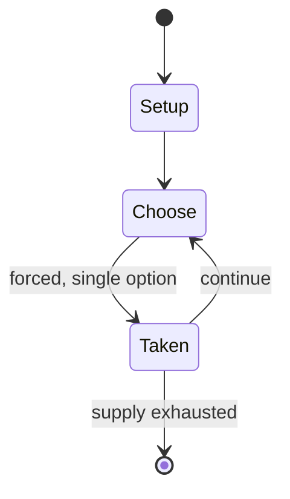

# Pacu Jalur

*Melayu Riau traditional race*

`pacu_jalur` &nbsp; state: **DEEPENED** &nbsp; method: **heuristic**

## Found layer (recorded, not trusted)

| field | value |
| --- | --- |
| wikidata | Q19729966 |
| wikipedia | Pacu Jalur |
| genres (source) | -- |
| instance of (source) | internet meme, racing, traditional sport, water sport |
| country of origin | Indonesia |

## Declared layer (orders bench work)

| field | value |
| --- | --- |
| year created | -- |
| epoch | -- |
| region | SOUTHEAST_ASIA |
| media | SPORT |
| players | -- |
| age band | -- |
| exogenous process | -- |
| loss shape | -- |
| live axes | - |
| horizon | -- |
| scoring shape | RACE_POSITION |
| information | -- |
| interaction | -- |
| turn structure | -- |
| tractability | SAMPLING_ONLY |
| randomness | -- |
| luck factor | 0.35 |
| rules complexity | 1.73 |
| strategic depth | 2.0 |
| novelty | 0.4839 |
| solved status | -- |
| strategies | -- |
| algorithms | -- |

## Object model

```
Episode
  players      : ?
  turn_structure: ?
  horizon       : ?
  scoring       : RACE_POSITION

Pitch          -- bounded physical region
Player         -- embodied agent with a foul count
Clock          -- counts down; stoppages are rule events
Official       -- detects infractions and applies penalties
```

## State transition diagram



## Research item -- turn trace

```
# Pacu Jalur -- simulated turn events
# generated from the DECLARED vector, not from a rulebook.
# structure: exo=None loss=None horizon=None scoring=RACE_POSITION axes=-

t=0    SETUP        players=2  pot=0  capacity=6
t=1    FORCED       p1 single legal option taken (pot_gain=+0.8)
t=2    ENDTURN      turn passes to p2
t=3    FORCED       p2 single legal option taken (pot_gain=+0.5)
t=4    FORCED       p2 single legal option taken (pot_gain=+1.6)
t=5    FORCED       p2 single legal option taken (pot_gain=+1.5)
t=6    FORCED       p2 single legal option taken (pot_gain=+1.6)
t=7    FORCED       p2 single legal option taken (pot_gain=+1.6)
t=8    FORCED       p2 single legal option taken (pot_gain=+1.7)
t=9    FORCED       p2 single legal option taken (pot_gain=+1.4)
t=10   FORCED       p2 single legal option taken (pot_gain=+0.9)
t=11   FORCED       p2 single legal option taken (pot_gain=+0.7)
t=12   FORCED       p2 single legal option taken (pot_gain=+0.7)
t=13   FORCED       p2 single legal option taken (pot_gain=+1.3)
t=14   FORCED       p2 single legal option taken (pot_gain=+1.3)
t=15   FORCED       p2 single legal option taken (pot_gain=+1.7)
t=16   FORCED       p2 single legal option taken (pot_gain=+2.0)
t=17   ENDTURN      turn passes to p1
t=18   FORCED       p1 single legal option taken (pot_gain=+1.6)
t=19   FORCED       p1 single legal option taken (pot_gain=+1.1)
t=20   FORCED       p1 single legal option taken (pot_gain=+1.9)
t=21   FORCED       p1 single legal option taken (pot_gain=+1.2)
t=22   FORCED       p1 single legal option taken (pot_gain=+0.6)
t=23   FORCED       p1 single legal option taken (pot_gain=+1.0)
t=24   FORCED       p1 single legal option taken (pot_gain=+1.6)
t=25   FORCED       p1 single legal option taken (pot_gain=+0.8)
t=26   FORCED       p1 single legal option taken (pot_gain=+1.6)

terminal: VARIABLE
```

## Source extract

Pacu Jalur (old spelling: Patjoe Djaloer; from Malay  Pacu Jalua 'boat race', pronounced
[ˈpat͡ʃu d͡ʒaˈluə̯]; pə-CHOO-jə-LOOR) also known as Pachu Jalugh is a traditional and cultural
watercraft-based Pacu (lit. 'Melayu race') originated from upper course of the Indragiri River
(a river formed by the union of the Ombilin River and Sinamar River) in Eastern-West Sumatran
region of Tanah Datar and its surrounding areas (including Sijunjung, Kuantan Singingi and
Indragiri Hulu – originally part of the native Eastern Minangkabau realm). One of the most
significant Pacu Jalur series of events held annually under the Pacu Jalur Festival at Teluk
Kuantan district on Sumatra. Since 2014, the traditions, knowledge, cultural customs,
biocentrism awareness, and the practices of Pacu Jalur officially recognized and regarded by the
Ministry of Education, Culture, Research, and Technology of Republic Indonesia as integral part
of the National Intangible Cultural Heritage of Indonesia. As the effort to preserve these
cultural heritage, the government of Indonesia support the Pacu Jalur Festival which held
annually in Kuantan Singingi and promote its importance for the wider public both nationwide

<sub>Wikipedia, CC BY-SA. Retained as evidence for the structural
classification above. Every rule inferred from it is HYPOTHESIZED
until audited against a rulebook.</sub>
