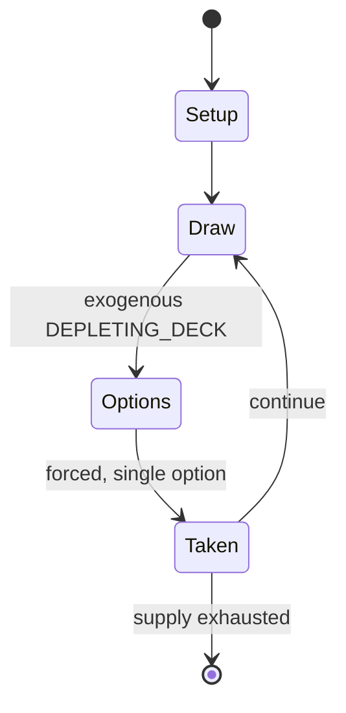

# Pai gow

*popular Chinese domino game, using tiles traditionally made of ox bone or ebony, in Northern Song dynasty, China (1120)*

`pai_gow` &nbsp; state: **DEEPENED** &nbsp; method: **heuristic**

## Found layer (recorded, not trusted)

| field | value |
| --- | --- |
| wikidata | Q1278119 |
| wikipedia | Pai gow |
| genres (source) | -- |
| instance of (source) | tile-based game |
| country of origin | Northern Song dynasty |

## Declared layer (orders bench work)

| field | value |
| --- | --- |
| year created | 1886 |
| epoch | INDUSTRIAL |
| region | -- |
| media | CARD, GAMBLING, TILE |
| players | -- |
| age band | CHILD |
| exogenous process | DEPLETING_DECK |
| loss shape | -- |
| live axes | - |
| horizon | -- |
| scoring shape | SET_COLLECTION_CONVEX |
| information | -- |
| interaction | -- |
| turn structure | -- |
| tractability | EXACT_WITH_CUT |
| randomness | DECK_SHUFFLE, HIDDEN_INFO |
| luck factor | 0.53 |
| rules complexity | 2.4 |
| strategic depth | 2.45 |
| novelty | 1.0 |
| solved status | -- |
| strategies | probability_estimation, set_collection |
| algorithms | -- |

## Object model

```
Episode
  players      : ?
  turn_structure: ?
  horizon       : ?
  scoring       : SET_COLLECTION_CONVEX

Deck           -- ordered multiset, drawn without replacement
Hand           -- private multiset held by one player
DiscardPile    -- public accumulation of spent cards
TileBag        -- unordered draw source
Layout         -- placed tiles and their adjacencies
```

## State transition diagram



## Research item -- turn trace

```
# Pai gow -- simulated turn events
# generated from the DECLARED vector, not from a rulebook.
# structure: exo=DEPLETING_DECK loss=None horizon=None scoring=SET_COLLECTION_CONVEX axes=-

t=0    SETUP        players=2  pot=0  capacity=8
t=1    DRAW         p1 draw from deck -> outcome #2  (p=0.126)
t=2    FORCED       p1 single legal option taken (pot_gain=+1.7)
t=3    DRAW         p1 draw from deck -> outcome #4  (p=0.233)
t=4    FORCED       p1 single legal option taken (pot_gain=+1.5)
t=5    DRAW         p1 draw from deck -> outcome #3  (p=0.204)
t=6    FORCED       p1 single legal option taken (pot_gain=+1.2)
t=7    DRAW         p1 draw from deck -> outcome #4  (p=0.098)
t=8    FORCED       p1 single legal option taken (pot_gain=+0.7)
t=9    ENDTURN      turn passes to p2
t=10   DRAW         p2 draw from deck -> outcome #3  (p=0.231)
t=11   FORCED       p2 single legal option taken (pot_gain=+1.5)
t=12   ENDTURN      turn passes to p1
t=13   DRAW         p1 draw from deck -> outcome #1  (p=0.172)
t=14   FORCED       p1 single legal option taken (pot_gain=+1.3)
t=15   ENDTURN      turn passes to p2
t=16   DRAW         p2 draw from deck -> outcome #6  (p=0.124)
t=17   FORCED       p2 single legal option taken (pot_gain=+0.6)
t=18   DRAW         p2 draw from deck -> outcome #3  (p=0.225)
t=19   FORCED       p2 single legal option taken (pot_gain=+1.0)
t=20   DRAW         p2 draw from deck -> outcome #4  (p=0.078)
t=21   FORCED       p2 single legal option taken (pot_gain=+1.7)
t=22   DRAW         p2 draw from deck -> outcome #3  (p=0.233)
t=23   FORCED       p2 single legal option taken (pot_gain=+0.6)
t=24   DRAW         p2 draw from deck -> outcome #4  (p=0.144)
t=25   FORCED       p2 single legal option taken (pot_gain=+1.7)
t=26   ENDTURN      turn passes to p1

terminal: VARIABLE
```

## Conditions

| kind | threshold | effect | trigger |
| --- | --- | --- | --- |
| WIN | -- | -- | When the player and dealer display hands with the same score, the one with the highest-valued tile (based on the named pair rankings described above) is the winner. |
| BOUNDARY | -- | -- | The name literally means "card nine", after the normal maximum hand. |
| BOUNDARY | -- | -- | This reflects the fact that, with the exception of named pairs, Gong, or Wong, the maximum score for a hand of mixed tiles is nine. |
| BOUNDARY | -- | -- | The combination of a Day or Teen with a seven (Tit, 1-6; or Chit, 2-5 or 3-4) is sometimes referred to as a high nine, as the score is the maximum (nine) when added together, and the group contains a high-rank tile for p |
| BOUNDARY | -- | -- | However, if there is at least one pair among the tiles, there are only two distinct ways to form two hands. |
| BOUNDARY | -- | -- | The player must decide which combination is most likely to give a set of front/rear hands that can beat the dealer, or at least break a tie in the player's favor. |

## Source extract

Pai gow ( py GOW; Chinese: 牌九; pinyin: páijiǔ; Jyutping: paai4 gau2 [pʰaj˩.kɐw˧˥]) is a Chinese
gambling game, played with a set of 32 Chinese dominoes. It is played in major casinos in China
(including Macau); the United States (including Boston, Massachusetts; Las Vegas, Nevada; Reno,
Nevada; Connecticut; Atlantic City, New Jersey; Pennsylvania; Mississippi; and cardrooms in
California); Canada (including Edmonton, Alberta and Calgary, Alberta); Australia; and New
Zealand. Illegal gambling clubs offering Pai gow can also be found in many Chinatown worldwide.
The name pai gow is sometimes used to refer to a card game called pai gow poker (or "double-hand
poker"), which is loosely based on pai gow. The act of playing pai gow is also colloquially
known as "eating dog meat".   == History == Although some claim that Pai Gow is the first
documented form of dominoes, originating in China before or during the Song dynasty, which can
only apply to gu pai 骨牌, that is, Chinese dominoes, the game of pai gow (Mandarin paijiu) is not
recorded until the late 19th century. Its earliest description is found in a collection of
Cantonese games published in Hong Kong in 1886. The name literally mea

<sub>Wikipedia, CC BY-SA. Retained as evidence for the structural
classification above. Every rule inferred from it is HYPOTHESIZED
until audited against a rulebook.</sub>
