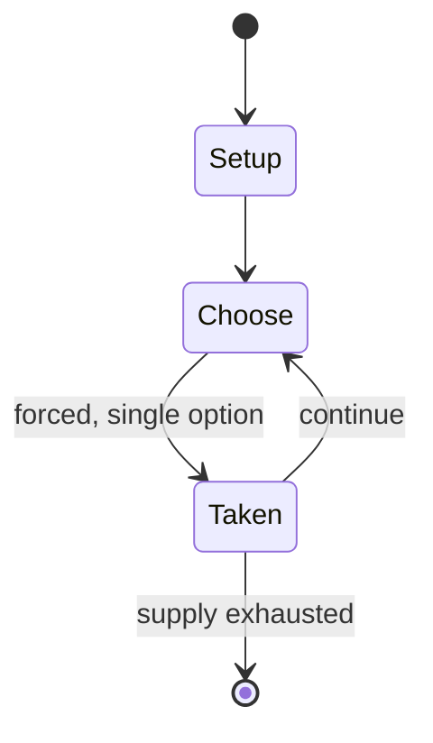

# Pallanguzhi

*ancient mancala game played in South India*

`pallanguzhi` &nbsp; state: **DEEPENED** &nbsp; method: **heuristic**

## Found layer (recorded, not trusted)

| field | value |
| --- | --- |
| wikidata | Q3521217 |
| wikipedia | Pallanguzhi |
| genres (source) | -- |
| instance of (source) | board game, mancala |
| country of origin | -- |

## Declared layer (orders bench work)

| field | value |
| --- | --- |
| year created | -- |
| epoch | -- |
| region | -- |
| media | MANCALA |
| players | -- |
| age band | -- |
| exogenous process | NONE |
| loss shape | OPPORTUNITY_ONLY |
| live axes | TRADE |
| horizon | VARIABLE |
| scoring shape | -- |
| information | PERFECT |
| interaction | NEGOTIATION |
| turn structure | -- |
| tractability | INTRACTABLE |
| randomness | NONE |
| luck factor | 0.02 |
| rules complexity | 2.78 |
| strategic depth | 2.4 |
| novelty | 0.938 |
| solved status | -- |
| strategies | -- |
| algorithms | -- |

## Object model

```
Episode
  players      : ?
  turn_structure: ?
  horizon       : VARIABLE
  scoring       : ?

Pits           -- cyclic array of counts
Store          -- player's banked seeds
Offer          -- proposed exchange between two agents
```

## State transition diagram



## Research item -- turn trace

```
# Pallanguzhi -- simulated turn events
# generated from the DECLARED vector, not from a rulebook.
# structure: exo=NONE loss=OPPORTUNITY_ONLY horizon=VARIABLE scoring=None axes=TRADE

t=0    SETUP        players=2  pot=0  capacity=5
t=1    FORCED       p1 single legal option taken (pot_gain=+0.7)
t=2    FORCED       p1 single legal option taken (pot_gain=+0.6)
t=3    TRADE        p1 offers 2:1 exchange to p2
t=4    ENDTURN      turn passes to p2
t=5    FORCED       p2 single legal option taken (pot_gain=+1.7)
t=6    ENDTURN      turn passes to p1
t=7    FORCED       p1 single legal option taken (pot_gain=+1.7)
t=8    TRADE        p1 offers 2:1 exchange to p2
t=9    FORCED       p1 single legal option taken (pot_gain=+1.0)
t=10   TRADE        p1 offers 2:1 exchange to p2
t=11   FORCED       p1 single legal option taken (pot_gain=+1.5)
t=12   FORCED       p1 single legal option taken (pot_gain=+1.8)
t=13   FORCED       p1 single legal option taken (pot_gain=+1.7)
t=14   FORCED       p1 single legal option taken (pot_gain=+0.6)
t=15   TRADE        p1 offers 2:1 exchange to p2
t=16   FORCED       p1 single legal option taken (pot_gain=+1.1)
t=17   FORCED       p1 single legal option taken (pot_gain=+1.7)
t=18   ENDTURN      turn passes to p2
t=19   FORCED       p2 single legal option taken (pot_gain=+1.8)
t=20   FORCED       p2 single legal option taken (pot_gain=+1.2)
t=21   TRADE        p2 offers 2:1 exchange to p1
t=22   FORCED       p2 single legal option taken (pot_gain=+1.9)
t=23   FORCED       p2 single legal option taken (pot_gain=+1.8)
t=24   ENDTURN      turn passes to p1
t=25   FORCED       p1 single legal option taken (pot_gain=+1.5)
t=26   TRADE        p1 offers 2:1 exchange to p2
t=27   ENDTURN      turn passes to p2

terminal: VARIABLE
```

## Conditions

| kind | threshold | effect | trigger |
| --- | --- | --- | --- |
| TERMINATE | -- | -- | The game ends when one of the players captures all the shells, and is declared as a winner. |
| TERMINATE | -- | -- | The game is over when a player is unable to fill any cups with six counters at the end of a round. |

## Source extract

Pallanguli, or Pallankuli (Tamil: பல்லாங்குழி, romanized: Pallāṅkuḻi, Malayalam: പല്ലാങ്കുഴി,
romanized: Pallāṅkuḻi, Kannada: ಅಳಗುಳಿ ಮನೆ, romanized: Alaguli Mane, Telugu: వామన గుంటలు,
romanized: Vamana guntalu, Odia: କଶାଡ଼ି, romanized: Kasāṛi, Marathi: सत्कोलि, romanized:
Satkoli), is a traditional ancient mancala game played in South India, especially Tamil Nadu and
Kerala. This game was later introduced to Karnataka and Andhra Pradesh in India, as well as Sri
Lanka and Malaysia. The game is played by two players, with a wooden board that has fourteen
pits in all (hence, it is also called fourteen pits, or pathinālam kuḻi. There have been several
variations in the layout of the pits, one among them being seven pits on each player's side. The
pits contain cowry shells, seeds or small pebbles used as counters. There are several variations
of the game depending on the number of shells each player starts with.   == Gameplay ==   ===
Overview ===  Pallankuli is played on a rectangular board with 2 rows and 7 columns. There are a
total of 14 cups (kuḻi in Tamil) and 148 counters. For the counters in the game, seeds, shells,
small stones are all common for use. As the game proceeds, each

<sub>Wikipedia, CC BY-SA. Retained as evidence for the structural
classification above. Every rule inferred from it is HYPOTHESIZED
until audited against a rulebook.</sub>
