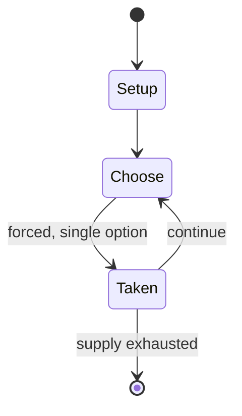

# Pan

*Polish card game*

`pan` &nbsp; state: **DEEPENED** &nbsp; method: **heuristic**

## Found layer (recorded, not trusted)

| field | value |
| --- | --- |
| wikidata | Q11802526 |
| wikipedia | Pan (game) |
| genres (source) | -- |
| instance of (source) | card game |
| country of origin | Poland |

## Declared layer (orders bench work)

| field | value |
| --- | --- |
| year created | -- |
| epoch | -- |
| region | EUROPE_EAST |
| media | CARD |
| players | -- |
| age band | -- |
| exogenous process | -- |
| loss shape | -- |
| live axes | - |
| horizon | -- |
| scoring shape | -- |
| information | -- |
| interaction | -- |
| turn structure | -- |
| tractability | SAMPLING_ONLY |
| randomness | -- |
| luck factor | 0.35 |
| rules complexity | 1.68 |
| strategic depth | 2.25 |
| novelty | 0.0896 |
| solved status | -- |
| strategies | spatial_packing |
| algorithms | -- |

## Object model

```
Episode
  players      : ?
  turn_structure: ?
  horizon       : ?
  scoring       : ?

Deck           -- ordered multiset, drawn without replacement
Hand           -- private multiset held by one player
DiscardPile    -- public accumulation of spent cards
```

## State transition diagram



## Research item -- turn trace

```
# Pan -- simulated turn events
# generated from the DECLARED vector, not from a rulebook.
# structure: exo=None loss=None horizon=None scoring=None axes=-

t=0    SETUP        players=2  pot=0  capacity=5
t=1    FORCED       p1 single legal option taken (pot_gain=+1.8)
t=2    FORCED       p1 single legal option taken (pot_gain=+1.4)
t=3    ENDTURN      turn passes to p2
t=4    FORCED       p2 single legal option taken (pot_gain=+1.7)
t=5    FORCED       p2 single legal option taken (pot_gain=+1.1)
t=6    FORCED       p2 single legal option taken (pot_gain=+1.4)
t=7    FORCED       p2 single legal option taken (pot_gain=+1.5)
t=8    FORCED       p2 single legal option taken (pot_gain=+0.8)
t=9    FORCED       p2 single legal option taken (pot_gain=+1.2)
t=10   FORCED       p2 single legal option taken (pot_gain=+1.7)
t=11   ENDTURN      turn passes to p1
t=12   FORCED       p1 single legal option taken (pot_gain=+1.8)
t=13   FORCED       p1 single legal option taken (pot_gain=+1.9)
t=14   ENDTURN      turn passes to p2
t=15   FORCED       p2 single legal option taken (pot_gain=+1.3)
t=16   FORCED       p2 single legal option taken (pot_gain=+1.8)
t=17   FORCED       p2 single legal option taken (pot_gain=+1.4)
t=18   FORCED       p2 single legal option taken (pot_gain=+0.6)
t=19   ENDTURN      turn passes to p1
t=20   FORCED       p1 single legal option taken (pot_gain=+1.3)
t=21   FORCED       p1 single legal option taken (pot_gain=+1.0)
t=22   ENDTURN      turn passes to p2
t=23   FORCED       p2 single legal option taken (pot_gain=+1.2)
t=24   FORCED       p2 single legal option taken (pot_gain=+1.5)
t=25   FORCED       p2 single legal option taken (pot_gain=+0.8)
t=26   FORCED       p2 single legal option taken (pot_gain=+1.6)

terminal: VARIABLE
```

## Conditions

| kind | threshold | effect | trigger |
| --- | --- | --- | --- |
| WIN | -- | -- | Whoever gets rid of their cards first wins the game but one can play only cards of higher or equal value than the one at the top of the stack. |

## Source extract

Pan is a card game of Polish origin, using a small French pack (cards from 9 to A are used).
Whoever gets rid of their cards first wins the game but one can play only cards of higher or
equal value than the one at the top of the stack. All cards are dealt evenly to each of the
players. The player that gets nine of Hearts starts the game by placing the card at the stack.
Then the next player can play one, three or four cards of the same value, provided that they are
of equal or higher value than the card at the top of the stack. If one can't play anything or
they don't want to, they have to take three or more cards from the stack. If there are three
cards or less at the stack, then the player has to take all the cards but the nine of Hearts at
the bottom.   == Bibliography == "Pan - zasady gry - Kurnik". Kurnik (in Polish). Retrieved 5
July 2017. "Jak grać w Pana? 2 vs 2". tipy.interia.pl (in Polish). Retrieved 5 July 2017.   ==
External links == Rules at Pagat.com

<sub>Wikipedia, CC BY-SA. Retained as evidence for the structural
classification above. Every rule inferred from it is HYPOTHESIZED
until audited against a rulebook.</sub>
