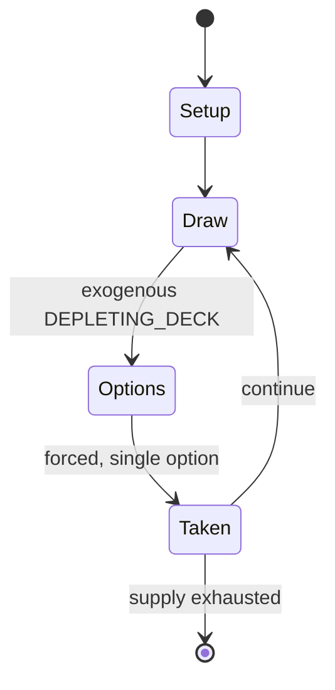

# Panguingue

`panguingue` &nbsp; state: **DEEPENED** &nbsp; method: **heuristic**

## Found layer (recorded, not trusted)

| field | value |
| --- | --- |
| wikidata | Q11280760 |
| wikipedia | Panguingue |
| genres (source) | -- |
| instance of (source) | -- |
| country of origin | -- |

## Declared layer (orders bench work)

| field | value |
| --- | --- |
| year created | -- |
| epoch | -- |
| region | -- |
| media | CARD, GAMBLING |
| players | -- |
| age band | -- |
| exogenous process | DEPLETING_DECK |
| loss shape | -- |
| live axes | DISCARD |
| horizon | -- |
| scoring shape | SET_COLLECTION_CONVEX |
| information | -- |
| interaction | SOLITAIRE |
| turn structure | -- |
| tractability | EXACT_WITH_CUT |
| randomness | -- |
| luck factor | 0.35 |
| rules complexity | 2.12 |
| strategic depth | 2.25 |
| novelty | 0.7067 |
| solved status | -- |
| strategies | set_collection |
| algorithms | -- |

## Object model

```
Episode
  players      : ?
  turn_structure: ?
  horizon       : ?
  scoring       : SET_COLLECTION_CONVEX

Deck           -- ordered multiset, drawn without replacement
Hand           -- private multiset held by one player
DiscardPile    -- public accumulation of spent cards
DiscardChoice  -- what is given up to satisfy a limit
```

## State transition diagram



## Research item -- turn trace

```
# Panguingue -- simulated turn events
# generated from the DECLARED vector, not from a rulebook.
# structure: exo=DEPLETING_DECK loss=None horizon=None scoring=SET_COLLECTION_CONVEX axes=DISCARD

t=0    SETUP        players=2  pot=0  capacity=5
t=1    DRAW         p1 draw from deck -> outcome #6  (p=0.262)
t=2    FORCED       p1 single legal option taken (pot_gain=+0.8)
t=3    DRAW         p1 draw from deck -> outcome #4  (p=0.123)
t=4    FORCED       p1 single legal option taken (pot_gain=+1.8)
t=5    ENDTURN      turn passes to p2
t=6    DRAW         p2 draw from deck -> outcome #3  (p=0.271)
t=7    FORCED       p2 single legal option taken (pot_gain=+0.5)
t=8    DISCARD      p2 discards to hand limit
t=9    DRAW         p2 draw from deck -> outcome #6  (p=0.192)
t=10   FORCED       p2 single legal option taken (pot_gain=+0.6)
t=11   DISCARD      p2 discards to hand limit
t=12   DRAW         p2 draw from deck -> outcome #2  (p=0.248)
t=13   FORCED       p2 single legal option taken (pot_gain=+1.8)
t=14   DISCARD      p2 discards to hand limit
t=15   DRAW         p2 draw from deck -> outcome #3  (p=0.073)
t=16   FORCED       p2 single legal option taken (pot_gain=+0.6)
t=17   DISCARD      p2 discards to hand limit
t=18   DRAW         p2 draw from deck -> outcome #1  (p=0.202)
t=19   FORCED       p2 single legal option taken (pot_gain=+2.0)
t=20   DRAW         p2 draw from deck -> outcome #5  (p=0.020)
t=21   FORCED       p2 single legal option taken (pot_gain=+1.2)
t=22   DISCARD      p2 discards to hand limit
t=23   DRAW         p2 draw from deck -> outcome #5  (p=0.132)
t=24   FORCED       p2 single legal option taken (pot_gain=+1.8)
t=25   DISCARD      p2 discards to hand limit
t=26   DRAW         p2 draw from deck -> outcome #2  (p=0.093)
t=27   FORCED       p2 single legal option taken (pot_gain=+0.8)

terminal: VARIABLE
```

## Conditions

| kind | threshold | effect | trigger |
| --- | --- | --- | --- |
| WIN | -- | -- | The first player to move their stack from left to right is the winner. |
| PENALTY | -- | -- | If a player fouls their hand, they stay in and continue to pay, but have no more chance to make paying combinations themself. |

## Source extract

Panguingue (pronounced "pan-geen-ee", in Tagalog Pangginggí, and also known as Pan) is a 19th-
century gambling card game probably of Philippine origin similar to rummy, first described in
America in 1905. It used to be particularly popular in Las Vegas and other casinos in the
American southwest. Its popularity has been waning, and it is now only found in a handful of
casinos in California, in house games and at online poker sites. In California, it, and the low-
ball version of poker, were the only games for which it was legal to play for money.   == The
deck == The game is traditionally played using a 320-card deck, constructed from eight decks of
playing cards, removing all eights, nines, tens, and Jokers, which makes it like the 40-card
Spanish deck. In some localities, 5, 6, or 11 decks are used, and often one set of spades is
removed. Meanwhile in the Philippines, instead of the Anglo-American deck, they traditionally
use the original 40-card Spanish Deck for the game with Ace, 2-7, Jack, Cavalier (instead of
Queen), King.   == The game == Each player pays an ante of one chip, called the top. The value
of the top sets the value of all pays in the game. Some high-stakes games a

<sub>Wikipedia, CC BY-SA. Retained as evidence for the structural
classification above. Every rule inferred from it is HYPOTHESIZED
until audited against a rulebook.</sub>
