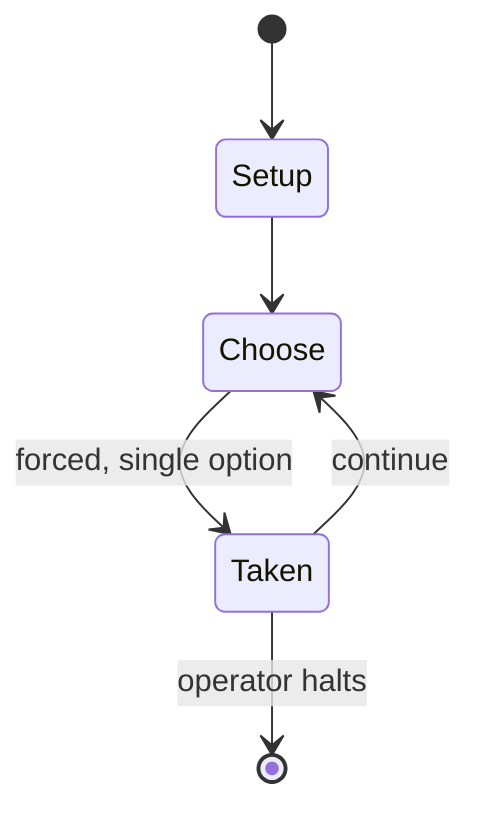

# Panzer Armee Afrika

*board game*

`panzer_armee_afrika` &nbsp; state: **DEEPENED** &nbsp; method: **heuristic**

## Found layer (recorded, not trusted)

| field | value |
| --- | --- |
| wikidata | Q10344258 |
| wikipedia | PanzerArmee Afrika (board game) |
| genres (source) | board wargame |
| instance of (source) | board game |
| country of origin | -- |

## Declared layer (orders bench work)

| field | value |
| --- | --- |
| year created | -- |
| epoch | -- |
| region | -- |
| media | BOARD, WARGAME |
| players | -- |
| age band | -- |
| exogenous process | -- |
| loss shape | -- |
| live axes | SPATIAL |
| horizon | OPEN_ENDED |
| scoring shape | SURVIVAL |
| information | -- |
| interaction | -- |
| turn structure | PHASE_STRUCTURED |
| tractability | SAMPLING_ONLY |
| randomness | DICE |
| luck factor | 0.58 |
| rules complexity | 3.92 |
| strategic depth | 2.12 |
| novelty | 0.7032 |
| solved status | -- |
| strategies | spatial_packing |
| algorithms | -- |

## Object model

```
Episode
  players      : ?
  turn_structure: PHASE_STRUCTURED
  horizon       : OPEN_ENDED
  scoring       : SURVIVAL

Board          -- spatial substrate; cells carry position and occupancy
Piece          -- movable token owned by a player
Placement      -- position subject to geometric legality
```

## State transition diagram



## Research item -- turn trace

```
# Panzer Armee Afrika -- simulated turn events
# generated from the DECLARED vector, not from a rulebook.
# structure: exo=None loss=None horizon=OPEN_ENDED scoring=SURVIVAL axes=SPATIAL

t=0    SETUP        players=2  pot=0  capacity=8
t=1    FORCED       p1 single legal option taken (pot_gain=+2.0)
t=2    FORCED       p1 single legal option taken (pot_gain=+1.5)
t=3    ENDTURN      turn passes to p2
t=4    FORCED       p2 single legal option taken (pot_gain=+2.0)
t=5    FORCED       p2 single legal option taken (pot_gain=+0.9)
t=6    SPATIAL      p2 places at (0,6); adjacency legal
t=7    ENDTURN      turn passes to p1
t=8    FORCED       p1 single legal option taken (pot_gain=+1.6)
t=9    FORCED       p1 single legal option taken (pot_gain=+1.4)
t=10   FORCED       p1 single legal option taken (pot_gain=+0.6)
t=11   FORCED       p1 single legal option taken (pot_gain=+0.7)
t=12   FORCED       p1 single legal option taken (pot_gain=+1.7)
t=13   FORCED       p1 single legal option taken (pot_gain=+1.3)
t=14   SPATIAL      p1 places at (3,6); adjacency legal
t=15   FORCED       p1 single legal option taken (pot_gain=+0.8)
t=16   FORCED       p1 single legal option taken (pot_gain=+1.9)
t=17   FORCED       p1 single legal option taken (pot_gain=+1.1)
t=18   SPATIAL      p1 places at (0,2); adjacency legal
t=19   ENDTURN      turn passes to p2
t=20   FORCED       p2 single legal option taken (pot_gain=+1.8)
t=21   SPATIAL      p2 places at (1,3); adjacency legal
t=22   ENDTURN      turn passes to p1
t=23   FORCED       p1 single legal option taken (pot_gain=+0.8)
t=24   SPATIAL      p1 places at (1,7); adjacency legal
t=25   ENDTURN      turn passes to p2
t=26   FORCED       p2 single legal option taken (pot_gain=+1.2)

terminal: OPEN_ENDED
```

## Source extract

PanzerArmee Afrika, subtitled "Rommel in the Desert, April 1941 - November 1942", is a board
wargame published by Simulations Publications, Inc. (SPI) in 1973 that simulates the World War
II North African Campaign that pitted the Axis forces commanded by Erwin Rommel against Allied
forces. The game was revised and republished in 1984 by Avalon Hill.   == Description == In
February 1941, Erwin Rommel was ordered to stabilize the situation in North Africa after British
troops routed the Italian army. This game simulates Rommel's campaign from April 1941 until his
defeat at the Battle of El Alamein in November 1942.   == Components == The magazine pull-out
edition had the following components:  One 22 x 34" paper hex grid map, scaled at 12 mi (19 km)
per hex 200 die-cut counters 12-page rules booklet SPI also published the game in a "flat-pack"
box with integral counter tray and clear plastic lid. In the Avalon Hill boxed set, the map was
mounted, and a 6-sided die was included.   === Gameplay === Each turn, which represents a month
of game time, is divided into 4 phases for the Allied player, and then the same phases for the
Axis player:  Supply Determination Phase Movement Phase Com

<sub>Wikipedia, CC BY-SA. Retained as evidence for the structural
classification above. Every rule inferred from it is HYPOTHESIZED
until audited against a rulebook.</sub>
