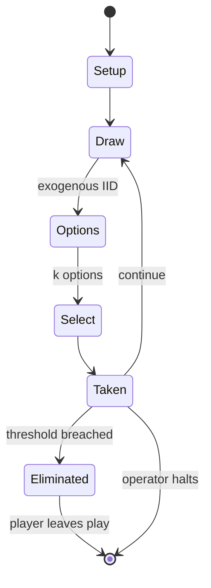

# Paranoia

*Science fiction tabletop role-playing game*

`paranoia` &nbsp; state: **DEEPENED** &nbsp; method: **heuristic**

## Found layer (recorded, not trusted)

| field | value |
| --- | --- |
| wikidata | Q1042398 |
| wikipedia | Paranoia (role-playing game) |
| genres (source) | tabletop role-playing game |
| instance of (source) | tabletop role-playing game, tabletop role-playing game family |
| country of origin | United States |

## Declared layer (orders bench work)

| field | value |
| --- | --- |
| year created | 1984 |
| epoch | DIGITAL |
| region | NORTH_AMERICA |
| media | DICE, RPG |
| players | -- |
| age band | -- |
| exogenous process | IID |
| loss shape | ELIMINATION |
| live axes | BID, COMMIT_BLIND, SELECT, TIMING |
| horizon | OPEN_ENDED |
| scoring shape | SET_COLLECTION_CONVEX |
| information | HIDDEN_PRIVATE |
| interaction | TEAM |
| turn structure | PRIORITY_QUEUE |
| tractability | SAMPLING_ONLY |
| randomness | DICE, HIDDEN_INFO |
| luck factor | 0.63 |
| rules complexity | 5.0 |
| strategic depth | 2.79 |
| novelty | 0.7421 |
| solved status | -- |
| strategies | set_collection, signalling, spatial_packing, tempo |
| algorithms | -- |

## Object model

```
Episode
  players      : ?
  turn_structure: PRIORITY_QUEUE
  horizon       : OPEN_ENDED
  scoring       : SET_COLLECTION_CONVEX

DicePool       -- n dice, each an iid categorical draw
Roll           -- realised outcome of a pool
Character      -- persistent stat block owned by a player
GameMaster     -- adjudicating agent outside the scoring loop
Scenario       -- authored state the players traverse
Auction        -- priced competition resolving to one winner
SealedChoice   -- irrevocable choice made without observation
OptionSet      -- the choices available after an exogenous draw
Initiative     -- who acts, and when, relative to others
```

## State transition diagram



## Research item -- turn trace

```
# Paranoia -- simulated turn events
# generated from the DECLARED vector, not from a rulebook.
# structure: exo=IID loss=ELIMINATION horizon=OPEN_ENDED scoring=SET_COLLECTION_CONVEX axes=BID,COMMIT_BLIND,SELECT,TIMING

t=0    SETUP        players=2  pot=0  capacity=3
t=1    DRAW         p1 roll from d6 pool -> outcome #3  (p=0.196)
t=2    SELECT       p1 2 options; take #1  (pot_gain=+3.3, capacity=-0)
t=3    BID          p1 sealed bid of 2 against 1 rivals
t=4    ENDTURN      turn passes to p2
t=5    DRAW         p2 roll from d6 pool -> outcome #3  (p=0.061)
t=6    SELECT       p2 3 options; take #1  (pot_gain=+3.5, capacity=-1)
t=7    BID          p2 sealed bid of 2 against 1 rivals
t=8    DRAW         p2 roll from d6 pool -> outcome #4  (p=0.246)
t=9    SELECT       p2 1 options; take #1  (pot_gain=+0.9, capacity=-1)
t=10   BID          p2 sealed bid of 5 against 1 rivals
t=11   ENDTURN      turn passes to p1
t=12   DRAW         p1 roll from d6 pool -> outcome #2  (p=0.048)
t=13   SELECT       p1 4 options; take #3  (pot_gain=+3.5, capacity=-2)
t=14   BID          p1 sealed bid of 9 against 1 rivals
t=15   ENDTURN      turn passes to p2
t=16   DRAW         p2 roll from d6 pool -> outcome #1  (p=0.125)
t=17   SELECT       p2 1 options; take #1  (pot_gain=+2.9, capacity=-0)
t=18   ENDTURN      turn passes to p1
t=19   DRAW         p1 roll from d6 pool -> outcome #1  (p=0.189)
t=20   SELECT       p1 2 options; take #1  (pot_gain=+1.6, capacity=-0)
t=21   DRAW         p1 roll from d6 pool -> outcome #2  (p=0.078)
t=22   SELECT       p1 2 options; take #2  (pot_gain=+0.6, capacity=-2)
t=23   BID          p1 sealed bid of 4 against 1 rivals
t=24   DRAW         p1 roll from d6 pool -> outcome #6  (p=0.298)
t=25   SELECT       p1 1 options; take #1  (pot_gain=+0.7, capacity=-2)
t=26   ENDTURN      turn passes to p2

terminal: OPEN_ENDED
```

## Conditions

| kind | threshold | effect | trigger |
| --- | --- | --- | --- |
| ELIMINATE | -- | -- | Player characters are initially enforcers of the Computer's authority known as Troubleshooters, and are given missions to seek out and eliminate threats to the Computer's control. |

## Source extract

Paranoia is a dystopian science-fiction tabletop role-playing game originally designed and
written by Greg Costikyan, Dan Gelber, and Eric Goldberg, and first published in 1984 by West
End Games. Since 2004 the game has been published under license by Mongoose Publishing. The game
won the Origins Award for Best Roleplaying Rules of 1984 and was inducted into the Origins
Awards Hall of Fame in 2007. Paranoia is notable among tabletop games for being more competitive
than co-operative, with players encouraged to betray one another for their own interests, as
well as for keeping a light-hearted, tongue in cheek tone despite its dystopian setting. Several
editions of the game have been published since the original version, and the franchise has
spawned several spin-offs, novels and comic books based on the game.   == Premise == The game is
set in a dystopian future city controlled by the Computer (also known as "Friend Computer"), and
where information (including the game rules) are restricted by color-coded "security clearance".
Player characters are initially enforcers of the Computer's authority known as Troubleshooters,
and are given missions to seek out and eliminate threats to th

<sub>Wikipedia, CC BY-SA. Retained as evidence for the structural
classification above. Every rule inferred from it is HYPOTHESIZED
until audited against a rulebook.</sub>
