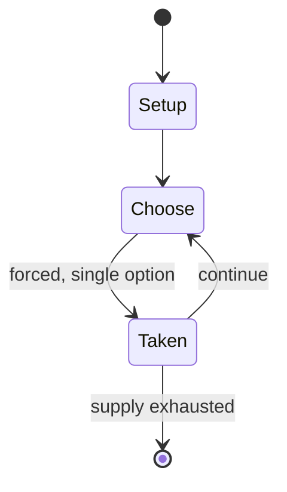

# pass the parcel

*British party game*

`pass_the_parcel` &nbsp; state: **DEEPENED** &nbsp; method: **heuristic**

## Found layer (recorded, not trusted)

| field | value |
| --- | --- |
| wikidata | Q7142435 |
| wikipedia | Pass the parcel |
| genres (source) | -- |
| instance of (source) | party game |
| country of origin | United Kingdom |

## Declared layer (orders bench work)

| field | value |
| --- | --- |
| year created | -- |
| epoch | -- |
| region | EUROPE_WEST |
| media | PARTY |
| players | -- |
| age band | -- |
| exogenous process | -- |
| loss shape | -- |
| live axes | - |
| horizon | -- |
| scoring shape | -- |
| information | -- |
| interaction | -- |
| turn structure | -- |
| tractability | SAMPLING_ONLY |
| randomness | -- |
| luck factor | 0.35 |
| rules complexity | 1.75 |
| strategic depth | 2.0 |
| novelty | 0.0876 |
| solved status | -- |
| strategies | -- |
| algorithms | -- |

## Object model

```
Episode
  players      : ?
  turn_structure: ?
  horizon       : ?
  scoring       : ?

State          -- opaque; no medium or axis evidence was found
Player         -- an agent that selects among legal successors
```

## State transition diagram



## Research item -- turn trace

```
# pass the parcel -- simulated turn events
# generated from the DECLARED vector, not from a rulebook.
# structure: exo=None loss=None horizon=None scoring=None axes=-

t=0    SETUP        players=2  pot=0  capacity=6
t=1    FORCED       p1 single legal option taken (pot_gain=+1.2)
t=2    ENDTURN      turn passes to p2
t=3    FORCED       p2 single legal option taken (pot_gain=+2.0)
t=4    FORCED       p2 single legal option taken (pot_gain=+1.6)
t=5    FORCED       p2 single legal option taken (pot_gain=+0.5)
t=6    FORCED       p2 single legal option taken (pot_gain=+1.0)
t=7    FORCED       p2 single legal option taken (pot_gain=+1.0)
t=8    FORCED       p2 single legal option taken (pot_gain=+1.1)
t=9    FORCED       p2 single legal option taken (pot_gain=+1.5)
t=10   FORCED       p2 single legal option taken (pot_gain=+2.0)
t=11   FORCED       p2 single legal option taken (pot_gain=+1.5)
t=12   FORCED       p2 single legal option taken (pot_gain=+1.9)
t=13   FORCED       p2 single legal option taken (pot_gain=+1.8)
t=14   FORCED       p2 single legal option taken (pot_gain=+1.5)
t=15   FORCED       p2 single legal option taken (pot_gain=+0.5)
t=16   ENDTURN      turn passes to p1
t=17   FORCED       p1 single legal option taken (pot_gain=+1.5)
t=18   FORCED       p1 single legal option taken (pot_gain=+1.4)
t=19   FORCED       p1 single legal option taken (pot_gain=+1.7)
t=20   FORCED       p1 single legal option taken (pot_gain=+1.1)
t=21   FORCED       p1 single legal option taken (pot_gain=+1.2)
t=22   FORCED       p1 single legal option taken (pot_gain=+1.9)
t=23   ENDTURN      turn passes to p2
t=24   FORCED       p2 single legal option taken (pot_gain=+0.8)
t=25   FORCED       p2 single legal option taken (pot_gain=+1.1)
t=26   ENDTURN      turn passes to p1

terminal: VARIABLE
```

## Conditions

| kind | threshold | effect | trigger |
| --- | --- | --- | --- |
| PENALTY | -- | -- | Variations on the game include allowing participants to remove as many layers of paper as possible (rather than just one) before the music restarts, and including challenges or forfeits on slips of paper in place of mott |

## Source extract

Pass the parcel, also known as “pass the present” in North America, is a classic British party
game in which a parcel is passed from one person to another. In preparation for the game, a
prize (or "gift") is wrapped in a large number of layers of wrapping paper or reusable fabric
bags of different sizes.  Usually, each layer is of a different design so they can be easily
distinguished.  Smaller prizes or mottos may be placed between some or all other layers of
wrapping. During the game, music is played as the parcel is passed around.  Whoever is holding
the parcel when the music is stopped removes one layer of wrapping and claims any prize found
under that layer. Sometimes there is a prize in each layer, but some people would prefer to have
only one prize in the final layer.  The music is then restarted and the game continues until
every layer is removed and the main prize claimed. The stopping and starting of the music is
usually done by an adult who is not taking part in the game.  While they should not observe the
game in order for it to be fair, in practice they often do to ensure that every participant has
a turn, that prizes are well distributed and perhaps that the child who

<sub>Wikipedia, CC BY-SA. Retained as evidence for the structural
classification above. Every rule inferred from it is HYPOTHESIZED
until audited against a rulebook.</sub>
