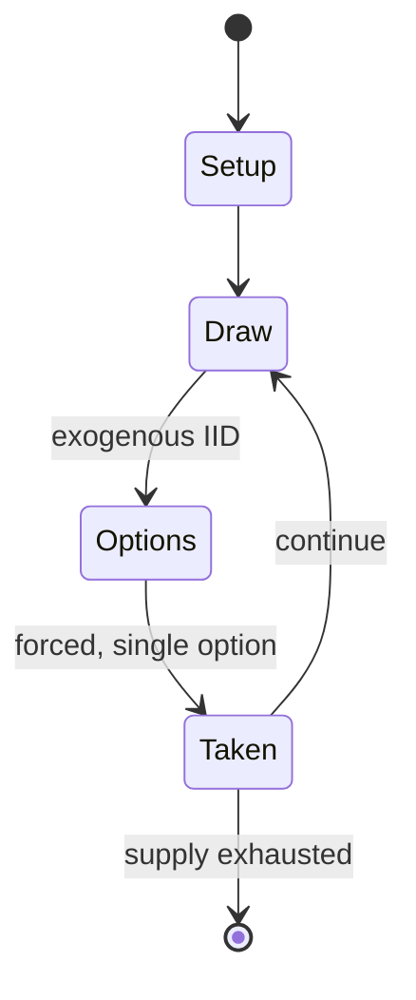

# passe-dix

*a game of chance using dice*

`passe_dix` &nbsp; state: **DEEPENED** &nbsp; method: **heuristic**

## Found layer (recorded, not trusted)

| field | value |
| --- | --- |
| wikidata | Q2055425 |
| wikipedia | Passe-dix |
| genres (source) | -- |
| instance of (source) | dice game, game of chance |
| country of origin | -- |

## Declared layer (orders bench work)

| field | value |
| --- | --- |
| year created | -- |
| epoch | -- |
| region | -- |
| media | DICE, GAMBLING |
| players | -- |
| age band | -- |
| exogenous process | IID |
| loss shape | -- |
| live axes | - |
| horizon | -- |
| scoring shape | -- |
| information | -- |
| interaction | -- |
| turn structure | -- |
| tractability | EXACT_WITH_CUT |
| randomness | DICE |
| luck factor | 0.58 |
| rules complexity | 1.76 |
| strategic depth | 1.87 |
| novelty | 0.6405 |
| solved status | -- |
| strategies | -- |
| algorithms | -- |

## Object model

```
Episode
  players      : ?
  turn_structure: ?
  horizon       : ?
  scoring       : ?

DicePool       -- n dice, each an iid categorical draw
Roll           -- realised outcome of a pool
```

## State transition diagram



## Research item -- turn trace

```
# passe-dix -- simulated turn events
# generated from the DECLARED vector, not from a rulebook.
# structure: exo=IID loss=None horizon=None scoring=None axes=-

t=0    SETUP        players=2  pot=0  capacity=7
t=1    DRAW         p1 roll from d6 pool -> outcome #6  (p=0.204)
t=2    FORCED       p1 single legal option taken (pot_gain=+0.7)
t=3    DRAW         p1 roll from d6 pool -> outcome #3  (p=0.250)
t=4    FORCED       p1 single legal option taken (pot_gain=+0.6)
t=5    DRAW         p1 roll from d6 pool -> outcome #5  (p=0.167)
t=6    FORCED       p1 single legal option taken (pot_gain=+1.2)
t=7    DRAW         p1 roll from d6 pool -> outcome #6  (p=0.094)
t=8    FORCED       p1 single legal option taken (pot_gain=+0.6)
t=9    ENDTURN      turn passes to p2
t=10   DRAW         p2 roll from d6 pool -> outcome #6  (p=0.241)
t=11   FORCED       p2 single legal option taken (pot_gain=+0.9)
t=12   DRAW         p2 roll from d6 pool -> outcome #1  (p=0.239)
t=13   FORCED       p2 single legal option taken (pot_gain=+1.7)
t=14   ENDTURN      turn passes to p1
t=15   DRAW         p1 roll from d6 pool -> outcome #3  (p=0.265)
t=16   FORCED       p1 single legal option taken (pot_gain=+0.9)
t=17   DRAW         p1 roll from d6 pool -> outcome #3  (p=0.283)
t=18   FORCED       p1 single legal option taken (pot_gain=+1.6)
t=19   DRAW         p1 roll from d6 pool -> outcome #3  (p=0.221)
t=20   FORCED       p1 single legal option taken (pot_gain=+1.8)
t=21   ENDTURN      turn passes to p2
t=22   DRAW         p2 roll from d6 pool -> outcome #3  (p=0.038)
t=23   FORCED       p2 single legal option taken (pot_gain=+2.0)
t=24   ENDTURN      turn passes to p1
t=25   DRAW         p1 roll from d6 pool -> outcome #3  (p=0.296)
t=26   FORCED       p1 single legal option taken (pot_gain=+1.7)

terminal: VARIABLE
```

## Source extract

Passe-dix, also called passage in English, is a game of chance using dice.   == Gameplay == It
was described by Charles Cotton in The Compleat Gamester (1674) thus:  Passage is a Game at dice
to be played at but by two, and it is performed with three Dice. The Caster throws continually
until he hath thrown Dubblets under ten, and then he is out and loseth; or Dubblets above ten,
and then he passeth and wins. Andrew Steinmetz, in The Gaming Table: Its Votaries and Victims,
described it at greater length but somewhat ambiguously (the results of rolling a 10 are
unclear, depending on whether it wins for the bank or is a push, the house advantage is at best
0, and at worst negative):   == History == In September 1553, a courtier lent money to William
Petre to play at "pass dice" with Mary I of England at Hampton Court.   == In Germany == In
southern Germany, playing passe-dix (or "Paschen") is a New Year's Eve tradition, which dates to
the Late Middle Ages. The rules of Paschen vary, but the following account, found in the 1896
Brockhaus Konversationslexikon is typical. The banker first wagers an ante, known as the banco.
The punters either place their own bets, the sum of which must e

<sub>Wikipedia, CC BY-SA. Retained as evidence for the structural
classification above. Every rule inferred from it is HYPOTHESIZED
until audited against a rulebook.</sub>
