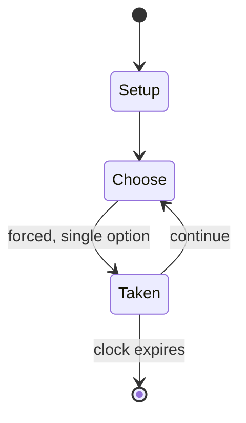

# Patintero

`patintero` &nbsp; state: **DEEPENED** &nbsp; method: **heuristic**

## Found layer (recorded, not trusted)

| field | value |
| --- | --- |
| wikidata | Q12969330 |
| wikipedia | Patintero |
| genres (source) | -- |
| instance of (source) | -- |
| country of origin | -- |

## Declared layer (orders bench work)

| field | value |
| --- | --- |
| year created | -- |
| epoch | -- |
| region | -- |
| media | - |
| players | 4 |
| age band | CHILD |
| exogenous process | NONE |
| loss shape | OPPORTUNITY_ONLY |
| live axes | SPATIAL |
| horizon | CLOCK_LIMITED |
| scoring shape | -- |
| information | PERFECT |
| interaction | -- |
| turn structure | -- |
| tractability | EXACT_WITH_CUT |
| randomness | NONE |
| luck factor | 0.02 |
| rules complexity | 2.17 |
| strategic depth | 2.4 |
| novelty | 0.8028 |
| solved status | -- |
| strategies | -- |
| algorithms | -- |

## Object model

```
Episode
  players      : 4
  turn_structure: ?
  horizon       : CLOCK_LIMITED
  scoring       : ?

Placement      -- position subject to geometric legality
```

## State transition diagram



## Research item -- turn trace

```
# Patintero -- simulated turn events
# generated from the DECLARED vector, not from a rulebook.
# structure: exo=NONE loss=OPPORTUNITY_ONLY horizon=CLOCK_LIMITED scoring=None axes=SPATIAL

t=0    SETUP        players=4  pot=0  capacity=3
t=1    FORCED       p1 single legal option taken (pot_gain=+1.9)
t=2    ENDTURN      turn passes to p2
t=3    FORCED       p2 single legal option taken (pot_gain=+0.6)
t=4    SPATIAL      p2 places at (6,3); adjacency legal
t=5    ENDTURN      turn passes to p3
t=6    FORCED       p3 single legal option taken (pot_gain=+1.1)
t=7    FORCED       p3 single legal option taken (pot_gain=+1.2)
t=8    ENDTURN      turn passes to p4
t=9    FORCED       p4 single legal option taken (pot_gain=+1.8)
t=10   FORCED       p4 single legal option taken (pot_gain=+0.8)
t=11   FORCED       p4 single legal option taken (pot_gain=+2.0)
t=12   ENDTURN      turn passes to p1
t=13   FORCED       p1 single legal option taken (pot_gain=+1.4)
t=14   FORCED       p1 single legal option taken (pot_gain=+1.8)
t=15   SPATIAL      p1 places at (0,6); adjacency legal
t=16   ENDTURN      turn passes to p2
t=17   FORCED       p2 single legal option taken (pot_gain=+1.2)
t=18   FORCED       p2 single legal option taken (pot_gain=+1.7)
t=19   FORCED       p2 single legal option taken (pot_gain=+1.3)
t=20   ENDTURN      turn passes to p3
t=21   FORCED       p3 single legal option taken (pot_gain=+1.5)
t=22   FORCED       p3 single legal option taken (pot_gain=+1.3)
t=23   FORCED       p3 single legal option taken (pot_gain=+0.8)
t=24   SPATIAL      p3 places at (0,1); adjacency legal
t=25   ENDTURN      turn passes to p4
t=26   FORCED       p4 single legal option taken (pot_gain=+0.9)

terminal: CLOCK_LIMITED
```

## Source extract

Patintero, also known as harangang-taga or tubigan, (Intl. Translate: Escape from the hell or
Block the runner) is a Filipino traditional children's game. Along with tumbang preso, it is one
of the most popular outdoor games played by children in the Philippines.   == Etymology ==
Patintero is derived from the Spanish word tinta ("tint" or "ink") in reference to the drawn
lines. Another name for it is tubigan, tubiganay, or tubig-tubig ("water [game]"), due to the
fact that the grid lines are also commonly drawn by wetting the ground with water. It is also
known as harangang-taga or harang-taga (lit. "block and catch"), referring to the game
mechanics. Other names for the game include lumplumpas (Igorot), alagwa (Kapampangan), sinibon
or serbab (Ilokano), and tadlas (for four players) or birus-birus (for six players) in eastern
Visayas.   == Description ==  Patintero is played on a rectangular grid drawn into the ground.
The rectangle is usually 5 to 6 m (16 to 20 ft) in length, and 4 m (13 ft) wide. It is
subdivided into four to six equal parts by drawing a central lengthwise line and then one or two
crosswise lines. The size of the rectangle and the number of subdivisions can be

<sub>Wikipedia, CC BY-SA. Retained as evidence for the structural
classification above. Every rule inferred from it is HYPOTHESIZED
until audited against a rulebook.</sub>
