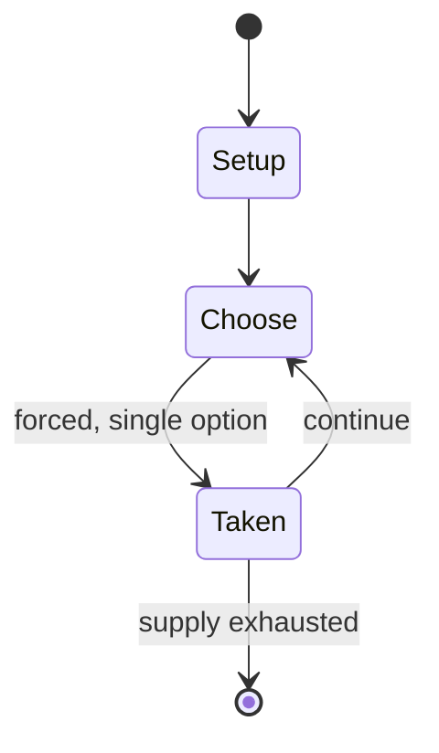

# Patolli

`patolli` &nbsp; state: **DEEPENED** &nbsp; method: **heuristic**

## Found layer (recorded, not trusted)

| field | value |
| --- | --- |
| wikidata | Q1700475 |
| wikipedia | Patolli |
| genres (source) | -- |
| instance of (source) | -- |
| country of origin | -- |

## Declared layer (orders bench work)

| field | value |
| --- | --- |
| year created | -- |
| epoch | -- |
| region | -- |
| media | BOARD, GAMBLING |
| players | -- |
| age band | -- |
| exogenous process | -- |
| loss shape | -- |
| live axes | - |
| horizon | -- |
| scoring shape | RACE_POSITION |
| information | -- |
| interaction | COMPETITIVE |
| turn structure | -- |
| tractability | SAMPLING_ONLY |
| randomness | -- |
| luck factor | 0.35 |
| rules complexity | 1.75 |
| strategic depth | 2.0 |
| novelty | 0.5324 |
| solved status | -- |
| strategies | -- |
| algorithms | -- |

## Object model

```
Episode
  players      : ?
  turn_structure: ?
  horizon       : ?
  scoring       : RACE_POSITION

Board          -- spatial substrate; cells carry position and occupancy
Piece          -- movable token owned by a player
```

## State transition diagram



## Research item -- turn trace

```
# Patolli -- simulated turn events
# generated from the DECLARED vector, not from a rulebook.
# structure: exo=None loss=None horizon=None scoring=RACE_POSITION axes=-

t=0    SETUP        players=2  pot=0  capacity=6
t=1    FORCED       p1 single legal option taken (pot_gain=+1.7)
t=2    FORCED       p1 single legal option taken (pot_gain=+0.9)
t=3    FORCED       p1 single legal option taken (pot_gain=+2.0)
t=4    FORCED       p1 single legal option taken (pot_gain=+1.6)
t=5    ENDTURN      turn passes to p2
t=6    FORCED       p2 single legal option taken (pot_gain=+1.2)
t=7    FORCED       p2 single legal option taken (pot_gain=+1.9)
t=8    FORCED       p2 single legal option taken (pot_gain=+1.5)
t=9    FORCED       p2 single legal option taken (pot_gain=+1.3)
t=10   FORCED       p2 single legal option taken (pot_gain=+1.4)
t=11   FORCED       p2 single legal option taken (pot_gain=+1.2)
t=12   FORCED       p2 single legal option taken (pot_gain=+1.4)
t=13   FORCED       p2 single legal option taken (pot_gain=+1.2)
t=14   FORCED       p2 single legal option taken (pot_gain=+1.0)
t=15   FORCED       p2 single legal option taken (pot_gain=+1.0)
t=16   ENDTURN      turn passes to p1
t=17   FORCED       p1 single legal option taken (pot_gain=+0.7)
t=18   FORCED       p1 single legal option taken (pot_gain=+0.8)
t=19   ENDTURN      turn passes to p2
t=20   FORCED       p2 single legal option taken (pot_gain=+1.6)
t=21   FORCED       p2 single legal option taken (pot_gain=+2.0)
t=22   ENDTURN      turn passes to p1
t=23   FORCED       p1 single legal option taken (pot_gain=+1.8)
t=24   FORCED       p1 single legal option taken (pot_gain=+1.3)
t=25   FORCED       p1 single legal option taken (pot_gain=+0.5)
t=26   FORCED       p1 single legal option taken (pot_gain=+2.0)

terminal: VARIABLE
```

## Conditions

| kind | threshold | effect | trigger |
| --- | --- | --- | --- |
| ELIMINATE | -- | removed | The four squares in the middle of the "X": Landing on an opponent's marker in this area is allowed, and if a player does so, the opponent's marker is removed from the game board and put back into the opponent's starting  |
| WIN | -- | -- | As soon as a player has won all of their opponent's treasures, the game is over and that player is the winner. |
| TERMINATE | -- | -- | In addition, if a player's toss results in all the beans standing on their sides, the game is over and the player automatically wins all the goods bet by both parties. |

## Source extract

Patolli (Nahuatl: [paˈtoːlːi]) or patole (Spanish: [paˈtole]) is one of the oldest known games
in America. It was a game of strategy and luck played by commoners and nobles alike. It was
reported by the conquistadors that Moctezuma Xocoyotzin often enjoyed watching his nobles play
the game at court.   == History == Patolli and its variants were played by a wide range of pre-
Columbian Mesoamerican cultures and were known all over Mesoamerica. While the term Patolli in
the strictest sense refers to the Aztec version of the game whose rules are known from surviving
codices, scholars also use the term to describe games played on similar boards found throughout
Mesoamerica whose exact ruleset is unknown. Versions of Patolli were played by the Teotihuacanos
(the builders of Teotihuacan, c. 200 BC - 650 AD), the Toltecs (c. 750 - 1000), the Aztecs (1168
- 1521) and all of the people they conquered (practically all of Mesoamerica, including the
Zapotecs and the Mixtecs). The Maya peoples played a version of the game from the early Classic
Period (c. 300 AD) until its suppression by the Catholic authorities in the 16th century.   ==
Players == Patolli is a race game with a heavy focus on ga

<sub>Wikipedia, CC BY-SA. Retained as evidence for the structural
classification above. Every rule inferred from it is HYPOTHESIZED
until audited against a rulebook.</sub>
