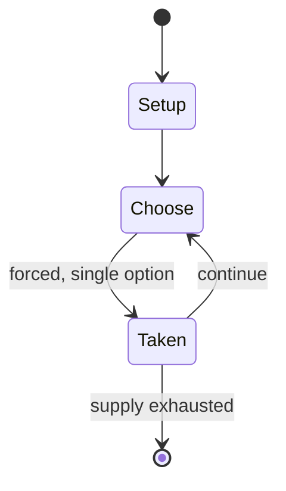

# peg solitaire

*board game for one player*

`peg_solitaire` &nbsp; state: **DEEPENED** &nbsp; method: **heuristic**

## Found layer (recorded, not trusted)

| field | value |
| --- | --- |
| wikidata | Q1411087 |
| wikipedia | Peg solitaire |
| genres (source) | -- |
| instance of (source) | board game, mechanical puzzle, solitaire |
| country of origin | France |

## Declared layer (orders bench work)

| field | value |
| --- | --- |
| year created | -- |
| epoch | -- |
| region | EUROPE_WEST |
| media | BOARD, PUZZLE, SOLITAIRE |
| players | 1 |
| age band | -- |
| exogenous process | NONE |
| loss shape | OPPORTUNITY_ONLY |
| live axes | SPATIAL |
| horizon | -- |
| scoring shape | SET_COLLECTION_CONVEX |
| information | PERFECT |
| interaction | SOLITAIRE |
| turn structure | -- |
| tractability | EXACT_WITH_CUT |
| randomness | NONE |
| luck factor | 0.02 |
| rules complexity | 2.28 |
| strategic depth | 2.9 |
| novelty | 0.7477 |
| solved status | -- |
| strategies | set_collection, spatial_packing |
| algorithms | -- |

## Object model

```
Episode
  players      : 1
  turn_structure: ?
  horizon       : ?
  scoring       : SET_COLLECTION_CONVEX

Board          -- spatial substrate; cells carry position and occupancy
Piece          -- movable token owned by a player
Configuration  -- the arrangement to be resolved
Constraint     -- predicate a legal configuration must satisfy
Placement      -- position subject to geometric legality
```

## State transition diagram



## Research item -- turn trace

```
# peg solitaire -- simulated turn events
# generated from the DECLARED vector, not from a rulebook.
# structure: exo=NONE loss=OPPORTUNITY_ONLY horizon=None scoring=SET_COLLECTION_CONVEX axes=SPATIAL

t=0    SETUP        players=1  pot=0  capacity=8
t=1    FORCED       p1 single legal option taken (pot_gain=+0.6)
t=2    FORCED       p1 single legal option taken (pot_gain=+0.6)
t=3    ENDTURN      turn passes to p1
t=4    FORCED       p1 single legal option taken (pot_gain=+1.6)
t=5    FORCED       p1 single legal option taken (pot_gain=+1.2)
t=6    FORCED       p1 single legal option taken (pot_gain=+1.9)
t=7    SPATIAL      p1 places at (3,2); adjacency legal
t=8    FORCED       p1 single legal option taken (pot_gain=+1.2)
t=9    FORCED       p1 single legal option taken (pot_gain=+1.4)
t=10   SPATIAL      p1 places at (0,1); adjacency legal
t=11   FORCED       p1 single legal option taken (pot_gain=+0.6)
t=12   FORCED       p1 single legal option taken (pot_gain=+1.8)
t=13   SPATIAL      p1 places at (3,1); adjacency legal
t=14   FORCED       p1 single legal option taken (pot_gain=+1.8)
t=15   SPATIAL      p1 places at (2,5); adjacency legal
t=16   FORCED       p1 single legal option taken (pot_gain=+0.7)
t=17   FORCED       p1 single legal option taken (pot_gain=+0.8)
t=18   FORCED       p1 single legal option taken (pot_gain=+0.6)
t=19   FORCED       p1 single legal option taken (pot_gain=+0.9)
t=20   FORCED       p1 single legal option taken (pot_gain=+1.9)
t=21   SPATIAL      p1 places at (0,4); adjacency legal
t=22   ENDTURN      turn passes to p1
t=23   FORCED       p1 single legal option taken (pot_gain=+1.6)
t=24   FORCED       p1 single legal option taken (pot_gain=+1.6)
t=25   FORCED       p1 single legal option taken (pot_gain=+2.0)
t=26   FORCED       p1 single legal option taken (pot_gain=+1.5)
t=27   ENDTURN      turn passes to p1

terminal: VARIABLE
```

## Source extract

Peg solitaire, solo noble, solo goli, marble solitaire or simply solitaire is a board game for
one player involving movement of pegs on a board with holes.  Some sets use marbles in a board
with indentations. The game is known as solitaire in Britain and as peg solitaire in the US
where 'solitaire' refers to the family of card games. The first evidence of the game can be
traced back to the court of Louis XIV, and the specific date of 1697, with an engraving made ten
years later by Claude Auguste Berey of Anne de Rohan-Chabot, Princess of Soubise, with the
puzzle by her side.  The August 1697 edition of the French literary magazine Mercure galant
contains a description of the board, rules and sample problems.  This is the first known
reference to the game in print. The standard game fills the entire board with pegs except for
the central hole. The objective is, making valid moves, to empty the entire board except for a
solitary peg in the central hole.   == Board ==  There are two traditional boards ('⚫' as an
initial peg, '⚪' as an initial hole):   == Play ==  A valid move is to jump a peg orthogonally
over an adjacent peg into a hole two positions away and then to remove the jumpe

<sub>Wikipedia, CC BY-SA. Retained as evidence for the structural
classification above. Every rule inferred from it is HYPOTHESIZED
until audited against a rulebook.</sub>
