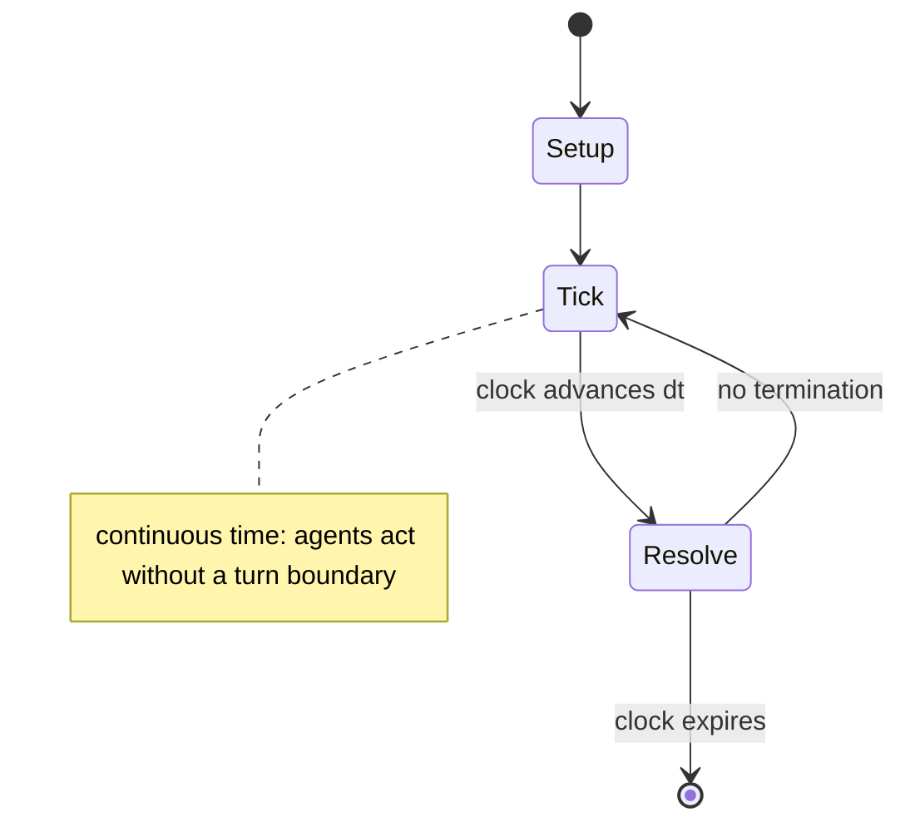

# Perfection

*board game*

`perfection` &nbsp; state: **DEEPENED** &nbsp; method: **heuristic**

## Found layer (recorded, not trusted)

| field | value |
| --- | --- |
| wikidata | Q7168111 |
| wikipedia | Perfection (board game) |
| genres (source) | -- |
| instance of (source) | board game |
| country of origin | -- |

## Declared layer (orders bench work)

| field | value |
| --- | --- |
| year created | 1973 |
| epoch | DIGITAL |
| region | -- |
| media | BOARD |
| players | -- |
| age band | -- |
| exogenous process | CONTINUOUS_TIME |
| loss shape | OPPORTUNITY_ONLY |
| live axes | SPATIAL |
| horizon | CLOCK_LIMITED |
| scoring shape | -- |
| information | PERFECT |
| interaction | -- |
| turn structure | REAL_TIME |
| tractability | SAMPLING_ONLY |
| randomness | REAL_TIME_PHYSICAL |
| luck factor | 0.3 |
| rules complexity | 2.19 |
| strategic depth | 2.4 |
| novelty | 0.7552 |
| solved status | -- |
| strategies | -- |
| algorithms | -- |

## Object model

```
Episode
  players      : ?
  turn_structure: REAL_TIME
  horizon       : CLOCK_LIMITED
  scoring       : ?

Board          -- spatial substrate; cells carry position and occupancy
Piece          -- movable token owned by a player
Placement      -- position subject to geometric legality
```

## State transition diagram



## Research item -- clock trace

```
# Perfection -- simulated clock trace (no turn boundary)
# generated from the DECLARED vector, not from a rulebook.
# structure: exo=CONTINUOUS_TIME loss=OPPORTUNITY_ONLY horizon=CLOCK_LIMITED scoring=None axes=SPATIAL

clk=0.000s  START        agents=4  clock=counts down
clk=0.242s  ACTION       a2 acts continuously; no turn boundary crossed
clk=2.576s  ACTION       a2 acts continuously; no turn boundary crossed
clk=5.540s  SCORE        a1 scores (+3)
clk=8.214s  STOPPAGE     clock halts; state frozen
clk=10.285s  CONTEST      a2 and a3 contend for the same resource
clk=11.284s  ACTION       a2 acts continuously; no turn boundary crossed
clk=11.803s  ACTION       a3 acts continuously; no turn boundary crossed
clk=13.091s  SCORE        a4 scores (+3)
clk=14.514s  ACTION       a4 acts continuously; no turn boundary crossed
clk=17.312s  STOPPAGE     clock halts; state frozen
clk=18.630s  STOPPAGE     clock halts; state frozen
clk=19.701s  INFRACTION   a4 commits infraction (count=1)
clk=21.999s  CONTEST      a3 and a4 contend for the same resource
clk=22.594s  ACTION       a3 acts continuously; no turn boundary crossed
clk=23.980s  INFRACTION   a2 commits infraction (count=1)
clk=26.488s  ACTION       a2 acts continuously; no turn boundary crossed
clk=28.685s  CONTEST      a1 and a2 contend for the same resource
clk=29.645s  ACTION       a2 acts continuously; no turn boundary crossed
clk=32.188s  ACTION       a1 acts continuously; no turn boundary crossed
clk=32.647s  ACTION       a3 acts continuously; no turn boundary crossed
clk=33.771s  ACTION       a3 acts continuously; no turn boundary crossed
clk=34.218s  ACTION       a3 acts continuously; no turn boundary crossed
clk=36.819s  CONTEST      a4 and a1 contend for the same resource
clk=37.298s  ACTION       a4 acts continuously; no turn boundary crossed
clk=38.276s  STOPPAGE     clock halts; state frozen
clk=38.850s  CONTEST      a2 and a3 contend for the same resource

note: elapsed time, not move count, is the episode's ordering variable.
```

## Source extract

Perfection is a game originally produced by the Pennsylvania company Reed Toys and then by the
Milton Bradley company. The object is to put all the pieces into matching holes on the board
(pushed down) before the time limit runs out. When time runs out, the board springs up, causing
the pieces to fly out. In the most common version, there are 25 pieces to be placed into a 5×5
grid within 60 seconds.   == History == Thomas Kinnard Liversidge was the inventor of the board
game perfection and owned harmonic Reed Company.  The original Perfection game was patented by
the Harmonic Reed Company (later Reed Toys) in 1973. The patent was later transferred to
Lakeside Industries, which was purchased by Coleco in 1986. Coleco declared bankruptcy in 1988,
after which the remaining assets and IPs were purchased by Hasbro in 1989, who continues to
manufacture the game under their Milton Bradley brand.   == Gameplay ==  Each player takes a
turn in which they attempt to fit all shapes into the corresponding holes in the game tray. The
shapes are mixed and placed next to the game unit with handles facing up, the pop-up mechanism
is pushed down, and the timer dial is set to 60 seconds. After moving

<sub>Wikipedia, CC BY-SA. Retained as evidence for the structural
classification above. Every rule inferred from it is HYPOTHESIZED
until audited against a rulebook.</sub>
