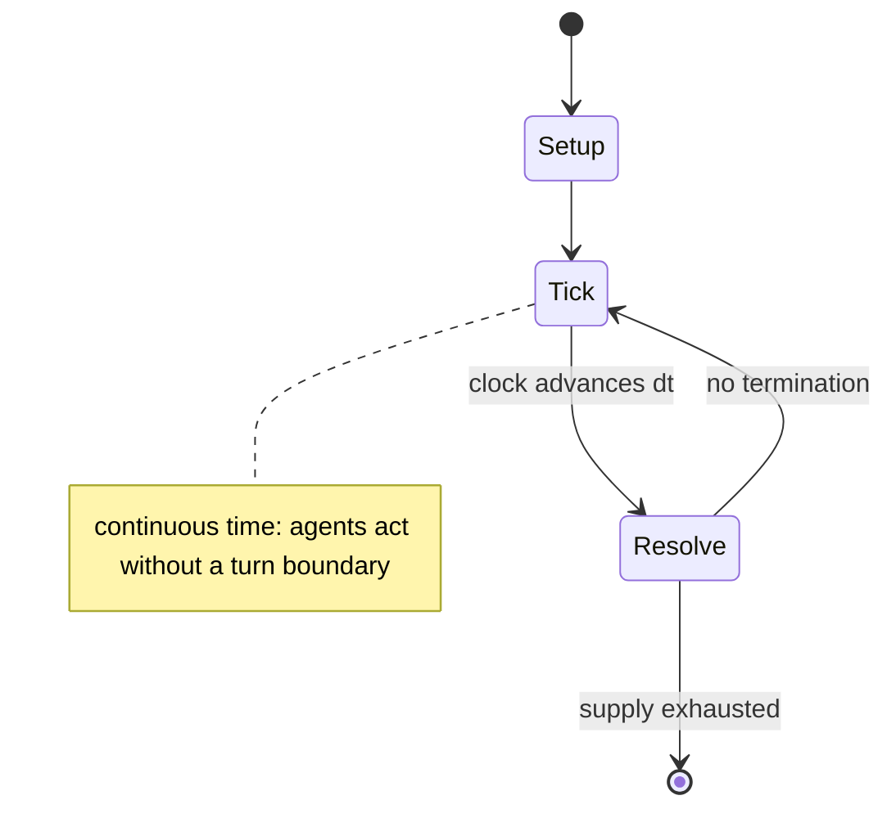

# Performous

*Karaoke, band games and dancing game*

`performous` &nbsp; state: **DEEPENED** &nbsp; method: **heuristic**

## Found layer (recorded, not trusted)

| field | value |
| --- | --- |
| wikidata | Q25091050 |
| wikipedia | Performous |
| genres (source) | music video game, rhythm game |
| instance of (source) | video game |
| country of origin | -- |

## Declared layer (orders bench work)

| field | value |
| --- | --- |
| year created | 2017 |
| epoch | CONTEMPORARY |
| region | -- |
| media | VIDEO |
| players | -- |
| age band | -- |
| exogenous process | CONTINUOUS_TIME |
| loss shape | -- |
| live axes | COMMIT_BLIND, SELECT, TIMING |
| horizon | -- |
| scoring shape | -- |
| information | SIMULTANEOUS |
| interaction | COMPETITIVE |
| turn structure | REAL_TIME |
| tractability | SAMPLING_ONLY |
| randomness | REAL_TIME_PHYSICAL, SIMULTANEOUS_CHOICE |
| luck factor | 0.3 |
| rules complexity | 3.27 |
| strategic depth | 2.0 |
| novelty | 0.6947 |
| solved status | -- |
| strategies | -- |
| algorithms | -- |

## Object model

```
Episode
  players      : ?
  turn_structure: REAL_TIME
  horizon       : ?
  scoring       : ?

WorldState     -- simulation state advanced by the engine
Avatar         -- player-controlled agent
Clock          -- frame or tick counter
SealedChoice   -- irrevocable choice made without observation
OptionSet      -- the choices available after an exogenous draw
Initiative     -- who acts, and when, relative to others
```

## State transition diagram



## Research item -- clock trace

```
# Performous -- simulated clock trace (no turn boundary)
# generated from the DECLARED vector, not from a rulebook.
# structure: exo=CONTINUOUS_TIME loss=None horizon=None scoring=None axes=COMMIT_BLIND,SELECT,TIMING

clk=0.000s  START        agents=4  clock=free running
clk=2.907s  ACTION       a2 acts continuously; no turn boundary crossed
clk=5.853s  CONTEST      a2 and a3 contend for the same resource
clk=8.380s  ACTION       a2 acts continuously; no turn boundary crossed
clk=8.607s  ACTION       a1 acts continuously; no turn boundary crossed
clk=10.536s  ACTION       a2 acts continuously; no turn boundary crossed
clk=11.292s  ACTION       a4 acts continuously; no turn boundary crossed
clk=11.991s  ACTION       a4 acts continuously; no turn boundary crossed
clk=12.603s  INFRACTION   a1 commits infraction (count=1)
clk=15.023s  SCORE        a2 scores (+3)
clk=16.247s  ACTION       a1 acts continuously; no turn boundary crossed
clk=17.209s  ACTION       a4 acts continuously; no turn boundary crossed
clk=18.884s  ACTION       a2 acts continuously; no turn boundary crossed
clk=21.539s  SCORE        a4 scores (+3)
clk=21.863s  CONTEST      a3 and a4 contend for the same resource
clk=22.225s  ACTION       a1 acts continuously; no turn boundary crossed
clk=24.755s  ACTION       a2 acts continuously; no turn boundary crossed
clk=25.304s  CONTEST      a1 and a2 contend for the same resource
clk=26.195s  SCORE        a3 scores (+1)
clk=26.567s  ACTION       a1 acts continuously; no turn boundary crossed
clk=27.237s  ACTION       a3 acts continuously; no turn boundary crossed
clk=28.452s  SCORE        a4 scores (+1)
clk=31.119s  ACTION       a1 acts continuously; no turn boundary crossed
clk=33.623s  STOPPAGE     clock halts; state frozen
clk=35.666s  CONTEST      a1 and a2 contend for the same resource
clk=37.854s  ACTION       a3 acts continuously; no turn boundary crossed
clk=38.946s  STOPPAGE     clock halts; state frozen

note: elapsed time, not move count, is the episode's ordering variable.
```

## Conditions

| kind | threshold | effect | trigger |
| --- | --- | --- | --- |
| BOUNDARY | -- | -- | Timing accuracy is still considered in the scoring so that hitting all notes does not always give the maximum score. |

## Source extract

UltraStar is a clone of SingStar, a music video game by Polish developer Patryk "Covus5" Cebula.
UltraStar lets one or several players score points by singing along to a song or music video and
match the pitch of the original song. UltraStar displays lyrics as well as the correct notes
similar to a piano roll. On top of the correct notes UltraStar displays the pitch recorded from
the players. UltraStar allows several people to play simultaneously by connecting several
microphones possibly to several sound cards. To add a song to UltraStar, a file with notes and
lyrics is required, together with an audio file. Optionally a cover image, a backdrop image and
a video may be added to each song. UltraStar comes preloaded with a short sample from Nine Inch
Nails hit "Discipline" from The Slip album.   == License == UltraStar is released under Freeware
License. Very old versions were available under GNU General Public License and most game forks
were initially based on the old code.   == Shop == New version of the game introduces Song Shop,
where users after free registration can download free songs and buy points. Free songs include:
== Ports == The original UltraStar is programmed in K

<sub>Wikipedia, CC BY-SA. Retained as evidence for the structural
classification above. Every rule inferred from it is HYPOTHESIZED
until audited against a rulebook.</sub>
