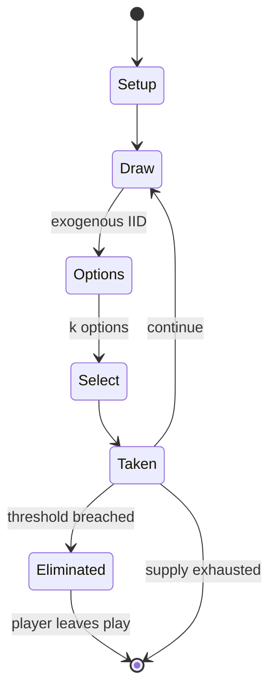

# Perudo

`perudo` &nbsp; state: **DEEPENED** &nbsp; method: **heuristic**

## Found layer (recorded, not trusted)

| field | value |
| --- | --- |
| wikidata | -- |
| wikipedia | Perudo |
| genres (source) | -- |
| instance of (source) | -- |
| country of origin | -- |

## Declared layer (orders bench work)

| field | value |
| --- | --- |
| year created | -- |
| epoch | -- |
| region | -- |
| media | DICE |
| players | -- |
| age band | -- |
| exogenous process | IID |
| loss shape | ELIMINATION |
| live axes | BID, SELECT |
| horizon | VARIABLE |
| scoring shape | SET_COLLECTION_CONVEX |
| information | -- |
| interaction | SOLITAIRE |
| turn structure | -- |
| tractability | EXACT_WITH_CUT |
| randomness | DICE, HIDDEN_INFO |
| luck factor | 0.63 |
| rules complexity | 2.68 |
| strategic depth | 2.04 |
| novelty | 0.7197 |
| solved status | -- |
| strategies | set_collection |
| algorithms | -- |

## Object model

```
Episode
  players      : ?
  turn_structure: ?
  horizon       : VARIABLE
  scoring       : SET_COLLECTION_CONVEX

DicePool       -- n dice, each an iid categorical draw
Roll           -- realised outcome of a pool
Auction        -- priced competition resolving to one winner
OptionSet      -- the choices available after an exogenous draw
```

## State transition diagram



## Research item -- turn trace

```
# Perudo -- simulated turn events
# generated from the DECLARED vector, not from a rulebook.
# structure: exo=IID loss=ELIMINATION horizon=VARIABLE scoring=SET_COLLECTION_CONVEX axes=BID,SELECT

t=0    SETUP        players=2  pot=0  capacity=6
t=1    DRAW         p1 roll from d6 pool -> outcome #4  (p=0.114)
t=2    SELECT       p1 4 options; take #2  (pot_gain=+1.0, capacity=-1)
t=3    DRAW         p1 roll from d6 pool -> outcome #3  (p=0.092)
t=4    SELECT       p1 2 options; take #1  (pot_gain=+0.8, capacity=-1)
t=5    ENDTURN      turn passes to p2
t=6    DRAW         p2 roll from d6 pool -> outcome #2  (p=0.220)
t=7    SELECT       p2 3 options; take #1  (pot_gain=+0.5, capacity=-0)
t=8    BID          p2 sealed bid of 6 against 1 rivals
t=9    DRAW         p2 roll from d6 pool -> outcome #2  (p=0.100)
t=10   SELECT       p2 2 options; take #2  (pot_gain=+2.3, capacity=-0)
t=11   BID          p2 sealed bid of 1 against 1 rivals
t=12   DRAW         p2 roll from d6 pool -> outcome #3  (p=0.110)
t=13   SELECT       p2 4 options; take #3  (pot_gain=+1.5, capacity=-2)
t=14   DRAW         p2 roll from d6 pool -> outcome #2  (p=0.213)
t=15   SELECT       p2 2 options; take #2  (pot_gain=+2.7, capacity=-0)
t=16   DRAW         p2 roll from d6 pool -> outcome #3  (p=0.022)
t=17   SELECT       p2 3 options; take #3  (pot_gain=+2.2, capacity=-2)
t=18   DRAW         p2 roll from d6 pool -> outcome #6  (p=0.234)
t=19   SELECT       p2 4 options; take #1  (pot_gain=+0.7, capacity=-2)
t=20   DRAW         p2 roll from d6 pool -> outcome #2  (p=0.034)
t=21   SELECT       p2 3 options; take #2  (pot_gain=+3.2, capacity=-2)
t=22   DRAW         p2 roll from d6 pool -> outcome #6  (p=0.191)
t=23   SELECT       p2 4 options; take #1  (pot_gain=+1.8, capacity=-2)
t=24   DRAW         p2 roll from d6 pool -> outcome #2  (p=0.105)
t=25   SELECT       p2 1 options; take #1  (pot_gain=+1.6, capacity=-0)
t=26   DRAW         p2 roll from d6 pool -> outcome #5  (p=0.263)
t=27   SELECT       p2 4 options; take #1  (pot_gain=+3.1, capacity=-2)
t=28   BID          p2 sealed bid of 8 against 1 rivals

terminal: VARIABLE
```

## Conditions

| kind | threshold | effect | trigger |
| --- | --- | --- | --- |
| WIN | 1 player | -- | The game ends when only one player has dice remaining; that player is the winner. |
| ELIMINATE | -- | eliminated | A player with no dice remaining is eliminated from the game. |
| ELIMINATE | -- | -- | After calling, a new round starts with the player that lost a die making the first bid, or (if that player was eliminated) the player to that player's left. |
| WIN | -- | -- | The last player to still have dice is the winner. |
| BOUNDARY | -- | -- | For example: a bid of "five threes" is a claim that there are at least five dice showing a three or a one, when you tally up all the dice across all players in the table. |
| BOUNDARY | -- | -- | For instance, if the current bid is "five threes" then the next player would have to bid at least three aces. |

## Source extract

Dudo (Spanish for I doubt), also known as cacho, pico, perudo, liar's dice, Peruvian liar dice,
cachito, or dadinho is a popular dice game played in South America. It is a more specific
version of a family of games collectively called liar's dice, which has many forms and variants.
This game can be played by two or more players and consists of guessing how many dice, placed
under cups, there are on the table showing a certain number. The player who loses a round loses
one of their dice. The last player to still have dice is the winner.   == Game play ==  Each
player starts having five dice and a cup, which is used for shaking the dice and concealing the
dice from the other players. To decide order of play (who starts and who goes next), players
roll a single die. Highest roll goes first, then next lowest and so on. In the event of a tie
between 2 players, they simply re-roll until one gains a higher score. Each game round begins
with the players shaking the dice in their cups, then slamming upside down cup on table so that
shaken dice remain concealed fully inside the cup. Players carefully lift the cups to look at
their own dice while keeping them concealed from other players. The

<sub>Wikipedia, CC BY-SA. Retained as evidence for the structural
classification above. Every rule inferred from it is HYPOTHESIZED
until audited against a rulebook.</sub>
