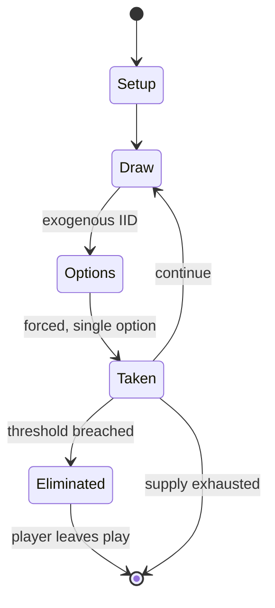

# Petteia

`petteia` &nbsp; state: **DEEPENED** &nbsp; method: **heuristic**

## Found layer (recorded, not trusted)

| field | value |
| --- | --- |
| wikidata | -- |
| wikipedia | Petteia |
| genres (source) | -- |
| instance of (source) | -- |
| country of origin | -- |

## Declared layer (orders bench work)

| field | value |
| --- | --- |
| year created | -450 |
| epoch | ANCIENT |
| region | -- |
| media | BOARD |
| players | 2 |
| age band | -- |
| exogenous process | IID |
| loss shape | ELIMINATION |
| live axes | SPATIAL |
| horizon | -- |
| scoring shape | -- |
| information | -- |
| interaction | -- |
| turn structure | -- |
| tractability | EXACT_WITH_CUT |
| randomness | DICE |
| luck factor | 0.58 |
| rules complexity | 2.13 |
| strategic depth | 1.87 |
| novelty | 0.7007 |
| solved status | -- |
| strategies | -- |
| algorithms | -- |

## Object model

```
Episode
  players      : 2
  turn_structure: ?
  horizon       : ?
  scoring       : ?

Board          -- spatial substrate; cells carry position and occupancy
Piece          -- movable token owned by a player
Placement      -- position subject to geometric legality
```

## State transition diagram



## Research item -- turn trace

```
# Petteia -- simulated turn events
# generated from the DECLARED vector, not from a rulebook.
# structure: exo=IID loss=ELIMINATION horizon=None scoring=None axes=SPATIAL

t=0    SETUP        players=2  pot=0  capacity=5
t=1    DRAW         p1 roll from d6 pool -> outcome #2  (p=0.158)
t=2    FORCED       p1 single legal option taken (pot_gain=+0.7)
t=3    SPATIAL      p1 places at (5,6); adjacency legal
t=4    DRAW         p1 roll from d6 pool -> outcome #2  (p=0.123)
t=5    FORCED       p1 single legal option taken (pot_gain=+0.6)
t=6    SPATIAL      p1 places at (6,5); adjacency legal
t=7    ENDTURN      turn passes to p2
t=8    DRAW         p2 roll from d6 pool -> outcome #4  (p=0.106)
t=9    FORCED       p2 single legal option taken (pot_gain=+1.0)
t=10   DRAW         p2 roll from d6 pool -> outcome #5  (p=0.030)
t=11   FORCED       p2 single legal option taken (pot_gain=+0.6)
t=12   SPATIAL      p2 places at (7,7); adjacency legal
t=13   DRAW         p2 roll from d6 pool -> outcome #3  (p=0.215)
t=14   FORCED       p2 single legal option taken (pot_gain=+0.6)
t=15   SPATIAL      p2 places at (3,6); adjacency legal
t=16   DRAW         p2 roll from d6 pool -> outcome #6  (p=0.046)
t=17   FORCED       p2 single legal option taken (pot_gain=+1.9)
t=18   SPATIAL      p2 places at (1,6); adjacency legal
t=19   DRAW         p2 roll from d6 pool -> outcome #6  (p=0.019)
t=20   FORCED       p2 single legal option taken (pot_gain=+1.5)
t=21   SPATIAL      p2 places at (1,5); adjacency legal
t=22   DRAW         p2 roll from d6 pool -> outcome #3  (p=0.222)
t=23   FORCED       p2 single legal option taken (pot_gain=+1.7)
t=24   DRAW         p2 roll from d6 pool -> outcome #1  (p=0.088)
t=25   FORCED       p2 single legal option taken (pot_gain=+1.1)
t=26   DRAW         p2 roll from d6 pool -> outcome #4  (p=0.271)
t=27   FORCED       p2 single legal option taken (pot_gain=+1.4)

terminal: VARIABLE
```

## Conditions

| kind | threshold | effect | trigger |
| --- | --- | --- | --- |
| ELIMINATE | 2 players | -- | It was a symmetrical game of elimination for two players, each playing with pieces of their color. |
| BOUNDARY | -- | -- | References to it are found in numerous other texts, suggesting that by mid-5th century BC the game was well known to ancient Greeks and was played until at least 2nd century BC. |

## Source extract

Polis (Greek: πόλις, lit. 'city-state') was an ancient Greek board game. One of the earliest
known strategy games and wargames, the original rules of the game have been only partially
preserved and resemble checkers. Its name appears in the Ancient Greek literature from around
450 BC to the 2nd century BC, and it seems to have been widely known in the region, particularly
in Athens. The game might have had a cultural significance to the Ancient Greeks, with the
process of learning the game mentioned in works of several Ancient Greek philosophers as part of
a philosophical education of educating children as a citizen of the city.   == History ==  As
with many ancient games, not much is known about polis, including where, when, and by whom it
was invented. The earliest known reference to polis comes from Cratinos, an Athenian comedic
poet, in his comedy Drapetides ("Female Runaways"), from 443/442 BC. The game was praised by
Plato and Polybius, and possibly Philostratus, "as a game of strategy requiring great tactical
skill". It was also likely referred to by Aristotle and Socrates. References to it are found in
numerous other texts, suggesting that by mid-5th century BC the game was

<sub>Wikipedia, CC BY-SA. Retained as evidence for the structural
classification above. Every rule inferred from it is HYPOTHESIZED
until audited against a rulebook.</sub>
