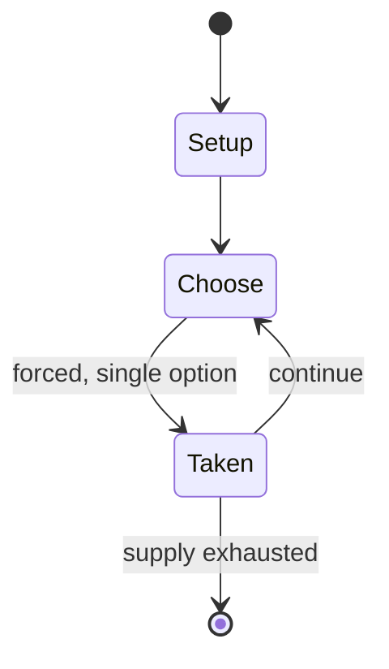

# philosophy shogi checkers

*board game similar to English draughts, invented by Inoue Enryō, Japanese philosopher, and described by his student in 1890*

`philosophy_shogi_checkers` &nbsp; state: **DEEPENED** &nbsp; method: **heuristic**

## Found layer (recorded, not trusted)

| field | value |
| --- | --- |
| wikidata | Q5932888 |
| wikipedia | Philosophy shogi checkers |
| genres (source) | -- |
| instance of (source) | shogi variant |
| country of origin | Empire of Japan |

## Declared layer (orders bench work)

| field | value |
| --- | --- |
| year created | 1890 |
| epoch | INDUSTRIAL |
| region | EAST_ASIA |
| media | BOARD |
| players | -- |
| age band | -- |
| exogenous process | -- |
| loss shape | -- |
| live axes | - |
| horizon | -- |
| scoring shape | -- |
| information | -- |
| interaction | COMPETITIVE |
| turn structure | -- |
| tractability | SAMPLING_ONLY |
| randomness | -- |
| luck factor | 0.35 |
| rules complexity | 1.73 |
| strategic depth | 2.0 |
| novelty | 0.3528 |
| solved status | -- |
| strategies | -- |
| algorithms | -- |

## Object model

```
Episode
  players      : ?
  turn_structure: ?
  horizon       : ?
  scoring       : ?

Board          -- spatial substrate; cells carry position and occupancy
Piece          -- movable token owned by a player
```

## State transition diagram



## Research item -- turn trace

```
# philosophy shogi checkers -- simulated turn events
# generated from the DECLARED vector, not from a rulebook.
# structure: exo=None loss=None horizon=None scoring=None axes=-

t=0    SETUP        players=2  pot=0  capacity=7
t=1    FORCED       p1 single legal option taken (pot_gain=+2.0)
t=2    FORCED       p1 single legal option taken (pot_gain=+1.9)
t=3    FORCED       p1 single legal option taken (pot_gain=+0.9)
t=4    ENDTURN      turn passes to p2
t=5    FORCED       p2 single legal option taken (pot_gain=+0.6)
t=6    FORCED       p2 single legal option taken (pot_gain=+0.7)
t=7    FORCED       p2 single legal option taken (pot_gain=+1.8)
t=8    FORCED       p2 single legal option taken (pot_gain=+1.9)
t=9    FORCED       p2 single legal option taken (pot_gain=+1.9)
t=10   FORCED       p2 single legal option taken (pot_gain=+0.5)
t=11   FORCED       p2 single legal option taken (pot_gain=+1.8)
t=12   FORCED       p2 single legal option taken (pot_gain=+1.4)
t=13   ENDTURN      turn passes to p1
t=14   FORCED       p1 single legal option taken (pot_gain=+0.8)
t=15   FORCED       p1 single legal option taken (pot_gain=+1.5)
t=16   FORCED       p1 single legal option taken (pot_gain=+0.6)
t=17   FORCED       p1 single legal option taken (pot_gain=+1.7)
t=18   FORCED       p1 single legal option taken (pot_gain=+1.9)
t=19   FORCED       p1 single legal option taken (pot_gain=+1.5)
t=20   FORCED       p1 single legal option taken (pot_gain=+1.7)
t=21   FORCED       p1 single legal option taken (pot_gain=+0.6)
t=22   FORCED       p1 single legal option taken (pot_gain=+1.2)
t=23   ENDTURN      turn passes to p2
t=24   FORCED       p2 single legal option taken (pot_gain=+1.2)
t=25   ENDTURN      turn passes to p1
t=26   FORCED       p1 single legal option taken (pot_gain=+1.7)

terminal: VARIABLE
```

## Conditions

| kind | threshold | effect | trigger |
| --- | --- | --- | --- |
| TERMINATE | -- | -- | How the game ends - A player wins by capturing opponent's king. |

## Source extract

Philosophy shogi checkers (哲学飛将碁) is a board game similar to English draughts, invented by Inoue
Enryō, Japanese philosopher, and described by his student in 1890. It has same board size with
shogi and game ends with capturing the opponent's king, similar to shogi and Persian chess.   ==
Game play == Rules of the game are almost similar to English draughts. Differences from English
draughts are explained here.  Board - Size of the board is 9x9 with alternative dark and light
squares, corner squares having dark colors. Pieces move in dark squares only. Pieces - Each
player has 14 pieces; one of them is king. Starting position - At the starting position the
pieces are placed at the dark squares of the first 3 rows closest to the players. King is placed
at the center of the row closest to the player. How to move - Move and jump are similar to
English draughts. Move and jump of the king are similar to king (crowned piece) of English
draughts. Princes - If a player's piece moves into the first row on the opposing side of the
board, the piece promotes to a "prince". Move and jump of prince are similar to king. To
distinguish it from king at the starting position, it is called prince. How

<sub>Wikipedia, CC BY-SA. Retained as evidence for the structural
classification above. Every rule inferred from it is HYPOTHESIZED
until audited against a rulebook.</sub>
