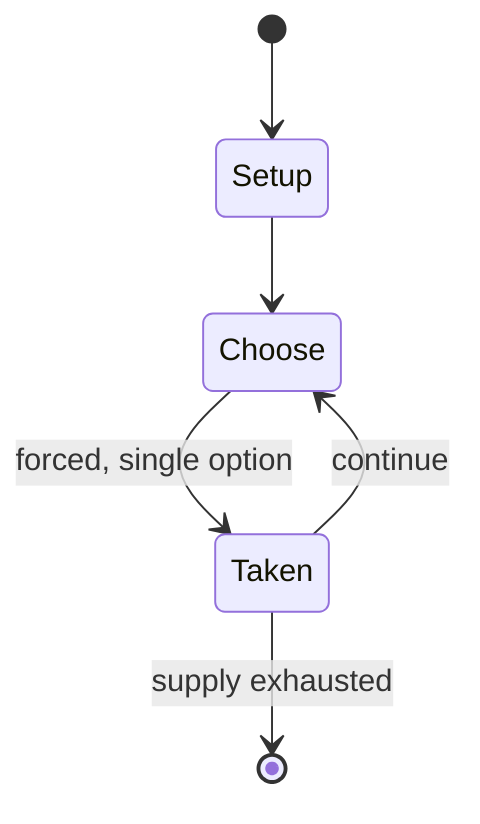

# Picigin

*Croatian ball game*

`picigin` &nbsp; state: **DEEPENED** &nbsp; method: **heuristic**

## Found layer (recorded, not trusted)

| field | value |
| --- | --- |
| wikidata | Q972513 |
| wikipedia | Picigin |
| genres (source) | -- |
| instance of (source) | amateur sports, ball game, traditional game, water sport |
| country of origin | Croatia |

## Declared layer (orders bench work)

| field | value |
| --- | --- |
| year created | -- |
| epoch | -- |
| region | EUROPE_EAST |
| media | SPORT |
| players | -- |
| age band | -- |
| exogenous process | -- |
| loss shape | -- |
| live axes | - |
| horizon | -- |
| scoring shape | -- |
| information | -- |
| interaction | COMPETITIVE |
| turn structure | -- |
| tractability | SAMPLING_ONLY |
| randomness | -- |
| luck factor | 0.35 |
| rules complexity | 1.73 |
| strategic depth | 2.0 |
| novelty | 0.0938 |
| solved status | -- |
| strategies | -- |
| algorithms | -- |

## Object model

```
Episode
  players      : ?
  turn_structure: ?
  horizon       : ?
  scoring       : ?

Pitch          -- bounded physical region
Player         -- embodied agent with a foul count
Clock          -- counts down; stoppages are rule events
Official       -- detects infractions and applies penalties
```

## State transition diagram



## Research item -- turn trace

```
# Picigin -- simulated turn events
# generated from the DECLARED vector, not from a rulebook.
# structure: exo=None loss=None horizon=None scoring=None axes=-

t=0    SETUP        players=2  pot=0  capacity=6
t=1    FORCED       p1 single legal option taken (pot_gain=+1.1)
t=2    FORCED       p1 single legal option taken (pot_gain=+1.2)
t=3    FORCED       p1 single legal option taken (pot_gain=+0.9)
t=4    FORCED       p1 single legal option taken (pot_gain=+0.9)
t=5    FORCED       p1 single legal option taken (pot_gain=+1.0)
t=6    FORCED       p1 single legal option taken (pot_gain=+1.7)
t=7    FORCED       p1 single legal option taken (pot_gain=+0.9)
t=8    FORCED       p1 single legal option taken (pot_gain=+1.9)
t=9    FORCED       p1 single legal option taken (pot_gain=+0.9)
t=10   FORCED       p1 single legal option taken (pot_gain=+0.8)
t=11   FORCED       p1 single legal option taken (pot_gain=+0.8)
t=12   FORCED       p1 single legal option taken (pot_gain=+0.7)
t=13   FORCED       p1 single legal option taken (pot_gain=+1.1)
t=14   ENDTURN      turn passes to p2
t=15   FORCED       p2 single legal option taken (pot_gain=+1.5)
t=16   ENDTURN      turn passes to p1
t=17   FORCED       p1 single legal option taken (pot_gain=+1.0)
t=18   ENDTURN      turn passes to p2
t=19   FORCED       p2 single legal option taken (pot_gain=+1.3)
t=20   FORCED       p2 single legal option taken (pot_gain=+1.0)
t=21   ENDTURN      turn passes to p1
t=22   FORCED       p1 single legal option taken (pot_gain=+1.1)
t=23   ENDTURN      turn passes to p2
t=24   FORCED       p2 single legal option taken (pot_gain=+1.1)
t=25   FORCED       p2 single legal option taken (pot_gain=+2.0)
t=26   FORCED       p2 single legal option taken (pot_gain=+1.4)

terminal: VARIABLE
```

## Source extract

Picigin (pronounced [pit͡sǐgiːn]) is traditional ball game from Split, Croatia that is played at
the beach. It is an amateur sport played in shoals or other shallow water, usually consisting of
cooperating players keeping a small ball aloft for as long as possible, with the game ending
when the ball falls in the water.   == Origin ==  Picigin originated on the sandy beach of
Bačvice in Split. It was first played in 1908 by a group of Croatian students returning from
Prague who were finding it difficult to play the game of water polo in shallow water. Instead,
they began playing a different game which would come to be known as picigin.   == Game
characteristics == The game involves several players in a circle batting around a small ball
with their hands; the objective is to keep the ball in the air and out of the water for as long
as possible. Players are not allowed to catch the ball, but bounce it around with the palm of
the hand to others. As such, the game somewhat resembles net-less volleyball, but it is played
with a much smaller ball, usually a tennis ball stripped of felt. There is no set number of
players, though five is usually average and customary. The game calls for agi

<sub>Wikipedia, CC BY-SA. Retained as evidence for the structural
classification above. Every rule inferred from it is HYPOTHESIZED
until audited against a rulebook.</sub>
