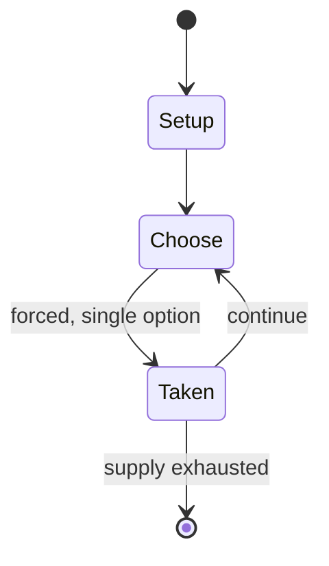

# Pick-up sticks

`pick_up_sticks` &nbsp; state: **DEEPENED** &nbsp; method: **heuristic**

## Found layer (recorded, not trusted)

| field | value |
| --- | --- |
| wikidata | Q1969196 |
| wikipedia | Pick-up sticks |
| genres (source) | -- |
| instance of (source) | -- |
| country of origin | -- |

## Declared layer (orders bench work)

| field | value |
| --- | --- |
| year created | -- |
| epoch | -- |
| region | -- |
| media | - |
| players | -- |
| age band | -- |
| exogenous process | -- |
| loss shape | -- |
| live axes | - |
| horizon | -- |
| scoring shape | SET_COLLECTION_CONVEX |
| information | -- |
| interaction | -- |
| turn structure | STRICT_TURN |
| tractability | SAMPLING_ONLY |
| randomness | -- |
| luck factor | 0.35 |
| rules complexity | 1.77 |
| strategic depth | 2.0 |
| novelty | 0.5282 |
| solved status | -- |
| strategies | -- |
| algorithms | -- |

## Object model

```
Episode
  players      : ?
  turn_structure: STRICT_TURN
  horizon       : ?
  scoring       : SET_COLLECTION_CONVEX

State          -- opaque; no medium or axis evidence was found
Player         -- an agent that selects among legal successors
```

## State transition diagram



## Research item -- turn trace

```
# Pick-up sticks -- simulated turn events
# generated from the DECLARED vector, not from a rulebook.
# structure: exo=None loss=None horizon=None scoring=SET_COLLECTION_CONVEX axes=-

t=0    SETUP        players=2  pot=0  capacity=7
t=1    FORCED       p1 single legal option taken (pot_gain=+1.1)
t=2    ENDTURN      turn passes to p2
t=3    FORCED       p2 single legal option taken (pot_gain=+1.8)
t=4    ENDTURN      turn passes to p1
t=5    FORCED       p1 single legal option taken (pot_gain=+2.0)
t=6    FORCED       p1 single legal option taken (pot_gain=+0.6)
t=7    FORCED       p1 single legal option taken (pot_gain=+0.8)
t=8    ENDTURN      turn passes to p2
t=9    FORCED       p2 single legal option taken (pot_gain=+1.3)
t=10   FORCED       p2 single legal option taken (pot_gain=+1.3)
t=11   FORCED       p2 single legal option taken (pot_gain=+1.5)
t=12   FORCED       p2 single legal option taken (pot_gain=+1.2)
t=13   ENDTURN      turn passes to p1
t=14   FORCED       p1 single legal option taken (pot_gain=+1.7)
t=15   FORCED       p1 single legal option taken (pot_gain=+1.5)
t=16   FORCED       p1 single legal option taken (pot_gain=+0.6)
t=17   FORCED       p1 single legal option taken (pot_gain=+1.1)
t=18   ENDTURN      turn passes to p2
t=19   FORCED       p2 single legal option taken (pot_gain=+1.3)
t=20   ENDTURN      turn passes to p1
t=21   FORCED       p1 single legal option taken (pot_gain=+0.9)
t=22   FORCED       p1 single legal option taken (pot_gain=+1.2)
t=23   ENDTURN      turn passes to p2
t=24   FORCED       p2 single legal option taken (pot_gain=+2.0)
t=25   FORCED       p2 single legal option taken (pot_gain=+1.2)
t=26   FORCED       p2 single legal option taken (pot_gain=+1.9)

terminal: VARIABLE
```

## Conditions

| kind | threshold | effect | trigger |
| --- | --- | --- | --- |
| BOUNDARY | 2 players | -- | In a game of pick-up sticks, there are typically 30 or more sticks and at least two players. |
| BOUNDARY | -- | -- | The game became popular in the 1800s in Germany, the United Kingdom (where it was played at least as early as 1845 at Windsor Castle), and the United States. |
| BOUNDARY | -- | removed | In some versions of the game any sticks not touching at least one other stick are removed. |

## Source extract

Pick-up sticks, pick-a-stick, jackstraws, jack straws, spillikins, spellicans, or fiddlesticks
is a game of physical and mental skill in which a bundle of sticks, between 8 and 20 centimeters
long, is dropped as a loose bunch onto a table top into a random pile. Each player, in turn,
tries to remove a stick from the pile without disturbing any of the others. The object of the
game is to pick up the most sticks or to score the most points based on the color of the sticks.
== History == The origin of the game of pick-up sticks is disputed, but it is believed to have
developed from the yarrow stalks used for divination with the Chinese I Ching. An English-
language reference to a "game at spilakees" dates from 1734. The game became popular in the
1800s in Germany, the United Kingdom (where it was played at least as early as 1845 at Windsor
Castle), and the United States. A particularly popular version of the game during the 1930s-50s,
456 Pickup Sticks, was manufactured by O. Schoenhut Inc, an offshoot of the US-based Schoenhut
Piano Company. In the 1800s, pick-up sticks were generally made from ivory or bone; modern
sticks may be made of almost any material, such as wood, bamboo, st

<sub>Wikipedia, CC BY-SA. Retained as evidence for the structural
classification above. Every rule inferred from it is HYPOTHESIZED
until audited against a rulebook.</sub>
