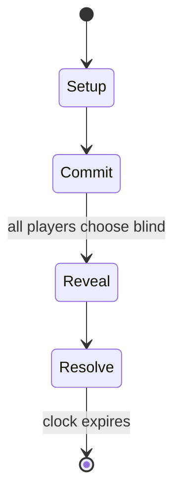

# Pictionary

*guessing word game*

`pictionary` &nbsp; state: **DEEPENED** &nbsp; method: **heuristic**

## Found layer (recorded, not trusted)

| field | value |
| --- | --- |
| wikidata | Q565449 |
| wikipedia | Pictionary |
| genres (source) | -- |
| instance of (source) | board game |
| country of origin | -- |

## Declared layer (orders bench work)

| field | value |
| --- | --- |
| year created | 1985 |
| epoch | DIGITAL |
| region | -- |
| media | BOARD |
| players | 3-16 |
| age band | -- |
| exogenous process | CONTINUOUS_TIME |
| loss shape | -- |
| live axes | COMMIT_BLIND, ORDER, SELECT |
| horizon | CLOCK_LIMITED |
| scoring shape | -- |
| information | SIMULTANEOUS |
| interaction | SOLITAIRE |
| turn structure | SIMULTANEOUS |
| tractability | SAMPLING_ONLY |
| randomness | DICE, REAL_TIME_PHYSICAL |
| luck factor | 0.58 |
| rules complexity | 2.75 |
| strategic depth | 1.87 |
| novelty | 0.7399 |
| solved status | -- |
| strategies | -- |
| algorithms | -- |

## Object model

```
Episode
  players      : 3-16
  turn_structure: SIMULTANEOUS
  horizon       : CLOCK_LIMITED
  scoring       : ?

Board          -- spatial substrate; cells carry position and occupancy
Piece          -- movable token owned by a player
SealedChoice   -- irrevocable choice made without observation
Sequence       -- the permutation under the player's control
OptionSet      -- the choices available after an exogenous draw
```

## State transition diagram



## Research item -- turn trace

```
# Pictionary -- simulated turn events
# generated from the DECLARED vector, not from a rulebook.
# structure: exo=CONTINUOUS_TIME loss=None horizon=CLOCK_LIMITED scoring=None axes=COMMIT_BLIND,ORDER,SELECT

t=0    SETUP        players=3  pot=0  capacity=8
t=1    DRAW         p1 tick from clock -> outcome #3  (p=0.224)
t=2    SELECT       p1 2 options; take #2  (pot_gain=+2.4, capacity=-2)
t=3    DRAW         p1 tick from clock -> outcome #2  (p=0.174)
t=4    SELECT       p1 3 options; take #2  (pot_gain=+1.2, capacity=-2)
t=5    DRAW         p1 tick from clock -> outcome #2  (p=0.143)
t=6    SELECT       p1 2 options; take #1  (pot_gain=+1.3, capacity=-0)
t=7    DRAW         p1 tick from clock -> outcome #5  (p=0.082)
t=8    SELECT       p1 4 options; take #1  (pot_gain=+1.4, capacity=-1)
t=9    DRAW         p1 tick from clock -> outcome #4  (p=0.088)
t=10   SELECT       p1 4 options; take #1  (pot_gain=+0.7, capacity=-1)
t=11   DRAW         p1 tick from clock -> outcome #2  (p=0.208)
t=12   SELECT       p1 2 options; take #1  (pot_gain=+1.4, capacity=-2)
t=13   DRAW         p1 tick from clock -> outcome #1  (p=0.058)
t=14   SELECT       p1 1 options; take #1  (pot_gain=+1.4, capacity=-2)
t=15   ENDTURN      turn passes to p2
t=16   DRAW         p2 tick from clock -> outcome #2  (p=0.214)
t=17   SELECT       p2 4 options; take #2  (pot_gain=+2.6, capacity=-2)
t=18   DRAW         p2 tick from clock -> outcome #6  (p=0.134)
t=19   SELECT       p2 4 options; take #3  (pot_gain=+1.7, capacity=-1)
t=20   DRAW         p2 tick from clock -> outcome #6  (p=0.125)
t=21   SELECT       p2 3 options; take #1  (pot_gain=+3.0, capacity=-2)
t=22   DRAW         p2 tick from clock -> outcome #4  (p=0.253)
t=23   SELECT       p2 2 options; take #1  (pot_gain=+3.1, capacity=-1)
t=24   DRAW         p2 tick from clock -> outcome #1  (p=0.160)
t=25   SELECT       p2 1 options; take #1  (pot_gain=+1.0, capacity=-0)
t=26   ENDTURN      turn passes to p3

terminal: CLOCK_LIMITED
```

## Source extract

Pictionary (, US: , PIK-shuh-NER-ee) is a charades-inspired word-guessing game invented by
Robert Angel with graphic design by Gary Everson and first published in 1985 by Angel Games Inc.
Angel Games licensed Pictionary to Western Publishing. Hasbro purchased the rights in 1994 after
acquiring the games business of Western Publishing. The game is played in teams with players
trying to identify specific words from their teammates. Its name is a portmanteau of "picture"
and "dictionary".   == History == The concept of Pictionary was first created by Robert Angel
and his friends in 1981. Angel and his roommates came up with the concept of the game, which
proved to be very popular between them. While originally hesitant to pitch the idea, Angel was
inspired by Trivial Pursuit, the gameplay of which was similar to his concept and proved to him
that such gameplay could work and be successful. Angel and his business partners Terry Langston
and Gary Everson first published Pictionary in 1985 through Angel Games. They gathered $35,000
and a thousand copies were printed. A week before Pictionary was first launched, Angel Games'
printing company called to inform them that they could not sort

<sub>Wikipedia, CC BY-SA. Retained as evidence for the structural
classification above. Every rule inferred from it is HYPOTHESIZED
until audited against a rulebook.</sub>
