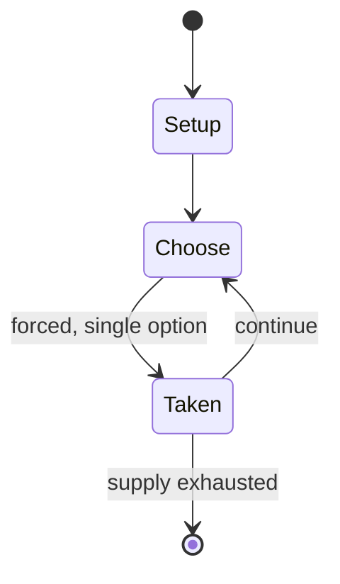

# Piedmontese tarot

*most common tarot card set in Italy*

`piedmontese_tarot` &nbsp; state: **DEEPENED** &nbsp; method: **heuristic**

## Found layer (recorded, not trusted)

| field | value |
| --- | --- |
| wikidata | Q17107473 |
| wikipedia | Tarocco Piemontese |
| genres (source) | -- |
| instance of (source) | playing card, tarot card game, tarot deck |
| country of origin | -- |

## Declared layer (orders bench work)

| field | value |
| --- | --- |
| year created | -- |
| epoch | -- |
| region | -- |
| media | CARD, TRICK_TAKING |
| players | -- |
| age band | -- |
| exogenous process | -- |
| loss shape | -- |
| live axes | - |
| horizon | -- |
| scoring shape | SURVIVAL |
| information | -- |
| interaction | COMPETITIVE |
| turn structure | -- |
| tractability | SAMPLING_ONLY |
| randomness | -- |
| luck factor | 0.35 |
| rules complexity | 1.81 |
| strategic depth | 2.25 |
| novelty | 0.0938 |
| solved status | -- |
| strategies | spatial_packing |
| algorithms | -- |

## Object model

```
Episode
  players      : ?
  turn_structure: ?
  horizon       : ?
  scoring       : SURVIVAL

Deck           -- ordered multiset, drawn without replacement
Hand           -- private multiset held by one player
DiscardPile    -- public accumulation of spent cards
Trick          -- one card per player; a winner is determined
Trump          -- suit that dominates the ordering
```

## State transition diagram



## Research item -- turn trace

```
# Piedmontese tarot -- simulated turn events
# generated from the DECLARED vector, not from a rulebook.
# structure: exo=None loss=None horizon=None scoring=SURVIVAL axes=-

t=0    SETUP        players=2  pot=0  capacity=3
t=1    FORCED       p1 single legal option taken (pot_gain=+1.0)
t=2    ENDTURN      turn passes to p2
t=3    FORCED       p2 single legal option taken (pot_gain=+0.9)
t=4    FORCED       p2 single legal option taken (pot_gain=+1.8)
t=5    FORCED       p2 single legal option taken (pot_gain=+0.9)
t=6    FORCED       p2 single legal option taken (pot_gain=+1.4)
t=7    ENDTURN      turn passes to p1
t=8    FORCED       p1 single legal option taken (pot_gain=+1.2)
t=9    FORCED       p1 single legal option taken (pot_gain=+1.4)
t=10   FORCED       p1 single legal option taken (pot_gain=+1.2)
t=11   FORCED       p1 single legal option taken (pot_gain=+1.8)
t=12   FORCED       p1 single legal option taken (pot_gain=+2.0)
t=13   FORCED       p1 single legal option taken (pot_gain=+1.8)
t=14   ENDTURN      turn passes to p2
t=15   FORCED       p2 single legal option taken (pot_gain=+0.5)
t=16   FORCED       p2 single legal option taken (pot_gain=+1.2)
t=17   ENDTURN      turn passes to p1
t=18   FORCED       p1 single legal option taken (pot_gain=+0.6)
t=19   FORCED       p1 single legal option taken (pot_gain=+1.4)
t=20   ENDTURN      turn passes to p2
t=21   FORCED       p2 single legal option taken (pot_gain=+1.5)
t=22   FORCED       p2 single legal option taken (pot_gain=+0.6)
t=23   ENDTURN      turn passes to p1
t=24   FORCED       p1 single legal option taken (pot_gain=+1.0)
t=25   ENDTURN      turn passes to p2
t=26   FORCED       p2 single legal option taken (pot_gain=+1.7)

terminal: VARIABLE
```

## Source extract

The Tarocco Piemontese (Tarot of Piedmont) is a type of tarot deck of Italian origin. It is the
most common tarot playing set in northern Italy, much more common than the Tarocco Bolognese.
The most popular Piedmontese tarot games are Scarto, Mitigati, Chiamare il Re, and Partita which
are played in Pinerolo and Turin. This deck is considered part of Piedmontese culture and
appeared in the 2006 Winter Olympics closing ceremony held in Turin. As this was the standard
tarot pack of the Kingdom of Sardinia, it was also formerly used in Savoy and Nice before their
annexation by France. Additionally, it was used as an alternative to the Tarocco Siciliano in
Calatafimi-Segesta, Sicily. Outside of Italy, it is used by a small number of players in Ticino,
Switzerland and was used by Italian Argentines. This deck is not related to the non-tarot
Piemontesi deck which uses French-suited hearts, diamonds, spades, and clubs. As such, their
cards are not interchangeable.   == Composition == This deck pattern was derived from the Tarot
of Marseilles but was made reversible for modern game playing. It consists of 78 cards: a trump
suit of 22 cards, numbered from 0 to 21, and four 14-card suits of

<sub>Wikipedia, CC BY-SA. Retained as evidence for the structural
classification above. Every rule inferred from it is HYPOTHESIZED
until audited against a rulebook.</sub>
