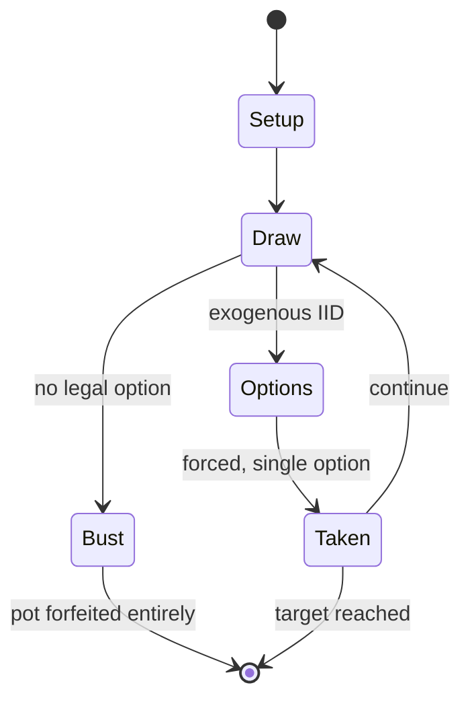

# Pig (dice game)

`pig_dice_game` &nbsp; state: **DEEPENED** &nbsp; method: **heuristic**

## Found layer (recorded, not trusted)

| field | value |
| --- | --- |
| wikidata | Q7193201 |
| wikipedia | Pig (dice game) |
| genres (source) | -- |
| instance of (source) | -- |
| country of origin | -- |

## Declared layer (orders bench work)

| field | value |
| --- | --- |
| year created | -- |
| epoch | -- |
| region | -- |
| media | DICE |
| players | -- |
| age band | -- |
| exogenous process | IID |
| loss shape | TOTAL_RUIN |
| live axes | ORDER |
| horizon | RACE_TO_TARGET |
| scoring shape | RACE_POSITION |
| information | -- |
| interaction | COMPETITIVE |
| turn structure | STRICT_TURN |
| tractability | EXACT_WITH_CUT |
| randomness | DICE |
| luck factor | 0.58 |
| rules complexity | 2.16 |
| strategic depth | 2.12 |
| novelty | 0.7395 |
| solved status | -- |
| strategies | probability_estimation |
| algorithms | -- |

## Object model

```
Episode
  players      : ?
  turn_structure: STRICT_TURN
  horizon       : RACE_TO_TARGET
  scoring       : RACE_POSITION

DicePool       -- n dice, each an iid categorical draw
Roll           -- realised outcome of a pool
Sequence       -- the permutation under the player's control
```

## State transition diagram



## Research item -- turn trace

```
# Pig (dice game) -- simulated turn events
# generated from the DECLARED vector, not from a rulebook.
# structure: exo=IID loss=TOTAL_RUIN horizon=RACE_TO_TARGET scoring=RACE_POSITION axes=ORDER

t=0    SETUP        players=2  pot=0  capacity=7
t=1    DRAW         p1 roll from d6 pool -> outcome #3  (p=0.081)
t=2    DEATH        p1 no legal option -- BUST. pot 0.0 -> 0.0
t=3    NOTE         loss_shape=TOTAL_RUIN: entire pot forfeited

terminal: RACE_TO_TARGET
```

## Conditions

| kind | threshold | effect | trigger |
| --- | --- | --- | --- |
| WIN | 5 rounds | -- | After five rounds, the highest-scoring player is the winner. |
| WIN | -- | -- | The first player to score 100 or more points wins. |

## Source extract

Pig is a simple dice game first described in print by John Scarne in 1945. Players take turns to
roll a single dice as many times as they wish, adding all roll results to a running total, but
losing their gained score for the turn if they roll a . As with many games of folk origin, Pig
is played with many rule variations, including the use of two dice instead of one. Commercial
variants of two-dice Pig include Pass the Pigs, Pig Dice, and Skunk. Pig is commonly used by
mathematics teachers to teach probability concepts. Pig is one of a family of dice games
described by Reiner Knizia as "jeopardy dice games", where the dominant type of decision is
whether or not to jeopardize previous gains by rolling for potential greater gains.   ==
Gameplay == Each turn, a player repeatedly rolls a die until a  is rolled or the player decides
to "hold":  If the player rolls a , they score nothing and it becomes the next player's turn. If
the player rolls any other number, it is added to their turn total and the player's turn
continues. If a player chooses to "hold", their turn total is added to their score, and it
becomes the next player's turn. The first player to score 100 or more points wins.

<sub>Wikipedia, CC BY-SA. Retained as evidence for the structural
classification above. Every rule inferred from it is HYPOTHESIZED
until audited against a rulebook.</sub>
