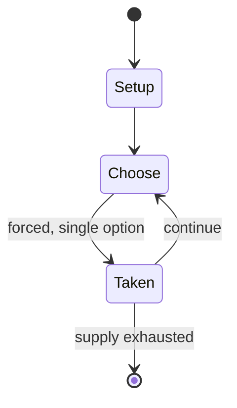

# Pilolo

`pilolo` &nbsp; state: **DEEPENED** &nbsp; method: **heuristic**

## Found layer (recorded, not trusted)

| field | value |
| --- | --- |
| wikidata | Q28130227 |
| wikipedia | Pilolo |
| genres (source) | -- |
| instance of (source) | -- |
| country of origin | -- |

## Declared layer (orders bench work)

| field | value |
| --- | --- |
| year created | -- |
| epoch | -- |
| region | -- |
| media | - |
| players | -- |
| age band | -- |
| exogenous process | -- |
| loss shape | -- |
| live axes | - |
| horizon | -- |
| scoring shape | -- |
| information | -- |
| interaction | -- |
| turn structure | -- |
| tractability | SAMPLING_ONLY |
| randomness | HIDDEN_INFO |
| luck factor | 0.35 |
| rules complexity | 1.8 |
| strategic depth | 2.25 |
| novelty | 0.0938 |
| solved status | -- |
| strategies | opponent_modelling |
| algorithms | -- |

## Object model

```
Episode
  players      : ?
  turn_structure: ?
  horizon       : ?
  scoring       : ?

State          -- opaque; no medium or axis evidence was found
Player         -- an agent that selects among legal successors
```

## State transition diagram



## Research item -- turn trace

```
# Pilolo -- simulated turn events
# generated from the DECLARED vector, not from a rulebook.
# structure: exo=None loss=None horizon=None scoring=None axes=-

t=0    SETUP        players=2  pot=0  capacity=7
t=1    FORCED       p1 single legal option taken (pot_gain=+1.5)
t=2    FORCED       p1 single legal option taken (pot_gain=+1.5)
t=3    FORCED       p1 single legal option taken (pot_gain=+0.8)
t=4    FORCED       p1 single legal option taken (pot_gain=+1.2)
t=5    FORCED       p1 single legal option taken (pot_gain=+1.0)
t=6    FORCED       p1 single legal option taken (pot_gain=+2.0)
t=7    FORCED       p1 single legal option taken (pot_gain=+1.7)
t=8    FORCED       p1 single legal option taken (pot_gain=+1.0)
t=9    FORCED       p1 single legal option taken (pot_gain=+1.4)
t=10   FORCED       p1 single legal option taken (pot_gain=+0.5)
t=11   FORCED       p1 single legal option taken (pot_gain=+1.2)
t=12   FORCED       p1 single legal option taken (pot_gain=+1.8)
t=13   ENDTURN      turn passes to p2
t=14   FORCED       p2 single legal option taken (pot_gain=+0.6)
t=15   FORCED       p2 single legal option taken (pot_gain=+1.5)
t=16   ENDTURN      turn passes to p1
t=17   FORCED       p1 single legal option taken (pot_gain=+0.9)
t=18   FORCED       p1 single legal option taken (pot_gain=+1.4)
t=19   ENDTURN      turn passes to p2
t=20   FORCED       p2 single legal option taken (pot_gain=+1.2)
t=21   FORCED       p2 single legal option taken (pot_gain=+0.8)
t=22   ENDTURN      turn passes to p1
t=23   FORCED       p1 single legal option taken (pot_gain=+1.5)
t=24   FORCED       p1 single legal option taken (pot_gain=+0.7)
t=25   ENDTURN      turn passes to p2
t=26   FORCED       p2 single legal option taken (pot_gain=+1.9)

terminal: VARIABLE
```

## Source extract

Pilolo is an outdoor game that is played among Ghanaian children. The literal English
translation of the name is "time to search for". The Pilolo game is played by two or more
children. The higher the number, the increase in excitement and zeal to win. An object like a
stick is mostly used and the number of sticks to use is dependent on the number of children.   A
non-participant hides the sticks while the participants have either closed their eyes or are not
in the same location. The participant then shouts out "pi-lo-lo", the participants then run from
their hideout to search for the item. A finishing point is indicated where they must send the
stick to be a winner.  One needs to be smart, observant and skillful to detect where the item
has been hidden. The first person that sees it secretly runs to the finish point before alerting
the others after a hard time trying. It is then recorded as they reach the finish point.   ==
Rules == The game is played among two or more children. When ten children have decided to play,
one kid is chosen to be the leader of the game. The leader searches for small pieces of sticks.
The game starts when the leader tells the other kids to hide. The le

<sub>Wikipedia, CC BY-SA. Retained as evidence for the structural
classification above. Every rule inferred from it is HYPOTHESIZED
until audited against a rulebook.</sub>
