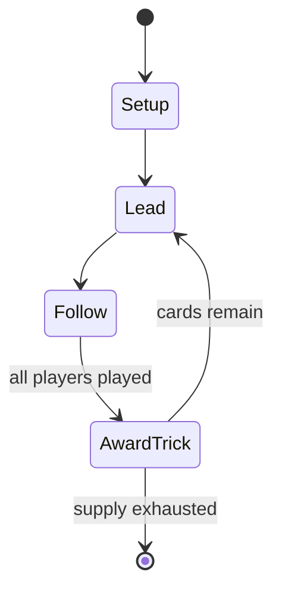

# Pilotta

*variant of Belote in Cyprus*

`pilotta` &nbsp; state: **DEEPENED** &nbsp; method: **heuristic**

## Found layer (recorded, not trusted)

| field | value |
| --- | --- |
| wikidata | Q3567102 |
| wikipedia | Pilotta |
| genres (source) | -- |
| instance of (source) | ace–ten game, card game |
| country of origin | Cyprus |

## Declared layer (orders bench work)

| field | value |
| --- | --- |
| year created | -- |
| epoch | -- |
| region | -- |
| media | CARD, TRICK_TAKING |
| players | -- |
| age band | -- |
| exogenous process | DEPLETING_DECK |
| loss shape | -- |
| live axes | BID |
| horizon | -- |
| scoring shape | SET_COLLECTION_CONVEX |
| information | -- |
| interaction | TEAM |
| turn structure | TRICK_ROUND |
| tractability | SAMPLING_ONLY |
| randomness | DECK_SHUFFLE |
| luck factor | 0.35 |
| rules complexity | 2.04 |
| strategic depth | 2.0 |
| novelty | 0.4732 |
| solved status | -- |
| strategies | set_collection, spatial_packing |
| algorithms | -- |

## Object model

```
Episode
  players      : ?
  turn_structure: TRICK_ROUND
  horizon       : ?
  scoring       : SET_COLLECTION_CONVEX

Deck           -- ordered multiset, drawn without replacement
Hand           -- private multiset held by one player
DiscardPile    -- public accumulation of spent cards
Trick          -- one card per player; a winner is determined
Trump          -- suit that dominates the ordering
Auction        -- priced competition resolving to one winner
```

## State transition diagram



## Research item -- turn trace

```
# Pilotta -- simulated turn events
# generated from the DECLARED vector, not from a rulebook.
# structure: exo=DEPLETING_DECK loss=None horizon=None scoring=SET_COLLECTION_CONVEX axes=BID

t=0    SETUP        players=2  pot=0  capacity=7
t=1    DRAW         p1 draw from deck -> outcome #5  (p=0.182)
t=2    FORCED       p1 single legal option taken (pot_gain=+1.1)
t=3    ENDTURN      turn passes to p2
t=4    DRAW         p2 draw from deck -> outcome #3  (p=0.262)
t=5    FORCED       p2 single legal option taken (pot_gain=+0.9)
t=6    BID          p2 sealed bid of 2 against 1 rivals
t=7    DRAW         p2 draw from deck -> outcome #4  (p=0.009)
t=8    FORCED       p2 single legal option taken (pot_gain=+1.6)
t=9    BID          p2 sealed bid of 5 against 1 rivals
t=10   ENDTURN      turn passes to p1
t=11   DRAW         p1 draw from deck -> outcome #5  (p=0.051)
t=12   FORCED       p1 single legal option taken (pot_gain=+1.0)
t=13   BID          p1 sealed bid of 2 against 1 rivals
t=14   ENDTURN      turn passes to p2
t=15   DRAW         p2 draw from deck -> outcome #6  (p=0.046)
t=16   FORCED       p2 single legal option taken (pot_gain=+1.1)
t=17   BID          p2 sealed bid of 5 against 1 rivals
t=18   DRAW         p2 draw from deck -> outcome #4  (p=0.127)
t=19   FORCED       p2 single legal option taken (pot_gain=+1.1)
t=20   DRAW         p2 draw from deck -> outcome #1  (p=0.202)
t=21   FORCED       p2 single legal option taken (pot_gain=+0.9)
t=22   ENDTURN      turn passes to p1
t=23   DRAW         p1 draw from deck -> outcome #5  (p=0.122)
t=24   FORCED       p1 single legal option taken (pot_gain=+0.7)
t=25   DRAW         p1 draw from deck -> outcome #4  (p=0.059)
t=26   FORCED       p1 single legal option taken (pot_gain=+0.5)
t=27   BID          p1 sealed bid of 1 against 1 rivals

terminal: VARIABLE
```

## Conditions

| kind | threshold | effect | trigger |
| --- | --- | --- | --- |
| TERMINATE | 351 points | -- | Usually the score ends when the first team reaches 351 points. |

## Source extract

Pilotta (in Greek Πιλόττα) is a trick-taking 32-card game derived from Belote. It is played
primarily in Cyprus, being very popular among the Cypriot population, especially the youngsters,
who usually arrange “pilotta meetings” in places such as cafés and cafeterias. Its counterpart
played in Greece is named Vida (in Greek βίδα).   == Rules ==   === Declaring the dealer ===
First, the 32-card Piquet pack is shuffled by the dealer and then cut by the player to the left.
The cutter is assigned hearts ♥ and moving on anticlockwise the players are assigned a suit in
the order:  ♥ > ♦ > ♣ > ♠. If the suit which made the cut is hearts, for example, then the
player who shuffled and cut the deck will be the dealer. If it was spades, then the person on
the left of the shuffler is the dealer. At the end of each turn, the player on dealer's left
becomes the new dealer.   === Deal === The cards are dealt anticlockwise; first, 3 cards are
given to each player, starting with eldest hand (on the dealer's right) and ending with the
dealer himself. Then, another 2 cards are dealt, and then another 3.   === Bidding === Starting
with eldest hand, players bid on the score they expect to gain. The play

<sub>Wikipedia, CC BY-SA. Retained as evidence for the structural
classification above. Every rule inferred from it is HYPOTHESIZED
until audited against a rulebook.</sub>
