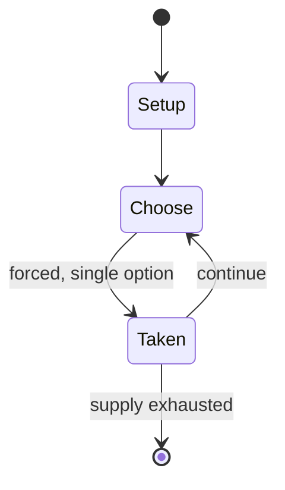

# Pinners

`pinners` &nbsp; state: **DEEPENED** &nbsp; method: **heuristic**

## Found layer (recorded, not trusted)

| field | value |
| --- | --- |
| wikidata | Q7196347 |
| wikipedia | Pinners |
| genres (source) | -- |
| instance of (source) | -- |
| country of origin | -- |

## Declared layer (orders bench work)

| field | value |
| --- | --- |
| year created | -- |
| epoch | -- |
| region | -- |
| media | - |
| players | -- |
| age band | -- |
| exogenous process | -- |
| loss shape | -- |
| live axes | - |
| horizon | -- |
| scoring shape | -- |
| information | -- |
| interaction | -- |
| turn structure | -- |
| tractability | SAMPLING_ONLY |
| randomness | -- |
| luck factor | 0.35 |
| rules complexity | 1.73 |
| strategic depth | 2.0 |
| novelty | 0.0914 |
| solved status | -- |
| strategies | -- |
| algorithms | -- |

## Object model

```
Episode
  players      : ?
  turn_structure: ?
  horizon       : ?
  scoring       : ?

State          -- opaque; no medium or axis evidence was found
Player         -- an agent that selects among legal successors
```

## State transition diagram



## Research item -- turn trace

```
# Pinners -- simulated turn events
# generated from the DECLARED vector, not from a rulebook.
# structure: exo=None loss=None horizon=None scoring=None axes=-

t=0    SETUP        players=2  pot=0  capacity=6
t=1    FORCED       p1 single legal option taken (pot_gain=+1.9)
t=2    FORCED       p1 single legal option taken (pot_gain=+1.9)
t=3    FORCED       p1 single legal option taken (pot_gain=+0.7)
t=4    ENDTURN      turn passes to p2
t=5    FORCED       p2 single legal option taken (pot_gain=+1.3)
t=6    FORCED       p2 single legal option taken (pot_gain=+0.8)
t=7    FORCED       p2 single legal option taken (pot_gain=+1.9)
t=8    FORCED       p2 single legal option taken (pot_gain=+1.5)
t=9    ENDTURN      turn passes to p1
t=10   FORCED       p1 single legal option taken (pot_gain=+1.5)
t=11   ENDTURN      turn passes to p2
t=12   FORCED       p2 single legal option taken (pot_gain=+1.1)
t=13   FORCED       p2 single legal option taken (pot_gain=+0.8)
t=14   FORCED       p2 single legal option taken (pot_gain=+1.7)
t=15   ENDTURN      turn passes to p1
t=16   FORCED       p1 single legal option taken (pot_gain=+0.9)
t=17   FORCED       p1 single legal option taken (pot_gain=+1.7)
t=18   FORCED       p1 single legal option taken (pot_gain=+1.2)
t=19   FORCED       p1 single legal option taken (pot_gain=+0.8)
t=20   FORCED       p1 single legal option taken (pot_gain=+0.5)
t=21   FORCED       p1 single legal option taken (pot_gain=+0.5)
t=22   FORCED       p1 single legal option taken (pot_gain=+1.1)
t=23   FORCED       p1 single legal option taken (pot_gain=+1.5)
t=24   ENDTURN      turn passes to p2
t=25   FORCED       p2 single legal option taken (pot_gain=+0.9)
t=26   FORCED       p2 single legal option taken (pot_gain=+1.6)
t=27   ENDTURN      turn passes to p1

terminal: VARIABLE
```

## Conditions

| kind | threshold | effect | trigger |
| --- | --- | --- | --- |
| PENALTY | -- | -- | A play in which the ball is out of play, either by foul ball, home run, or a misplay by the fielder, the fielder must throw the ball to the batter from where he stands or the batter may call stalling if the fielder is wa |

## Source extract

Pinners is a Chicago neighborhood game played on the front stoop, or on walls with angled bricks
or stones which can be used to pop the ball up in the air. References and accounts of the game
exist to 1949 or earlier.   == Play == The batter throws a rubber ball or tennis ball at the
edge of the step or angled wall brick, and the fielder (or fielders) try to catch it as it
bounces back. The game is played with a 2.5-inch (64 mm) hollow pink soft rubber ball called a
"Pinky" that bounces well from the edges of steps. Baseball gloves are not allowed. The scoring
rules are similar to baseball, but with runs being virtual and determined by where the ball
lands. A single, double, triple or home run depends upon predetermined landmarks (i.e. sidewalk,
trees, cars, street, curb lines) from the batting area. A catch is an out, and a one-handed
catch is called a "rushie". As with most neighborhood games, rules varied by the groups playing
and house rules are determined at the start of the game, including the base locations. The game
utilizes traditional Chicago neighborhood row house architecture, with most houses (Chicago
Bungalow style) having front stairs or a stoop that leads from the f

<sub>Wikipedia, CC BY-SA. Retained as evidence for the structural
classification above. Every rule inferred from it is HYPOTHESIZED
until audited against a rulebook.</sub>
