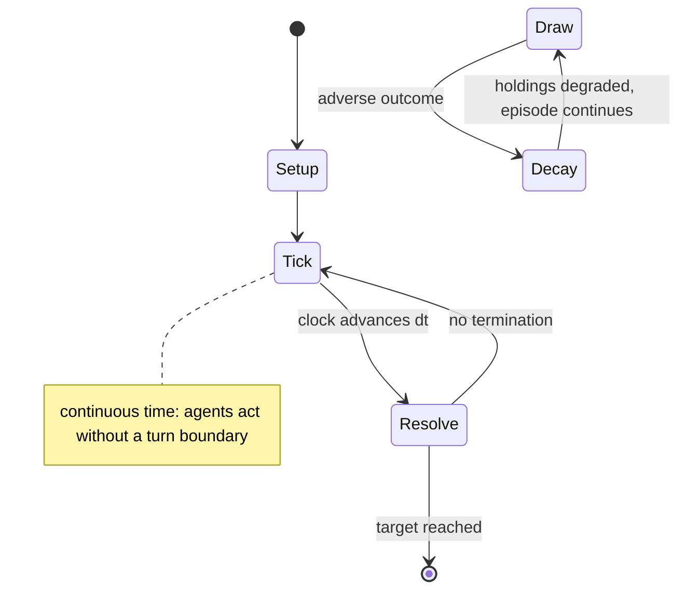

# Pit (game)

`pit_game` &nbsp; state: **DEEPENED** &nbsp; method: **heuristic**

## Found layer (recorded, not trusted)

| field | value |
| --- | --- |
| wikidata | Q7198545 |
| wikipedia | Pit (game) |
| genres (source) | -- |
| instance of (source) | -- |
| country of origin | -- |

## Declared layer (orders bench work)

| field | value |
| --- | --- |
| year created | 1903 |
| epoch | MODERN |
| region | -- |
| media | CARD |
| players | -- |
| age band | -- |
| exogenous process | NONE |
| loss shape | PARTIAL_DECAY |
| live axes | BID, TRADE |
| horizon | RACE_TO_TARGET |
| scoring shape | SET_COLLECTION_CONVEX |
| information | PERFECT |
| interaction | NEGOTIATION |
| turn structure | REAL_TIME |
| tractability | SAMPLING_ONLY |
| randomness | NONE |
| luck factor | 0.35 |
| rules complexity | 2.87 |
| strategic depth | 2.25 |
| novelty | 0.7276 |
| solved status | -- |
| strategies | set_collection |
| algorithms | -- |

## Object model

```
Episode
  players      : ?
  turn_structure: REAL_TIME
  horizon       : RACE_TO_TARGET
  scoring       : SET_COLLECTION_CONVEX

Deck           -- ordered multiset, drawn without replacement
Hand           -- private multiset held by one player
DiscardPile    -- public accumulation of spent cards
Auction        -- priced competition resolving to one winner
Offer          -- proposed exchange between two agents
```

## State transition diagram



## Research item -- clock trace

```
# Pit (game) -- simulated clock trace (no turn boundary)
# generated from the DECLARED vector, not from a rulebook.
# structure: exo=NONE loss=PARTIAL_DECAY horizon=RACE_TO_TARGET scoring=SET_COLLECTION_CONVEX axes=BID,TRADE

clk=0.000s  START        agents=4  clock=free running
clk=1.620s  ACTION       a3 acts continuously; no turn boundary crossed
clk=4.494s  STOPPAGE     clock halts; state frozen
clk=5.694s  CONTEST      a4 and a1 contend for the same resource
clk=6.351s  INFRACTION   a1 commits infraction (count=1)
clk=6.613s  SCORE        a3 scores (+1)
clk=9.463s  ACTION       a2 acts continuously; no turn boundary crossed
clk=10.005s  CONTEST      a3 and a4 contend for the same resource
clk=11.626s  ACTION       a4 acts continuously; no turn boundary crossed
clk=14.238s  ACTION       a2 acts continuously; no turn boundary crossed
clk=15.894s  CONTEST      a2 and a3 contend for the same resource
clk=17.087s  ACTION       a4 acts continuously; no turn boundary crossed
clk=17.933s  ACTION       a4 acts continuously; no turn boundary crossed
clk=19.484s  ACTION       a1 acts continuously; no turn boundary crossed
clk=21.738s  SCORE        a3 scores (+1)
clk=24.404s  SCORE        a3 scores (+3)
clk=26.055s  ACTION       a2 acts continuously; no turn boundary crossed
clk=27.799s  STOPPAGE     clock halts; state frozen
clk=29.273s  STOPPAGE     clock halts; state frozen
clk=30.909s  SCORE        a4 scores (+3)
clk=31.292s  STOPPAGE     clock halts; state frozen
clk=31.783s  STOPPAGE     clock halts; state frozen
clk=32.566s  SCORE        a2 scores (+2)
clk=33.643s  ACTION       a2 acts continuously; no turn boundary crossed
clk=35.597s  SCORE        a4 scores (+3)
clk=37.014s  SCORE        a4 scores (+2)
clk=39.892s  ACTION       a4 acts continuously; no turn boundary crossed

note: elapsed time, not move count, is the episode's ordering variable.
```

## Conditions

| kind | threshold | effect | trigger |
| --- | --- | --- | --- |
| WIN | -- | -- | The first player to reach an agreed-upon point total wins the game. |
| PENALTY | -- | -- | At the end of a round, the Bear and the Bull each impose a 20-point penalty on any non-winning player holding them. |

## Source extract

Pit is a fast-paced card game for three to eight players, designed to simulate open outcry
bidding for commodities. The game first went on sale in 1904 by the American games company
Parker Brothers. The inspirations were the Chicago Board of Trade (known as the Pit) and the US
Corn Exchange. The game itself was likely based on the very successful game Gavitt's Stock
Exchange, invented in 1903 by Harry E. Gavitt of Topeka, Kansas. While the name Pit remains
trademarked in many countries by Hasbro, versions of the game have been marketed under names,
including Billionaire, Business, Cambio, Deluxe Pit, Quick 7, Zaster.  As early as 1904, the
attributed clairvoyant Edgar Cayce claimed he had developed the game and sent it to Parker
Brothers.    == Contents == Different versions of the game contain different numbers of cards.
The original edition has 63 cards, with nine cards each of the seven different commodities.
Later editions added an eighth commodity, along with a Bear card and a Bull card, for 74 cards
total. Originally, the commodities and values were the following:  Newer versions include seven
or eight commodities, with Flax, Hay and Rye removed from the list of commodities:

<sub>Wikipedia, CC BY-SA. Retained as evidence for the structural
classification above. Every rule inferred from it is HYPOTHESIZED
until audited against a rulebook.</sub>
